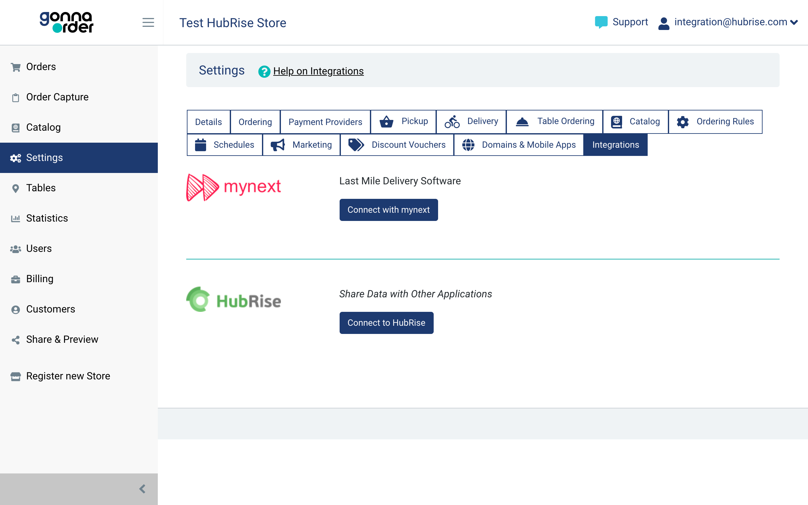
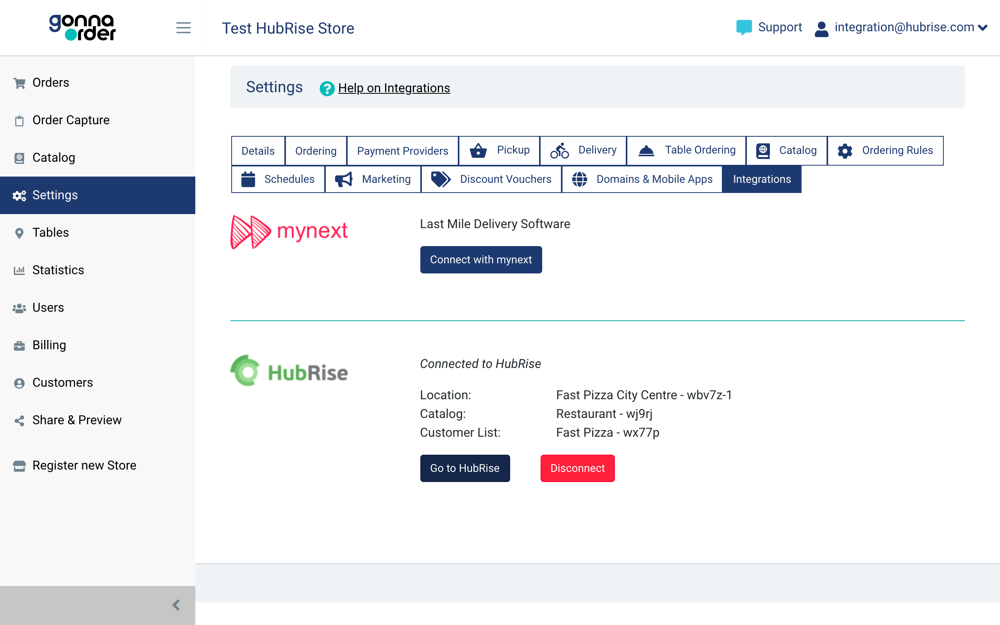

Connecting GonnaOrder to HubRise can be done with a few simple steps.

---

**IMPORTANT NOTE:** If you do not have a HubRise account yet, register on our [Signup Page](https://manager.hubrise.com/signup). It only takes a minute!

---

## 1. Connect From The GonnaOrder Back Office

You can connect to HubRise directly from your GonnaOrder account with the following steps:

1. Log in to your [GonnaOrder back office](https://admin.gonnaorder.com).
1. From the dashboard, go to **Settings > Integrations**.
1. From the HubRise section, click **Connect to HubRise**. This takes you to the HubRise website.
   
1. If you are not logged in already, enter your HubRise credentials and click **Log in**.
1. If you have multiple HubRise locations, select the location that you want to connect to GonnaOrder.
1. Review the permissions and click **Allow**. This takes you back to the GonnaOrder dashboard, where you can verify the details of the HubRise location connected.
   

For more details about connecting GonnaOrder with HubRise, see the [GonnaOrder documentation](https://www.gonnaorder.com/help/store-settings/integrations/hubrise-integration#connect-to-hubrise).

## 2. Map Ref Codes

If you use GonnaOrder with an EPOS, you need to map all the products in your GonnaOrder menu to their corresponding ref codes. This ensures that your EPOS can identify every item correctly.

Additionally, some EPOS systems require ref codes for service types, payments, and fees. You can also specify these values from the GonnaOrder back office.

To learn how to map ref codes on GonnaOrder, see [Map Ref Codes](/apps/gonnaorder/map-ref-codes).

## 3. Give Access to GonnaOrder Support

We recommend providing GonnaOrder support with access to your HubRise location connected with GonnaOrder.
If needed, they will be able to troubleshoot issues by inspecting the logs on HubRise.

To give GonnaOrder support access to your location, follow these steps.

1. If you have multiple accounts, click the down arrow <InlineImage width="28" height="21"></InlineImage> next to **Account** to select the appropriate account.
1. From your HubRise back office, select **CONFIGURATION**.
1. From the **Usage** section, select the location connected to GonnaOrder from the **Location** column.
1. In the **Permissions** section, add *support@gonnaorder.com* to the list, and select **Manager** from the dropdown menu.
1. Click on the **+** plus icon to confirm.

---

**IMPORTANT NOTE:** Sharing the username and password of your HubRise user profile is highly discouraged for security reasons.

---
