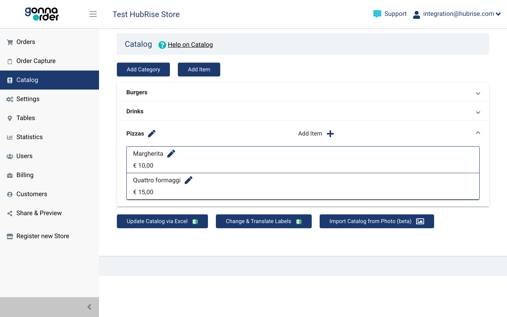
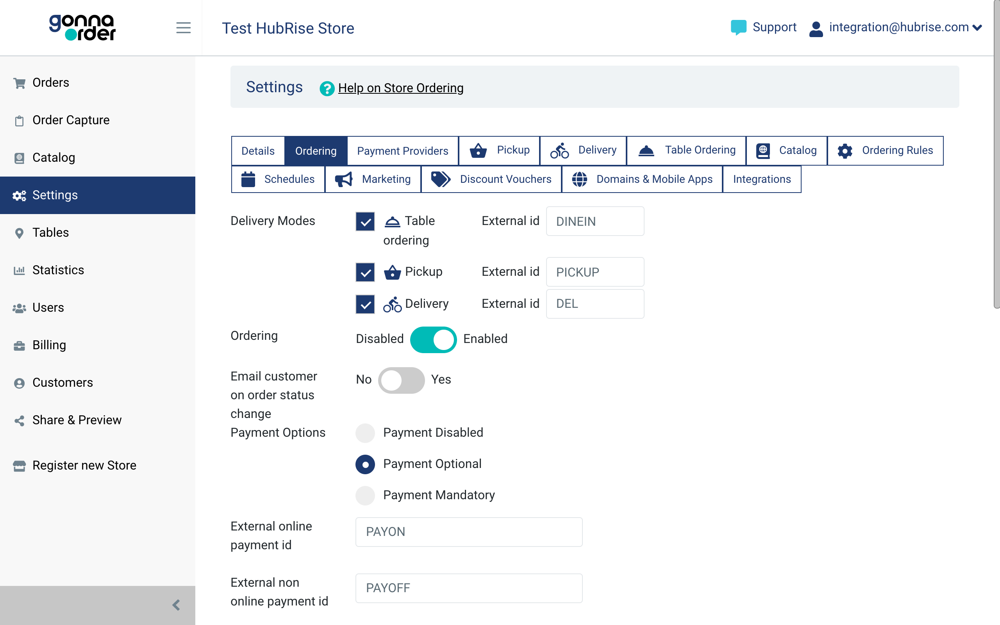

Most EPOS solutions require a ref code for each product to correctly parse orders. Therefore, when you create your menu on GonnaOrder, you need to make sure that each product is assigned to the correct ref code. This applies also to service types, payments, and fees.

This page explains how to map ref codes in your GonnaOrder back office.

## Products

To assign ref codes to a specific product from the GonnaOrder dashboard, follow these steps:

1. Log in to your [GonnaOrder back office](https://admin.gonnaorder.com/).
1. From the dashboard, go to **Catalog**.
1. Click on a category to show the products, then click the <InlineImage width="21" height="21"></InlineImage> **Edit icon** next to the product name.
   
1. In the product page, enter the ref code in the **External product id** field.
   
1. Click **Save**.

To upload the ref codes for your products in bulk, follow these steps:

1. Log in to your [GonnaOrder back office](https://admin.gonnaorder.com/).
1. From the dashboard, go to **Catalog**.
1. Click on **Upload catalog via Excel**.
1. Follow the instructions on screen to download an Excel file with your catalog in table form.
   
1. Open the file with a spreadsheet editor, enter the ref codes for your products, then upload the file again to your GonnaOrder back office.

## Service Types

You can assign a different service type to each delivery mode in GonnaOrder.

To assign ref codes to your delivery modes from the GonnaOrder dashboard, follow these steps:

1. Log in to your [GonnaOrder back office](https://admin.gonnaorder.com/).
1. From the dashboard, go to **Settings > Ordering**.
1. Under the **Delivery Modes** section, specify the ref codes for your service types in the **External id** fields. Changes are automatically saved.
   

## Charges

GonnaOrder lets you set up delivery fees. Delivery fees are a charge in HubRise, whose ref code must be configured for your EPOS to handle it correctly.

To assign a ref codes to your delivery fees from the GonnaOrder dashboard, follow these steps:

1. Log in to your [GonnaOrder back office](https://admin.gonnaorder.com/).
2. From the dashboard, go to **Settings > Delivery**.
3. Specify the ref code for your delivery fees in the **Delivery fee external id** field. Changes are automatically saved.
   

For more details about configuring your GonnaOrder integration with HubRise, see the [GonnaOrder documentation](https://www.gonnaorder.com/help/store-settings/integrations/hubrise-integration/#special-hubrise-settings).

## Payment Methods

To assign ref codes to your payment methods from the GonnaOrder dashboard, follow these steps:

1. Log in to your [GonnaOrder back office](https://admin.gonnaorder.com/).
1. From the dashboard, go to **Settings > Ordering**.
1. Specify the ref codes for payment methods:
   - For online payments, enter the ref code in the **External online payment id** field.
   - For cash payments, enter the ref code in the **External non online payment id** field.

Changes are automatically saved.
