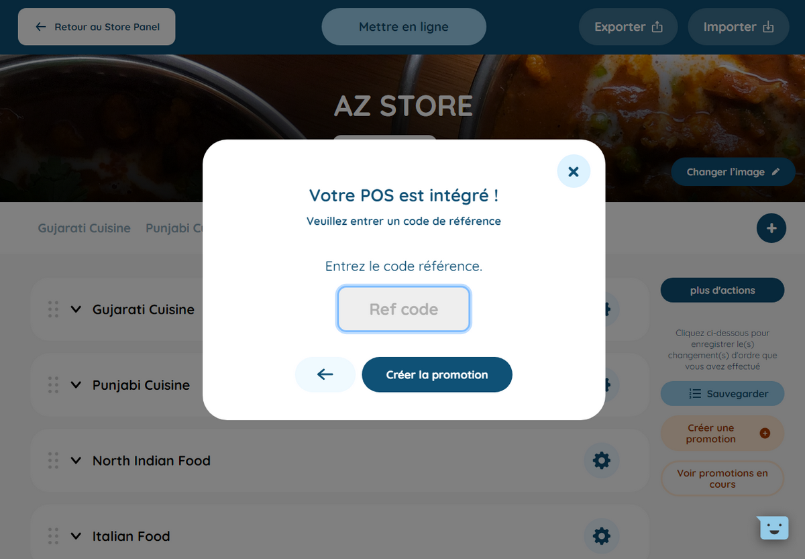

## Produits et SKUs

Les produits et les SKUs sur HubRise correspondent aux produits sur Hop Delivery. Les produits sur Hop Delivery ne peuvent avoir qu'une seule SKU.

Pour modifier le code ref d'un produit, suivez ces étapes :

1. Depuis le back office Hop Delivery, dans le menu de gauche, cliquez sur **Menu** > **Menu Smart Editor**.
   
2. Cliquez sur la catégorie, puis sur le produit. Le champ **Code ref** se trouve sous la description du produit, au-dessus du prix.
   
3. Modifiez le code ref du produit et cliquez sur le bouton **Sauvegarder les modifications**.

## Options

Les listes d'options sur HubRise correspondent aux modificateurs sur Hop Delivery. Les modificateurs sont créés indépendamment des produits et rattachés ensuite à un ou plusieurs produits.

Les options sur HubRise correspondent aux options sur Hop Delivery.

Pour modifier le code ref d'un modificateur, suivez ces étapes :

1. Depuis le back office Hop Delivery, dans le menu de gauche, cliquez sur **Menu** > **Liste**.
2. Cliquez sur l'en-tête **Modificateurs**. Le code ref de chaque modificateur se trouve dans le champ **Réf.**.
   
3. Modifiez le code ref du modificateur. Le changement est automatiquement sauvegardé.

Pour modifier le code ref d'une option, suivez ces étapes :

1. Depuis le back office Hop Delivery, dans le menu de gauche, cliquez sur **Menu** > **Liste**.
2. Cliquez sur l'en-tête **Options**. Le code ref de chaque option se trouve dans le champ **Réf.**.
3. Modifiez le code ref de l'option. Le changement est automatiquement sauvegardé.

## Promotions et remises

Seuls les utilisateurs administrateurs peuvent créer des promotions sur Hop Delivery. Si ce n'est pas votre cas, contactez le support de Hop Delivery.

Les promotions de type **1 acheté = 1 offert** et **Réduction sur produit(s) spécifique(s)** sur Hop delivery correspondent aux promotions sur HubRise et s'appliquent à certains produits.
Les promotions de type **Réduction sur frais de livraison** et **Réduction sur prix total de commande** sur Hop Delivery correspondent aux remises sur HubRise et s'appliquent à toute la commande.

Pour modifier le code ref d'une promotion, suivez ces étapes :

1. Depuis le back office Hop Delivery, dans le menu de gauche, cliquez sur **Menu** > **Menu Smart Editor**.
2. À droite, cliquez sur le bouton **Voir promotions en cours**. Le code ref de chaque promotion s'affiche dans le champ **Code ref**.
   
3. Pour modifier le code ref d'une promotion, dans la liste des promotions en cours, cliquez sur le bouton **Modifier** d'une promotion.
   
4. Selon le type de promotion :
   - pour une promotion de type **1 acheté = 1 offert** : cliquez sur **Suivant**. Modifiez le code ref, puis cliquez sur **Créer la promotion** pour sauvegarder.
   - pour une promotion de type **Réduction sur produit(s) spécifique(s)** : cliquez deux fois sur **Suivant**. Modifiez le code ref, puis cliquez sur **Créer la promotion** pour sauvegarder.
   - pour une promotion de type **Réduction sur frais de livraison** ou **Réduction sur prix total de commande** : cliquez sur **Suivant**, puis sur **Créer la promotion**. Modifiez le code ref, puis cliquez sur **Créer la promotion** pour sauvegarder.

## Frais

Les frais supplémentaires sur Hop Delivery correspondent aux frais sur HubRise.

Pour modifier le code ref des frais, suivez ces étapes :

1. Depuis le back office Hop Delivery, dans le menu de gauche, cliquez sur **Paramètres**, puis sur **Réglages commandes**. Le code ref des frais se trouve dans le champ **Code ref frais supplémentaire**.
   
2. Modifiez le code ref des frais et cliquez sur **Sauvegarder** pour enregistrer.

## Méthodes de paiement

Les méthodes de paiement utilisées sur Hop Delivery peuvent nécessiter des codes ref.

Pour modifier le code ref d'une méthode de paiement, suivez ces étapes :

1. Depuis le back office Hop Delivery, dans le menu de gauche, cliquez sur **Paramètres**, puis sur **Réglages profil**. Les codes ref des méthodes de paiement se trouvent dans les champs **Code ref carte de credit** et **Code ref cash**.
   
2. Modifiez le code ref de la méthode de paiement et cliquez sur **Sauvegarder** pour enregistrer.

## Types de service

Les types de service tels que la livraison et le _click & collect_ peuvent nécessiter un code ref.

Pour modifier le code ref d'un type de service, suivez ces étapes :

1. Depuis le back office Hop Delivery, dans le menu de gauche, cliquez sur **Paramètres**, puis sur **Réglages profil**. Les codes ref des types de service se trouvent dans les champs **Code ref click & collect** et **Code ref livraison**.
   
2. Modifiez le code ref du type de service et cliquez sur **Sauvegarder** pour enregistrer.
