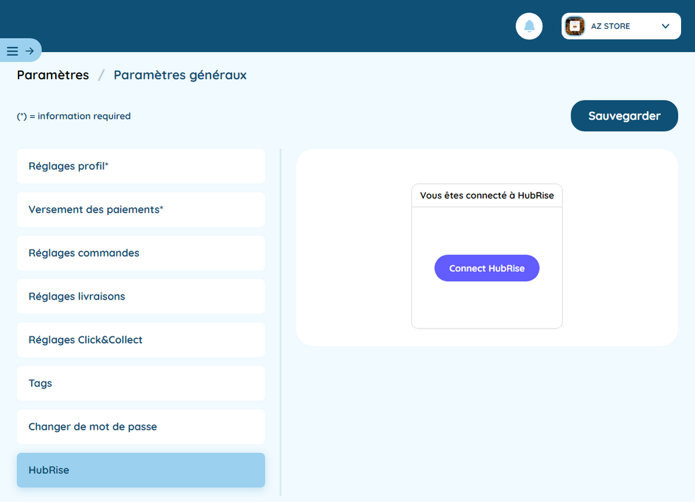

---

**REMARQUE IMPORTANTE :** Si vous ne possédez pas encore de compte HubRise, commencez par en ouvrir un sur la [page d'inscription à HubRise](https://manager.hubrise.com/signup). L'inscription ne prend que quelques minutes !

---

Seuls les utilisateurs administrateurs peuvent accéder à cette fonctionnalité. Si ce n'est pas votre cas, contactez le support de Hop Delivery.

## Connecter Hop Delivery

Pour établir la connexion entre Hop Delivery et HubRise :

1. Depuis le back office Hop Delivery, dans le menu de gauche, cliquez sur **Paramètres**, puis sur **HubRise**.
   
2. À droite, cliquez sur le bouton **Connecter HubRise**. La page HubRise s'ouvre dans votre navigateur.
3. Si vous avez plusieurs points de vente, choisissez le point de vente à connecter. Si le point de vente sélectionné possède plusieurs listes de clients ou catalogues, cliquez sur **Suivant** pour afficher les listes déroulantes correspondantes, puis sélectionnez les options voulues.
4. Cliquez sur **Autoriser**.

## Déconnecter Hop Delivery

Pour déconnecter Hop Delivery de HubRise, suivez ces étapes :

1. Depuis le back office Hop Delivery, dans le menu de gauche, cliquez sur **Paramètres**, puis sur **HubRise**.
   
2. À droite, cliquez sur le bouton **Déconnecter**.
