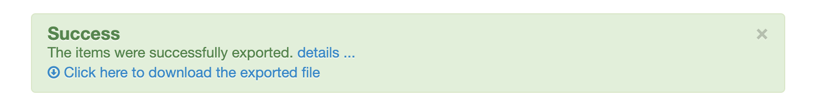

iKentoo Bridge is a _push-only_ integration. For this reason, when you connect a delivery platform or an online ordering solution to iKentoo via HubRise, you must manually set the same ref codes you use on iKentoo to ensure a smooth communication among all the integrations.  
To correctly receive orders from delivery platforms, you also need to create special items on iKentoo.

## Finding ref codes

To find the ref codes for specific items, follow these steps.

- From your iKentoo back office, select **Configuration**, then select **Items** > **Items**.
- The ref codes appear under the **Code** column.
  

You can then copy the codes in the connected app. For detailed instructions, follow the steps in the connected app's documentation in the HubRise website.

## Exporting iKentoo Menus

In some cases, it is useful to download the menu from your iKentoo account to manage the items and the ref codes with a separate software.

To export the iKentoo menu, follow these steps.

- From your iKentoo back office, select **Configuration**, then select **Items** > **Items**.
- Click the **Export** button.
  
- In the popup window, choose your operating system type: Mac or Windows (or Manual configuration), then click **Export**.
- After the export is complete, select **Click here to download the exported file** to download the CSV file with your menu.
  

To check the ref codes for the items, you can open the downloaded CSV file in Excel or a text editor. The ref codes appear under the **SKU** column.

## Creating Ref Codes for Delivery Platforms

If you connect iKentoo to delivery platforms such as Deliveroo, Uber Eats, and Just Eat, you need to create special service types, payments, charges, and discounts for every delivery platform you support.
To simplify troubleshooting, we recommend that you use the specific codes provided in the page [Integrating with delivery platforms](/apps/ikentoo-lightspeed/food-ordering-platforms).

To create the ref codes in your iKentoo account, you have these two options:

1. You can contact Lightspeed support and ask them to include the codes in your back office for you.
2. You can include these codes in your back office autonomously. In this case, follow the procedures below.

### Creating Service Types in iKentoo

Service types are known as _account profiles_ on iKentoo. To create a service type for a delivery platform, follow these steps.

1. From your iKentoo back office, select **Configuration**, then select **Settings** > **Account profiles**.
1. Click **Add an account profile**, then click **OK**.
1. In the **Base options** section, specify the ref code for your service type in the **Code** field.
1. Fill in the other sections in the page as needed, then click **Save**.
1. Repeat the process for all the service types you support for each delivery platform.

### Creating Discounts in iKentoo

To create a discount for a delivery platform, follow these steps.

1. From your iKentoo back office, select **Configuration**, then select **Settings** > **Discounts**.
1. Click **Add a discount**.
1. In the **Add new discount** page, specify the discount code in the first field.
1. Fill in the other sections in the page as needed, then click **Save**.
1. Repeat the process for all the discounts you support for each delivery platform.

### Creating Charges in iKentoo

To create a charge for a delivery platform, you need to create an item by following these steps.

1. From your iKentoo back office, select **Configuration**, then select **Items** > **Items**.
2. Click **Add item**.
3. Next to **Sku**, select **Click here to add your custom SKU manually**.
4. A field appears where you can include the ref code for your charge.
5. For **Price structure**, make sure you select **Single price** from the dropdown menu.
6. Fill in the other sections in the page as needed, then click **Save**.
7. Repeat the process for all the charges you support for each delivery platform.

### Creating Payment Methods in iKentoo

To create a payment method for a delivery platform, follow these steps.

1. From your iKentoo back office, select **Configuration**, then select **Settings** > **Payment methods**.
1. Click **Add a payment method**.
1. In the **Add new payment method** page, specify the code for your payment method in the **Code** field.
1. Fill in the other sections in the page as needed, then click **Save**.
1. Repeat the process for all the payment methods you support for each delivery platform.
