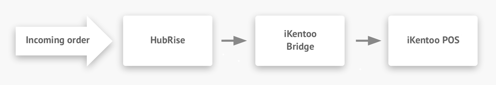

## Description

iKentoo Bridge is an app developed by HubRise that allows the communication between HubRise and the iKentoo EPOS.

## Integration features

iKentoo Bridge can forward any order from HubRise to iKentoo. These orders could come from online ordering solutions, self-ordering kiosks, online food ordering and delivery platforms or any other such solution connected to your HubRise account.

iKentoo Bridge also provides a user interface to see the requests sent to the EPOS and responses received. For more technical details about API requests and related responses, see the [HubRise documentation](/docs/hubrise-logs/).

iKentoo Bridge is a one-way connection from HubRise to the EPOS (push only integration). This means that information only flows from HubRise to the EPOS, not vice versa.

Therefore, iKentoo Bridge cannot transfer the menu from the EPOS to HubRise, which must then be inserted with a manual process in the online ordering system. For more information, see [Mapping EPOS Codes](/apps/ikentoo/mapping-pos-codes). Furthermore, it cannot transfer orders placed on the EPOS back to HubRise.

