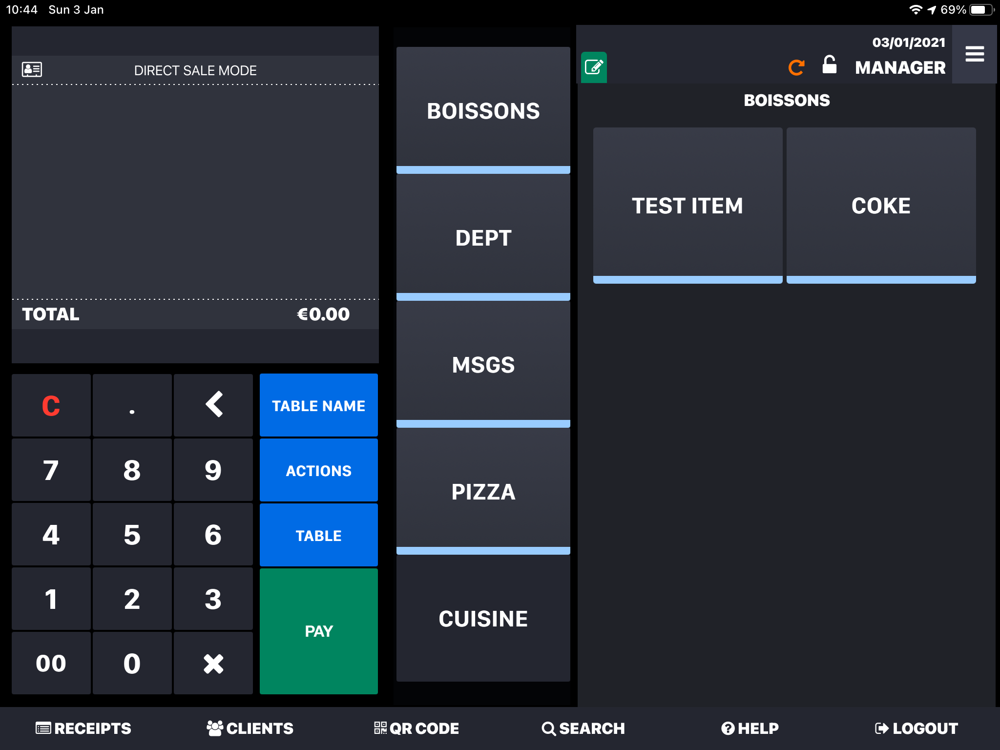

---

**IMPORTANT NOTE**: Lightspeed K Series was formerly known as iKentoo. iKentoo Bridge will soon be renamed Lightspeed Bridge to align with the new name.

---

There might be different reasons why an order is not successfully transferred to your Lightspeed Restaurant (K Series) EPOS. In this page, we discuss some of the typical cases.

## Incorrect Ref Codes

If you receive orders from a connected app, for example a food delivery platform, you need to make sure that ref codes are properly configured there. An incorrect ref code in your food delivery platform menu can cause a whole order to be rejected by the Lightspeed Restaurant (K Series) EPOS.

To troubleshoot an incorrect ref code in an order, you can look at the logs for iKentoo Bridge:

- Open the **CONNECTIONS** page: https://manager.hubrise.com/connections.
- Click **OPEN** next to the iKentoo Bridge connection. This opens a new window with all your recent orders.
- In the list, find the order you had an issue with.
- Click the corresponding row and identify the transaction coming from Lightspeed, that is the one whose direction is "iKentoo -> Bridge".
- In the request boby, if you see `FAILURE` as the status value and `Could not add item <id> (not found)` as the reason for the error, then the order rejection is probably due to an incorrect ref code in your integrated app. The `<id>` value in the error message will indicate the problematic item.

If you recently migrated from Deliverect to HubRise, some ref codes in your online ordering platforms menus might be incorrect due to how Deliverect exports menus. For more details on this issue and how to solve it, see our [FAQ about migrating from Deliverect](/apps/ikentoo-lightspeed/faqs/migrating-from-deliverect/).

## API Activation in the Tablet

To connect with Lightspeed Restaurant (K Series), the Lightspeed API needs to be activated. You can simply contact Lightspeed support and request the activation.
If you plan to connect Lightspeed Restaurant (K Series) to food delivery platforms like Deliveroo, Uber Eats, and Just Eat, it is best to specify the platforms you will be connecting with. Lightspeed support will prepare the settings to receive this type of orders, too.

If after this configuration you are still not able to receive orders in your tablet, you should check if the API connection is enabled on your tablet. On the main screen of the Lightspeed app, if you see a green pencil icon <InlineImage width="28" height="28"></InlineImage> at the top, then your API connection is activated. If that icon is not green, you can simply tap on it and tap the **Enable** button to activate the API.

