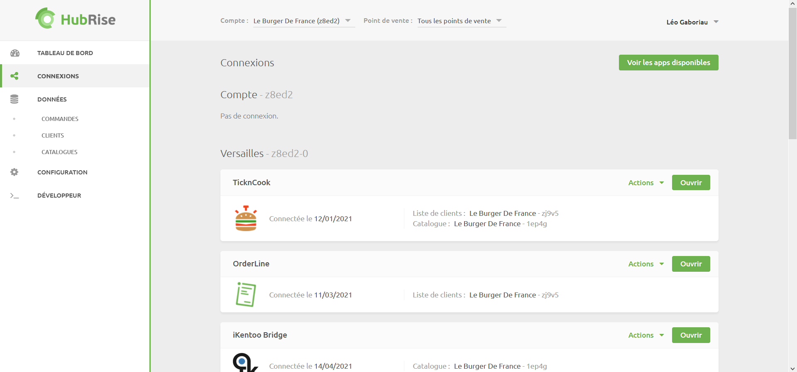
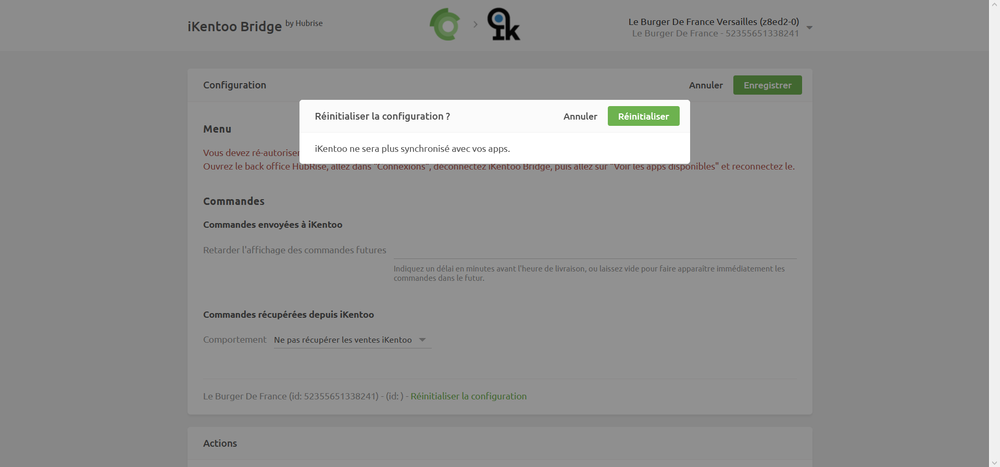
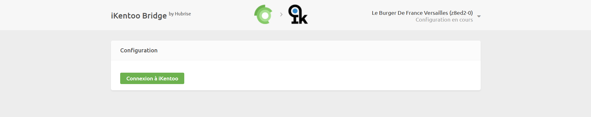
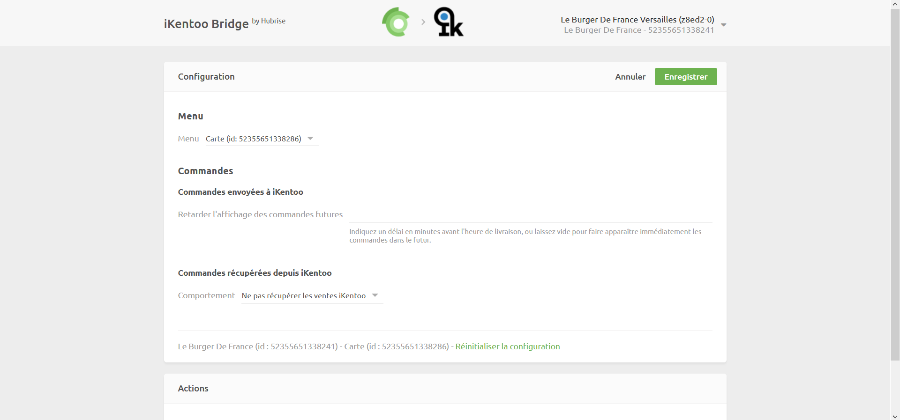

Pour profiter des fonctionnalités offertes par la nouvelle intégration avec iKentoo by Lightspeed, telles que la synchronisation de catalogue ou la remontée des commandes depuis votre caisse, vous devez mettre à jour iKentoo Bridge. Pour cela, suivez les étapes suivantes.

## Reconnexion de l'app iKentoo Bridge

1. Depuis votre espace HubRise, sélectionnez **CONNEXIONS**.
   

1. Cliquez sur le menu déroulant **Actions** au niveau de la connexion **iKentoo Bridge**, puis sélectionnez **Déconnecter**.

1. Cliquez sur **Voir les apps disponibles**, cliquez sur l'app **iKentoo Bridge**, puis cliquez sur **Connecter** et suivez les étapes indiquées.

Pour plus d'informations, consultez les pages [Déconnecter une app](/docs/connections/#disconnect-app) et [Connecter une nouvelle app](/docs/connections/#connecting-a-new-app) (en anglais).

## Reconnexion de votre compte Lightspeed

1. Depuis votre espace HubRise, sélectionnez **CONNEXIONS**.

1. Cliquez sur **Ouvrir** au niveau de la connexion **iKentoo Bridge**. L'app iKentoo Bridge s'ouvre dans un nouvel onglet de votre navigateur.
   

1. Dans le menu déroulant situé en haut à droite, sélectionnez **Configuration**.
   

1. Cliquez sur **Réinitialiser la configuration**.
   

1. Cliquez sur **Réinitialiser**.
   

1. Cliquez sur **Connexion à iKentoo**. Si vous êtes redirigé vers votre espace Lightspeed, munissez-vous de vos identifiants et connectez-vous à votre compte Lightspeed.
   

1. Sélectionnez votre établissement et cliquez sur **Enregistrer**.
   
   
1. (Optionnel) Si vous souhaitez synchroniser votre menu Lightspeed, sélectionnez un menu dans la section **Menu**. 

1. (Optionnel) Si vous souhaitez remonter les commandes Lightspeed vers HubRise, sélectionnez **Récupérer les ventes payées d'iKentoo** dans la section **Commandes récupérées depuis iKentoo**.
   

1. Cliquez sur **Enregistrer**.

Si vous possédez plusieurs points de vente, répétez les étapes ci-dessus pour chacun d'entre eux.
