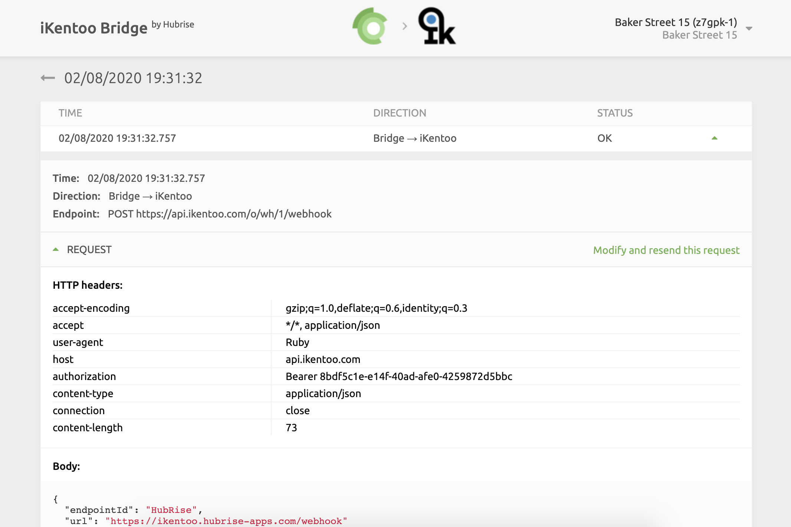

## Setup

iKentoo Bridge connects your iKentoo POS (Lightspeed Restaurant K Series) to a HubRise location. You must set up a connection for each of the locations you want to connect.

To connect iKentoo to a specific location:

1. Open your HubRise back office and click the down arrow <InlineImage width="28" height="21"></InlineImage> next to **Location** to select the location you want to connect. For help, check the HubRise User Guide > [Accounts](/docs/account) and [Locations](/docs/locations).

2. Select **CONNECTIONS** > **View available apps**.

3. Select iKentoo Bridge from the list of apps.

4. Click **Connect**.

5. Allow iKentoo Bridge permission to access your location registered in HubRise. For accounts with multiple locations, expand the **Choose location** section to select the correct one and **click** on **Allow**. If you have multiple customer lists, you will also be prompted to confirm the one you wish to use.

6. You will be redirected to the iKentoo Bridge user interface. Click **Connect to iKentoo** button.

7. The first time you connect, you will be redirected to iKentoo login page. Specify your iKentoo **Email** and **Password** and click **LOGIN**.

8. Once you are authorized in iKentoo, the **Configuration** page will appear.

   - In the **Business location** dropdown, select the iKentoo business location to connect.
   - Click **Save**.

9. You have now connected iKentoo to your HubRise location.

---

## User Interface

The user interface for the iKentoo Bridge provides basic diagnostic information about your connection. It also provides a link to the logs of the latest HubRise requests sent to the POS.

### Main page

The main page of iKentoo Bridge displays the latest operations. Each row shows:

- **TIME**: The date and time of the operation.
- **STATUS**: The status of the operation. The value OK indicates that the operation has been successfull, otherwise a message will explain the type of error occurred.

Clicking on an row will open a new page displaying all the information about it.

On the top right corner of the iKentoo Bridge main page, the HubRise user and location connected are displayed, together with the iKentoo business location currently used. Clicking the down arrow <InlineImage width="28" height="21"></InlineImage> expands a menu where it is possible to change the language of the interface and to access the **Configuration page**.

---

**IMPORTANT NOTE**: The first time you access the logs from iKentoo Bridge, you will be asked to **Allow** the Bridge to access the information on your HubRise account.

---

### Operation page

Selecting an operation from the list will display all the logs of the API requests exchanged between HubRise and the iKentoo POS via the iKentoo Bridge.

Requests are ordered with the latest on top, and each of them displays the following information:

- **TIME**: The date and time the order was placed.
- **DIRECTION**: The apps sending and receiving the request, in the format Origin → Destination.
- **STATUS**: The status of the request. The value **OK** indicates that the request has been successfully received, otherwise a message will explain the type of error occurred.
  **Clicking** on a request will expand it to reveal the detailed logs of the request and its response. Logs are a powerful debugging tool in case of issues. To understand in detail how to read logs, see the [HubRise documentation](/docs/hubrise-logs/).

## Configuration page

In the **Configuration page**, it is possible to change the iKentoo business location associated with the HubRise location.

