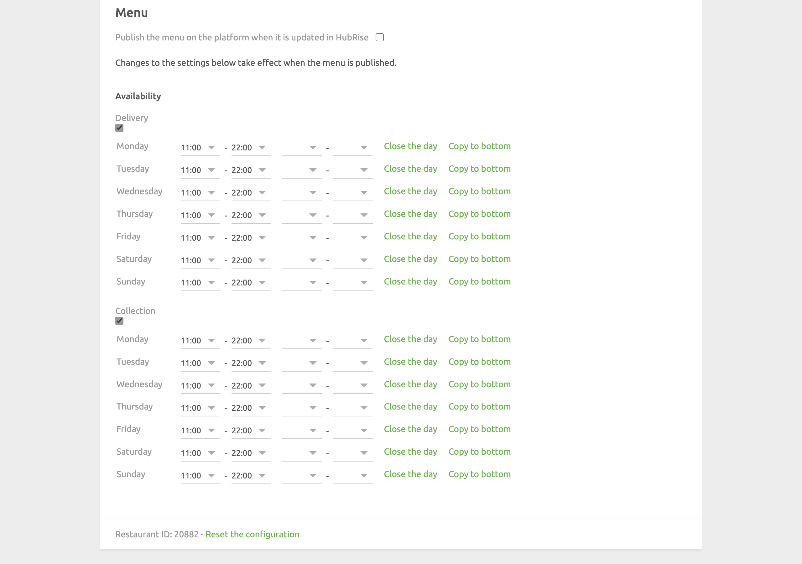

The configuration page allows you to customise the behaviour of Just Eat Flyt Bridge based on your preferences.
These are divided into different sections for an easier navigation.

## Language

Choose the language to use for generic items such as `Delivery charge`. These names may appear in your EPOS and in customer receipts.

## Orders

### Service Types

Service types such as platform delivery, restaurant delivery or takeaway might require the corresponding ref code entry. Refer to your EPOS documentation on the HubRise website to verify.

Additionally, from this section you can choose to mark Just Eat orders as delivery orders or collection orders.
This is useful if you have specific business requirements for financial reporting.

### Discounts

In this section, include the ref code associated with Just Eat discounts on your EPOS.
Refer to your EPOS documentation on the HubRise website to know how to handle discounts in your EPOS.

### Charges

If charges apply, a ref code might be required. Refer to your EPOS documentation on the HubRise website to verify.

In this section, you can specify the ref codes for the following charges:

- Delivery charge
- Service charge
- Bag fee
- Driver tip
- Other charge

### Payments

Just Eat customers can pay for their order either online or by cash for restaurant delivery orders.

This section of the configuration page allows you to specify the ref codes for these two payment methods. Refer to your EPOS documentation on the HubRise website to verify the correct codes to use.

## Customers

Enable the **Duplicate phone access code in delivery notes** option if your EPOS lacks native support for fetching phone access codes.

All EPOS systems integrated with HubRise can read delivery notes. If your EPOS has native support and this option is enabled, the code will appear duplicated. Refer to your EPOS documentation on the HubRise website to verify the correct value.

## Catalog {#catalog}

Select the **Enable automatic catalog push** checkbox to synchronise your HubRise catalog with Just Eat whenever it gets updated.

### Opening Hours

In the **Opening hours** section, you can choose to make your products available for delivery, collection, or both.

For each day of the week, set the opening and closing times of your store by specifying one or two time shifts. Customers will not be able to order from your Just Eat store outside of these time windows.

If your restaurant is closed on a specific day, click **Close the day**.
To quickly copy opening hours to all the following days on the list, click **Copy to bottom**.

---

**IMPORTANT NOTE:** By default, closing times for delivery will be set half an hour earlier on the Just Eat store than the value you set on Just Eat Flyt Bridge. Closing times for collection, instead, are not modified.

---

## Inventory

Through inventory synchronisation, products and options that have a stock quantity of zero can be hidden can be hidden on your Just Eat store.

Select the **Enable automatic inventory push** checkbox to synchronise your HubRise inventory with Just Eat whenever it gets updated.

## Save the Configuration

To save the configuration, click **Save** at the top of the page.

## Reset the Configuration

If you need to reset the configuration, click **Reset the configuration** at the bottom of the page.

---

**IMPORTANT NOTE:** Resetting the configuration will instantly disconnect the bridge from Just Eat. You will need your Just Eat API keys and restaurant ID to reestablish the connection.

---

Resetting the configuration does not delete the operation logs displayed in the main page.
