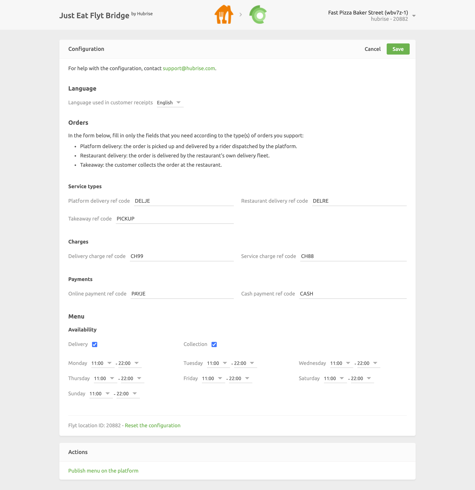

The configuration page allows you to customise the behaviour of Just Eat Flyt Bridge based on your preferences.
These are divided into different sections for an easier navigation.

## Language

From this section, you can decide which language is used to localise your receipts.

## Service Types

Service types such as delivery by Just Eat, restaurant delivery or takeaway might require the corresponding ref code entry. Refer to your connected EPOS documentation on the HubRise website to verify.

## Charges

If charges apply, a ref code might be required. Refer to your connected EPOS documentation on the HubRise website to verify.

In this section, you can specify the ref code for delivery charges, and for the Just Eat surcharge applied to orders.

## Payments

Just Eat customers can pay for their order either online or by cash for restaurant delivery orders.

This section of the configuration page allows you to specify the ref codes for these two payment methods. Refer to your connected EPOS documentation on the HubRise website to verify the correct codes to use.

## Menu Availability

From this section, you can customise the availability of your Just Eat menu. For more information, see [Updating the Menu](/apps/just-eat-flyt/pulling-menu#availability).

## Saving the Configuration

Once you are happy with the configuration of Just Eat Bridge, click **Save** at the top of the page to go back to the Operations page.

## Pulling the Menu

Make sure you save the configuration to use the latest [Menu Availability](#menu-availability) options.

To pull your HubRise catalog into Just Eat, from the **Actions** section at the bottom of the page, select **Publish menu on the platform**. For more information on how HubRise catalogs are mapped to Just Eat, see [Pulling the Menu](/apps/just-eat-flyt/pulling-menu).

---

**IMPORTANT NOTE:** Pulling the HubRise catalog into Just Eat will erase your current menu on your Just Eat store. This action cannot be reverted.

---

## Resetting the Configuration

If you want to reset the configuration and erase its values, click **Reset the configuration** at the bottom of the page.

---

**IMPORTANT NOTE:** Resetting the configuration will also erase your integration settings. To continue receiving Just Eat orders, you will need to enter your integration settings again.

---

Resetting the configuration does not remove the operation logs displayed in the main page.
