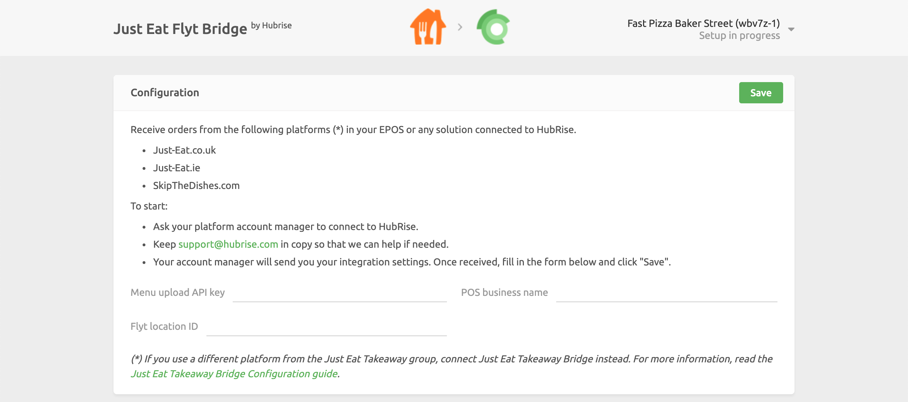

Connecting Just Eat to HubRise can be done with a few simple steps.

---

**IMPORTANT NOTE:** If you don't already have a HubRise account, start by registering on the [HubRise Signup Page](https://manager.hubrise.com/signup). It only takes a minute!

---

## 1. Enable the API integration

As a first step, you need to contact your Just Eat account manager and ask them to activate the Flyt API for your stores.
Include [support@hubrise.com](mailto:support@hubrise.com) in the email recipients and add the following information in your email:

- The URL link of the Just Eat store you wish to connect. For example: [https://www.just-eat.ie/restaurants-saba-to-go-rathmines/](https://www.just-eat.ie/restaurants-saba-to-go-rathmines/).
- Your HubRise location name and identifier. For example: `Fast Pizza Baker Street z6q31-0`.

With this information in hand, Flyt integration team will enable the HubRise integration for your store and provide you with the required credentials to connect.

## 2. Connect the Bridge

---

**IMPORTANT NOTE:** Just Eat Flyt Bridge connects to HubRise at the location level. For more information, see [Locations](/docs/locations/).

---

To connect Just Eat Flyt Bridge to HubRise, follow these steps.

1. Log in to your HubRise account.
1. Select the location you want to connect from the dropdown menu.
1. Select **CONNECTIONS**, then **View available apps**.
1. Select **Just Eat Flyt Bridge** from the list of apps.
1. Click **Connect**.
1. Click **Allow** to grant Just Eat Flyt Bridge permission to access the location of your restaurant registered in HubRise. For accounts with multiple locations, expand the **Choose location** section to select the correct one first, and then click **Allow**.
1. A new page asks you to provide your Just Eat credentials:
   - The API key for uploading the menu
   - The POS business name
   - Flyt location ID
   Enter the credentials in the page, then click **Save** to complete the connection process.

## 3. Configure Your Preferences

After connecting the bridge, you need to configure a few parameters on the Configuration page to send orders correctly to your EPOS.

For more information about the Configuration page and how to navigate to it, see [User Interface](/apps/just-eat-flyt/user-interface/#configuration-page). For details on how to configure the parameters of Just Eat Flyt Bridge, see [Configuration](/apps/just-eat-flyt/configuration).

## 4. Upload Your Menu

If you have a catalog of products on HubRise, you can upload it to your Just Eat store with a single click. 

For more information on HubRise catalogs, see [Catalogs](/docs/catalog/).
To learn how to pull your HubRise catalog into Just Eat, see [Pulling the Menu](/apps/just-eat-flyt/configuration#pulling-the-menu).
