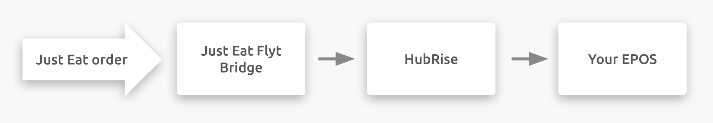
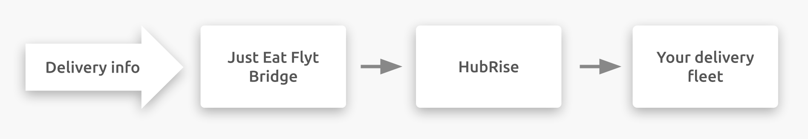
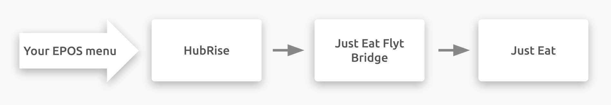

## Description

Just Eat is an online food ordering and delivery service platform for restaurants and convenience stores. Customers can order food online or via a mobile app. The Just Eat headquarters is based in the United Kingdom, but the company operates in 13 different countries in Europe, Asia, America, and Oceania.

In the UK, Ireland and Canada, Just Eat connects to your HubRise account through Just Eat Flyt Bridge, an app developed by HubRise.

## Available Platforms

Just Eat Flyt Bridge allows you to connect to HubRise the following platforms:

- Just-Eat.co.uk
- Just-Eat.ie
- Menulog.com.au
- SkipTheDishes.com

---

**IMPORTANT NOTE:** If you wish to connect a store of the Just Eat Takeaway chain outside Ireland or the United Kingdom, you should use [Just Eat Takeaway Bridge](/apps/just-eat-takeaway/) instead.

---

## Integration Features

Connecting Just Eat Flyt Bridge allows you to:

- Push orders into HubRise, including order status.
  
- Push delivery information into HubRise, for orders delivered by your restaurant.
  
- Pull the menu from a HubRise catalog directly into your Just Eat store.
  

Just Eat Flyt Bridge can be connected to HubRise from the HubRise back office.

## Why Connect?

Connecting your Just Eat online restaurant or convenience store to HubRise allows you to receive Just Eat orders directly in your EPOS, your Kitchen Display System or your Delivery Management System also connected with HubRise.
You will be able to manage Just Eat orders alongside other orders, using tools you use every day. Just Eat orders will flow through your existing setup, as all other orders already do.

Via HubRise, synchronise your menu, your customer and order information with your EPOS, online ordering, food delivery platforms (including Deliveroo, Uber Eats and Just Eat), delivery management, delivery services, eMarketing (SMS/emailing), business intelligence, stock management, loyalty systems, and more. The number of compatible applications increases every month. To see which apps you can connect, see our [Apps page](/apps).

## Prerequisites

To establish a connection between Just Eat and HubRise via Just Eat Flyt Bridge, your restaurant must be a Just Eat partner with a store in Ireland or in the United Kingdom.
