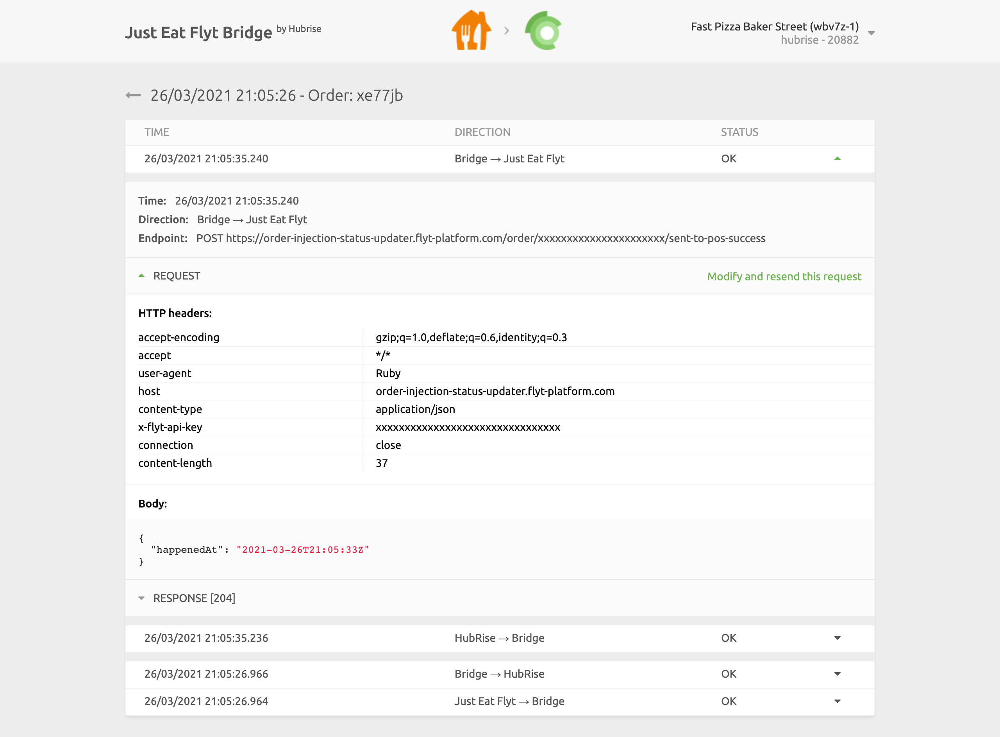
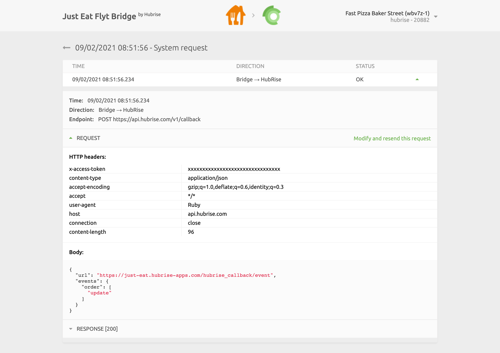
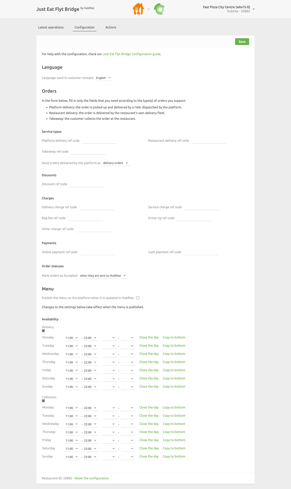

From Just Eat Flyt Bridge, you can read the logs of all the operations between HubRise and Just Eat, and access the configuration settings of the integration.

## Latest Operations

This is the default page when you open Just Eat Flyt bridge. It displays the latest API operations between HubRise, Just Eat, and Just Eat Flyt Bridge.

Operations can either be related to a specific order, or be generic system requests performed by Just Eat Flyt Bridge.

Each row in the page shows the following information about an operation:

- **TIME**: The date and time of the order.
- **ORDER**: The HubRise order ID, for order operations.
- **DESCRIPTION**: An optional description for operations that are not related to a specific order. It could be empty, or inform of a `System request` or a `Catalog push`.
- **STATUS**: The status of the order. The value `OK` indicates that the order has been successfully sent, otherwise an error code will be displayed in red.

Clicking on a row will open a new page displaying the logs associated with the operation.

### Order Operation

Selecting an order operation from the list in the main page will display all the logs of the API requests exchanged between HubRise and Just Eat via Just Eat Flyt Bridge.

Requests are ordered with the latest on top, and those related to the same order event (order received, order cancelled, etc.) are visually grouped together.

Each row in the logs displays the following information:

- **Time**: The date and time the request was sent.
- **Direction**: The apps sending and receiving the request, in the format Origin → Destination.
- **Endpoint**: The status of the request. The value `OK` indicates that the request has been successfully received, otherwise a message will explain the type of error occurred.

Clicking on a request will expand it to reveal the detailed logs of the request and its response.

Logs are a powerful debugging tool in case of issues. To understand in detail how to read logs, see [Understanding HubRise Logs](/docs/hubrise-logs/overview).

### System Request Operation

The layout of a system request page is identical to that of an order page.

System requests are generally sent by Just Eat Flyt Bridge to notify HubRise about a change in the configuration or to fetch the most up-to-date information. As an example, the following image displays a request to update the Just Eat Flyt Bridge callback after a configuration change.

System request pages can provide useful debugging insights to support teams, but are rarely of interest to other users.

## Configuration {#configuration}

To access the Just Eat Flyt Bridge configuration page, click **Configuration** at the top of the screen.

From this page, you will be able to customise the behaviour of Just Eat Flyt Bridge. For more details, see [Configuration](/apps/just-eat-flyt/configuration).

## Actions

To access the actions page, click **Actions** at the top of the screen. If the link is not visible, first complete the configuration of Just Eat Flyt Bridge.

From the actions page, you can perform the following actions:

- **Push Catalog**: Push the catalog to Just Eat. For more details, see [Push Catalog](/apps/just-eat-flyt/push-catalog).
- **Push Inventory**: Push your HubRise inventory to Just Eat.

## Language and Navigation

In the top right corner of the screen, you can click on the arrow <InlineImage width="20" height="20"></InlineImage> to expand the menu. From there, you can change the language of the page to English or French.

Clicking on the Just Eat and HubRise logos on top of any page of Just Eat Flyt Bridge will bring you back to the **Latest Operations** page.
