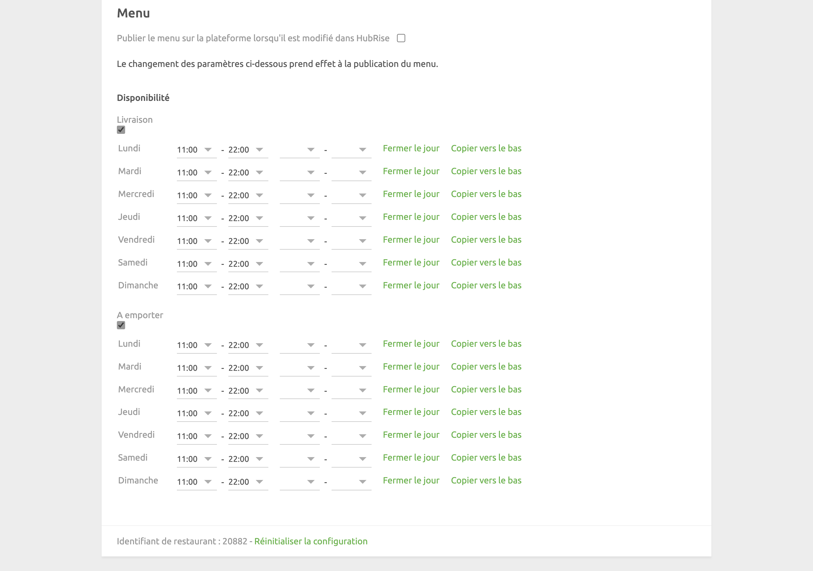

Cette page de configuration vous permet de personnaliser le comportement de Just Eat Flyt Bridge selon vos préférences. Elle est divisée en plusieurs sections pour faciliter la navigation.

## Langue

Dans cette section, vous pouvez choisir la langue d'édition de vos reçus.

## Commandes

### Types de service

Les types de service tels que la livraison via la plateforme, la livraison par le restaurant ou la vente à emporter peuvent nécessiter la saisie du code ref correspondant. Reportez-vous à la documentation de votre logiciel de caisse sur le site internet de HubRise.

Cette section vous permet également de marquer les commandes Just Eat comme étant à livrer ou à emporter. Cette option est utile si vous votre entreprise est soumise à des exigences spécifiques en matière de rapports financiers.

### Remises

Dans cette section, incluez le code ref associé aux remises Just Eat dans votre logiciel de caisse. Pour savoir comment gérer les remises dans votre logiciel de caisse, reportez-vous à la documentation de celle-ci sur le site internet de HubRise.

### Frais

Si des frais s'appliquent, un code ref peut être nécessaire. Reportez-vous à la documentation de votre logiciel de caisse sur le site internet de HubRise.

Dans cette section, vous pouvez spécifier les codes ref relatifs aux frais suivants :

- Frais de livraison
- Frais de service
- Frais d'emballage
- Pourboire pour le livreur
- Autres frais

### Paiements

Les clients de Just Eat peuvent régler leur commande en espèces lorsque le restaurant prend en charge la livraison.

Cette section de la page de configuration permet de spécifier les codes ref pour les paiements en ligne et en espèces. Pour connaître les codes à utiliser, consultez la documentation de votre logiciel de caisse sur le site internet de HubRise.

## Catalogue {#catalog}

Cette section vous permet de pousser votre catalogue HubRise dans Just Eat chaque fois que vous actualisez le catalogue HubRise. Par défaut, cette option est désactivée.

### Heures d'ouverture

Dans la section **Heures d'ouverture**, vous pouvez choisir de rendre vos produits disponibles pour la livraison, la vente à emporter ou pour ces deux options.

Pour chaque jour de la semaine, définissez les horaires d'ouverture et de fermeture de votre enseigne en spécifiant une ou deux tranches horaires. En dehors de celles-ci, les clients ne pourront pas passer de commandes dans votre enseigne Just Eat.

Si votre restaurant est fermé un jour précis, cliquez sur **Fermer le jour**. Pour copier rapidement les horaires d'ouverture sur tous les jours suivants de la liste, cliquez sur **Copier vers le bas**.

---

**REMARQUE IMPORTANTE** : par défaut, les heures de fermeture pour les livraisons sont fixées une demi-heure plus tôt dans Just Eat par rapport à la valeur que vous avez spécifiée dans Just Eat Flyt Bridge. Les heures de fermeture pour la vente à emporter, en revanche, restent inchangées.

---

## Enregistrer la configuration

Lorsque vous êtes satisfait de la configuration de Just Eat Bridge, cliquez sur **Enregistrer** en haut de la page pour revenir à la page Dernières opérations.

## Réinitialiser la configuration

Si vous souhaitez réinitialiser la configuration et effacer ses valeurs, cliquez sur **Réinitialiser la configuration** en bas de la page.

---

**REMARQUE IMPORTANTE :** la réinitialisation de la configuration effacera également vos paramètres d'intégration. Pour continuer à recevoir les commandes Just Eat, vous devrez les saisir à nouveau.

---

La réinitialisation de la configuration ne supprime pas les fichiers journaux des opérations affichés sur la page principale.
