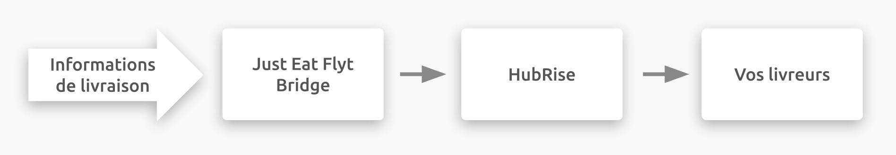
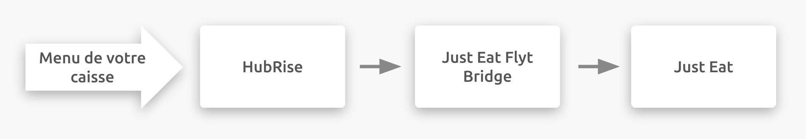

---

**REMARQUE IMPORTANTE :** La documentation complète est disponible <Link to="/apps/just-eat-flyt" addLocalePrefix={false}>en anglais uniquement</Link>.

---

## Description

Just Eat est une plateforme de services de commande et de livraison de repas en ligne destinée aux restaurants et aux commerces de proximité. Les clients peuvent commander des plats sur Internet ou via une application mobile. Le siège de Just Eat est situé au Royaume-Uni, mais l'entreprise est présente dans 13 pays différents en Europe, en Asie, en Amérique et en Océanie.

Au Royaume-Uni, en Irlande et au Canada, Just Eat se connecte à votre compte HubRise via l'application Just Eat Flyt Bridge développée par HubRise.

## Plateformes disponibles

Just Eat Flyt Bridge vous permet de vous connecter à HubRise sur les plateformes suivantes :

- Just-Eat.co.uk
- Just-Eat.ie
- Menulog.com.au
- SkipTheDishes.com

---

**REMARQUE IMPORTANTE :** Pour connecter un magasin hébergé sur une autre plateforme de Just Eat Takeaway.com, vous devez passer par l'application [Just Eat Takeaway Bridge](/apps/just-eat-takeaway/).

---

## Fonctionnalités de l'intégration

La connexion avec Just Eat Flyt Bridge vous permet de :

- Envoyer les commandes à HubRise, en incluant le statut des commandes. 
- Recevoir les informations de livraison dans HubRise, lorsque les commandes sont livrées par votre restaurant. 
- Extraire la carte dans un catalogue HubRise et l'incorporer directement à votre magasin Just Eat. 

---

**REMARQUE IMPORTANTE :** La tablette Just Eat doit rester allumée pour recevoir les commandes dans HubRise.

---

Just Eat Flyt Bridge peut être connecté à HubRise depuis le back-office de HubRise.

## Pourquoi se connecter ?

Le fait de connecter votre restaurant en ligne ou votre magasin de proximité Just Eat à HubRise vous permet de recevoir vos commandes Just Eat directement dans votre solution d'encaissement, sur votre système d'écran de cuisine ou dans votre système de gestion de livraison également connecté à HubRise. Vous pouvez ainsi gérer les commandes Just Eat parallèlement à vos autres commandes, en utilisant vos outils habituels. Les commandes Just Eat transiteront par votre installation existante, comme vos autres commandes.

Grâce à HubRise, synchronisez votre menu, vos informations clients et vos commandes avec votre solution d'encaissement, les plateformes de livraison de repas (dont Deliveroo, Uber Eats et Just Eat), les solutions de gestion de livreurs ou de services de livraison, les solutions d'e-marketing (SMS/e-mailing) et de business intelligence, les systèmes de gestion de stock et de fidélisation client, et bien d'autres encore. Le nombre d'applications compatibles augmente chaque mois. Pour voir les applications que vous pouvez connecter, consultez notre [page Apps](/apps).

## Prérequis

Pour établir une connexion entre Just Eat et HubRise via Just Eat Flyt Bridge, votre restaurant doit être un partenaire de Just Eat exploitant un magasin en Irlande ou au Royaume-Uni.
