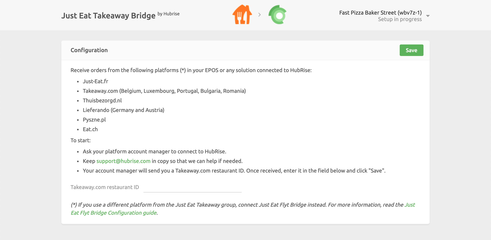

Connecting Just Eat Takeaway to HubRise can be done with a few steps.

---

**IMPORTANT NOTE:** If you do not have a HubRise account yet, register on our [Signup Page](https://manager.hubrise.com/signup). It only takes a minute!

---

## 1. Enable HubRise on Just Eat Takeaway

As a first step, the Just Eat Takeaway support must activate the HubRise integration for your stores.

Contact us at [support@hubrise.com](mailto:support@hubrise.com) and include the following information in your email:

- The URL link to your restaurant page on the Just Eat website. For example: [https://www.just-eat.ie/restaurants-saba-to-go-rathmines/](https://www.just-eat.ie/restaurants-saba-to-go-rathmines/).
- Whether your Just Eat store is already connected to another middleware or EPOS.
- Your HubRise location name and identifier. For example: `Fast Pizza Baker Street z6q31-0`.

With this information in hand, we will ask Just Eat Takeaway support to enable the HubRise connection for your store and provide the Just Eat Takeaway ID, for example: `8736550`.

## 2. Map Products Ref Codes

Most apps require products ref codes to process orders correctly. You can either enter products ref codes manually in the Just Eat Takeaway back office, or ask their support team to enter them for you.

For more information, see [Map Ref Codes](/apps/just-eat-takeaway/map-ref-codes).

## 3. Connect Just Eat Takeaway Bridge

---

**IMPORTANT NOTE:** Just Eat Takeaway Bridge connects to HubRise at the location level. For more information, see [Locations](/docs/locations/).

---

To connect Just Eat Takeaway Bridge to HubRise, follow these steps.

1. Log in to your [HubRise account](https://manager.hubrise.com).
1. Select the location you want to connect from the dropdown menu.
1. Select **CONNECTIONS**, then **View available apps**.
1. Select **Just Eat Takeaway Bridge** from the list of apps.
1. Click **Connect**.
1. Click **Allow** to grant Just Eat Takeaway Bridge permission to access the location of your restaurant registered in HubRise. For accounts with multiple locations, expand the **Choose location** section to select the correct one first, and then click **Allow**.
1. A new page asks you to provide your Just Eat Takeaway Restaurant ID provided by the Just Eat Takeaway support team. Enter the ID, then click **Save** to complete the connection process.

## 4. Configure Your Preferences

After connecting the bridge, you need to configure a few parameters on the **Configuration** page to send orders correctly to your EPOS.

For more information about the configuration page and how to navigate to it, see [Configuration Page](/apps/just-eat-takeaway/user-interface/#configuration-page) in the User Interface section. For details on how to configure the parameters of Just Eat Takeaway Bridge, see [Configuration](/apps/just-eat-takeaway/configuration).
