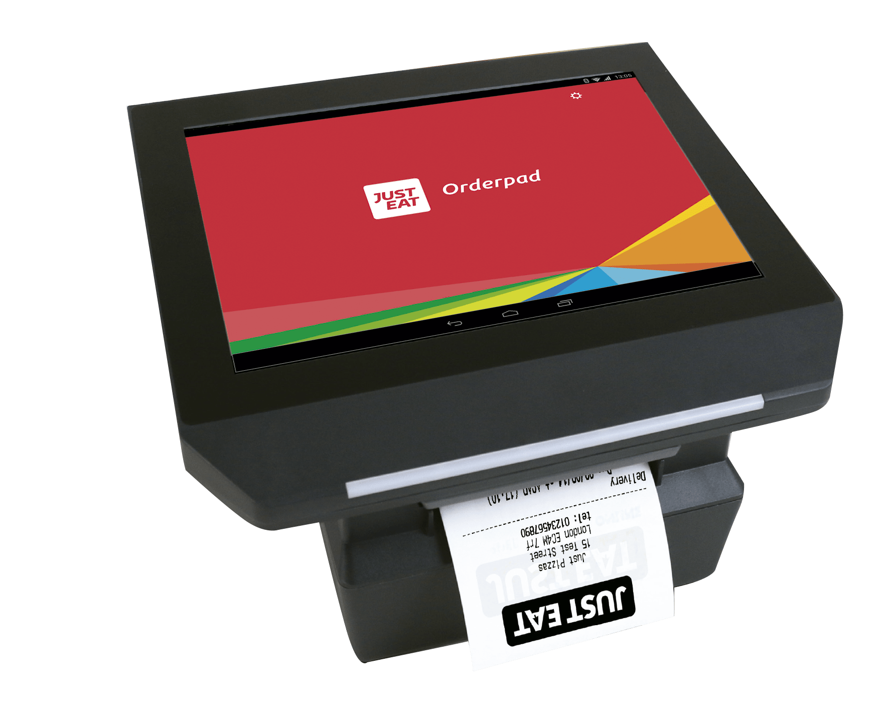
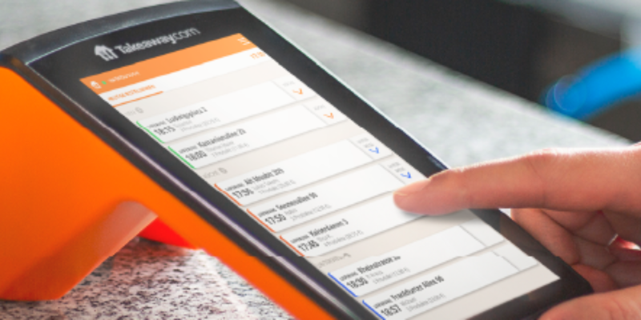

## Just Eat Terms

The following table explains the terms that are specific to Just Eat Takeaway.

| Term      | Description                                                                                |
| --------- | ------------------------------------------------------------------------------------------ |
| Orderpad  | A device with a touch screen and a built-in printer. Phased out and replaced by T-Connect. |
| T-Connect | A portable device, with a printer and display.                                             |

## Orderpad vs T-Connect

If you are not sure which device you use, check the following pictures:

| Orderpad                                                     | T-Connect                                       |
| ------------------------------------------------------------ | ----------------------------------------------- |
|                       |        |
| The Orderpad is a legacy device, still used in some markets. | The T-Connect is a more recent, smaller device. |
