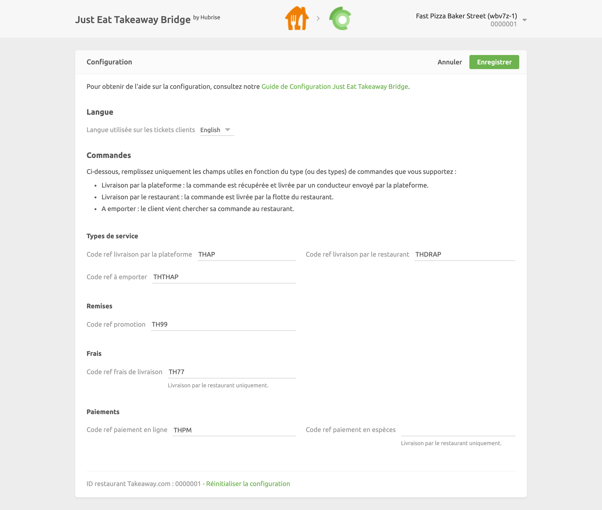

La page de configuration vous permet de personnaliser le comportement de Just Eat Takeway Bridge selon vos préférences. Elle est divisée en plusieurs sections pour faciliter la navigation.

## Langue

Dans cette section, vous pouvez choisir la langue d'édition de vos reçus.

## Types de service

Les types de service tels que la livraison via la plateforme, la livraison par le restaurant ou la vente à emporter peuvent nécessiter la saisie du code ref correspondant. Reportez-vous à la documentation de votre logiciel de caisse sur le site internet de HubRise.

Cette section vous permet également de marquer les commandes Just Eat comme étant à livrer ou à emporter. Cette option est utile si vous votre entreprise est soumise à des exigences spécifiques en matière de rapports financiers.

## Remises

Cette section permet de spécifier le code ref de la remise appliquée à vos produits, dans le cas où vous auriez une remise active sur votre point de vente Just Eat Takeaway. Pour obtenir le code ref correspondant, reportez-vous à la documentation de votre logiciel de caisse sur le site internet de HubRise.

## Frais

Si des frais s'appliquent, un code ref peut être nécessaire. Reportez-vous à la documentation de votre logiciel de caisse sur le site internet de HubRise.

Dans cette section, vous pouvez spécifier le code ref des frais d'expédition appliqués par la plateforme de livraison.

## Paiements

Les clients de Just Eat Takeaway peuvent régler leur commande en espèces lorsque le restaurant prend en charge la livraison.

Cette section de la page de configuration permet de spécifier les codes ref pour les paiements en ligne et en espèces. Pour connaître les codes à utiliser, consultez la documentation de votre logiciel de caisse sur le site internet de HubRise.

## Statuts de commande

Just Eat Takeaway vous demande de marquer chaque commande réussie comme « confirmée ». Cette section vous permet de sélectionner le changement de statut HubRise qui est utilisé pour envoyer la confirmation à Just Eat Takeaway.

## Enregistrer la configuration

Lorsque vous êtes satisfait de la configuration de Just Eat Takeaway Bridge, cliquez sur **Enregistrer** en haut de la page pour revenir à la page Opérations.

## Réinitialiser la configuration

Si vous souhaitez réinitialiser la configuration et effacer ses valeurs, cliquez sur **Réinitialiser la configuration** en bas de la page.

---

**REMARQUE IMPORTANTE :** la réinitialisation de la configuration effacera également vos paramètres d'intégration. Pour continuer à recevoir les commandes Just Eat Takeaway, vous devrez les saisir à nouveau.

---

La réinitialisation de la configuration ne supprime pas les fichiers journaux des opérations affichés sur la page principale.
