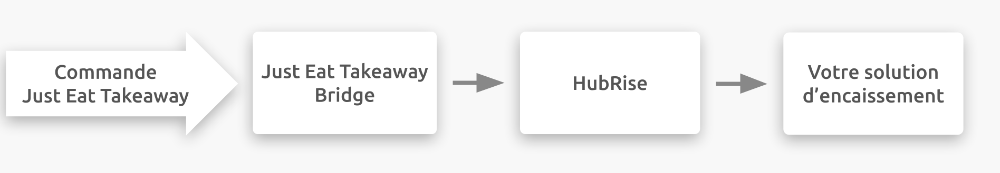

---

**REMARQUE IMPORTANTE :** La documentation complète est disponible <Link to="/apps/just-eat-takeaway" addLocalePrefix={false}>en anglais uniquement</Link>.

---

## Description

Just Eat Takeaway.com est une plateforme de commande en ligne et de livraison pour les restaurants et les commerces de proximité. Les clients peuvent commander sur Internet ou via une application mobile. L'équipe d'assistance à l'intégration est basée aux Pays-Bas, mais l'entreprise opère dans 21 pays différents en Europe, en Asie, en Amérique et en Océanie.

Just Eat Takeaway.com se connecte à votre compte HubRise via l'application Just Eat Takeaway Bridge développée par HubRise.

## Plateformes disponibles

Just Eat Takeaway Bridge vous permet de connecter les plateformes suivantes à HubRise :

- Just-Eat.fr
- Takeaway.com (Belgique, Luxembourg, Portugual, Bulgarie, Roumanie)
- Thuisbezorgd.nl
- Lieferando (Allemagne, Autriche)
- Pyszne.pl
- Eat.ch
- Vietnammm.com

---

**REMARQUE IMPORTANTE :** Pour connecter un magasin hébergé sur une autre plateforme de Just Eat Takeaway.com, vous devez passer par l'application [Just Eat Flyt Bridge](/apps/just-eat-flyt/).

---

## Fonctionnalités de l'intégration

La connexion avec Just Eat Takeaway Bridge vous permet de :

- Envoyer les commandes à HubRise, y compris le statut de la commande.
- Recevoir les informations de livraison dans HubRise, lorsque les commandes sont livrées par votre personnel.

---

**REMARQUE IMPORTANTE:** La tablette Just Eat doit rester allumée pour recevoir les commandes dans HubRise.

---

Just Eat Takeaway Bridge peut être connecté à HubRise depuis le back-office de HubRise.

## Pourquoi se connecter ?

Le fait de connecter votre restaurant en ligne ou votre magasin de proximité Just Eat Takeaway à HubRise vous permet de recevoir vos commandes Just Eat Takeaway directement dans votre solution d'encaissement, sur votre système d'écran de cuisine ou dans votre système de gestion de livraison également connecté à HubRise. Vous pouvez ainsi gérer les commandes Just Eat Takeaway parallèlement à vos autres commandes, en utilisant vos outils habituels. Les commandes Just Eat Takeaway transiteront par votre installation existante, comme vos autres commandes.

Grâce à HubRise, synchronisez votre menu, vos informations clients et vos commandes avec votre solution d'encaissement, les plateformes de livraison de repas (dont Deliveroo, Uber Eats et Just Eat), les solutions de gestion de livreurs ou de services de livraison, les solutions d'e-marketing (SMS/e-mailing) et de business intelligence, les systèmes de gestion de stock et de fidélisation client, et bien d'autres encore. Le nombre d'applications compatibles augmente chaque mois. Pour voir les applications que vous pouvez connecter, consultez notre [page Apps](/apps).

## Prérequis

Pour permettre la connexion entre Just Eat Takeaway et HubRise, votre restaurant doit être partenaire de Just Eat Takeaway.
