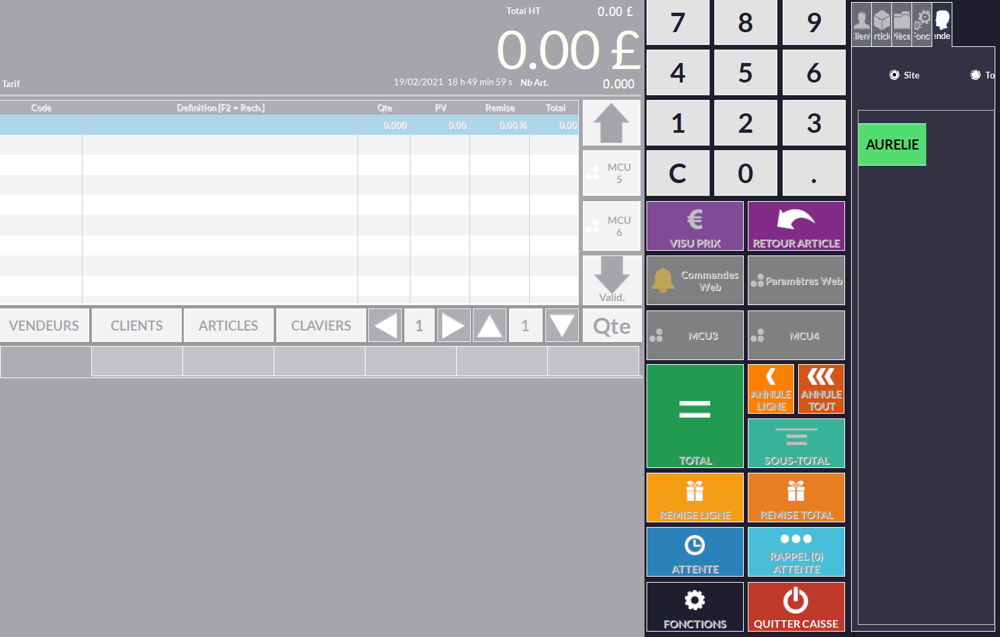
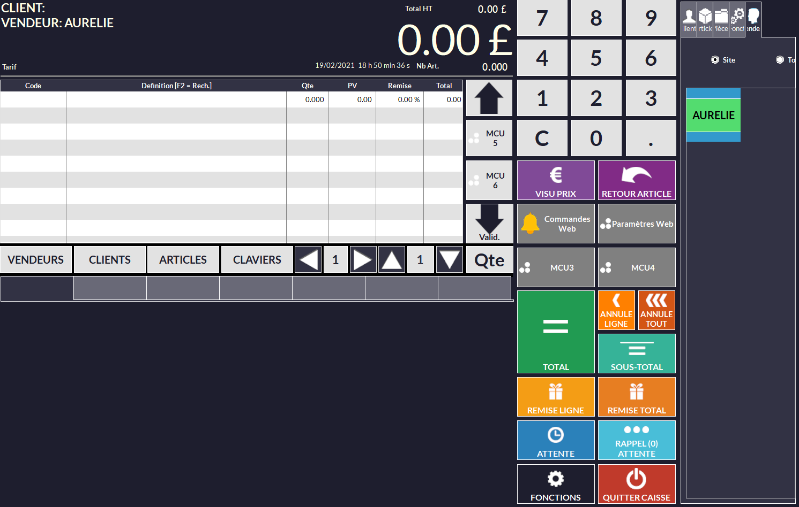
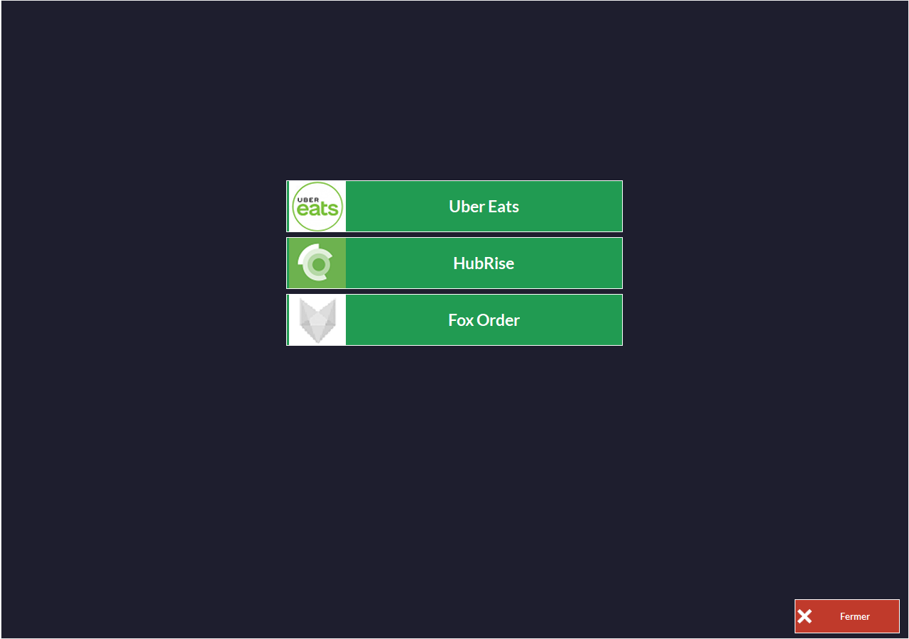
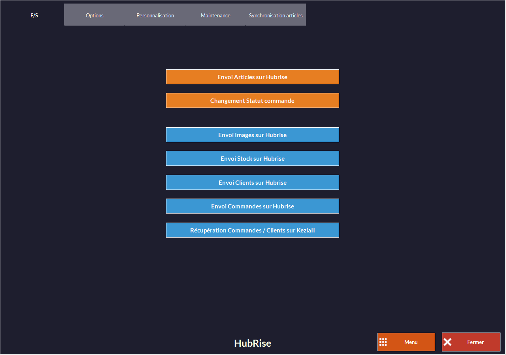
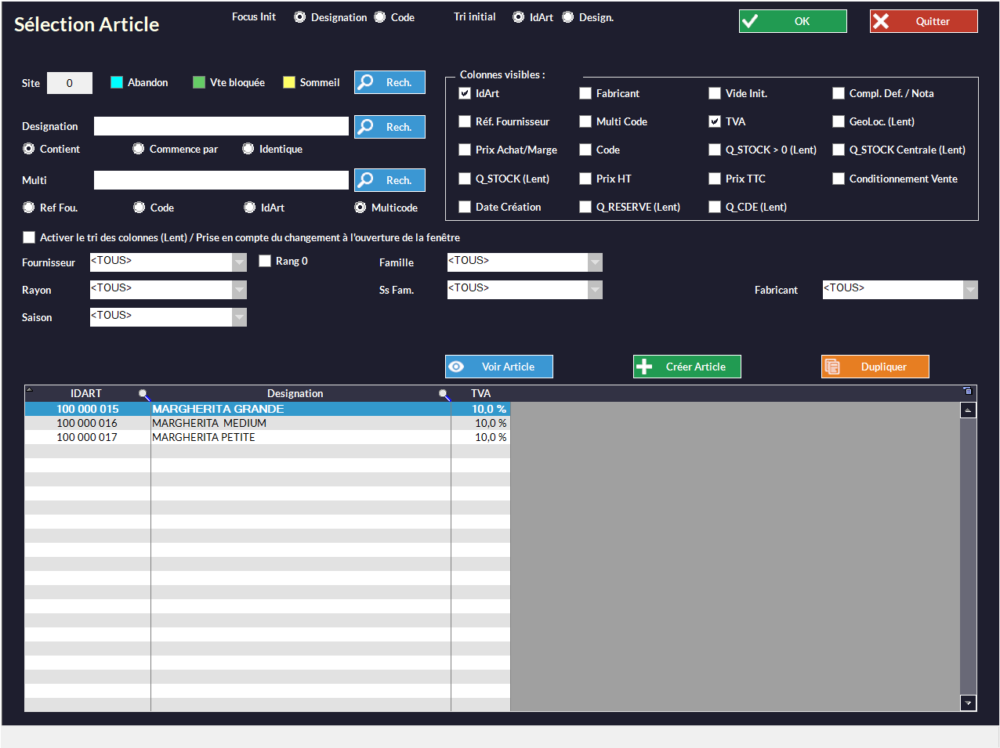

Une fois votre logiciel de caisse Kezia II connecté à HubRise, vous devez configurer vos autres applications connectées, afin que les différents éléments présents dans les commandes soient bien identifiés par Kezia II.

Kezia II identifie chaque élément d'une commande par un code ref. Vous devez indiquer les codes ref fournis par Kezia II dans vos autres applications, afin que les commandes puissent être réceptionnées.

Il y a deux façons de procéder :

- Vous pouvez exporter le catalogue Kezia II vers HubRise, puis importer ce catalogue dans vos autres applications.
- Ou vous pouvez saisir manuellement les codes ref dans vos autres applications.

Seules certaines applications permettent l'import d'un catalogue depuis HubRise. Pour les autres, il faudra saisir manuellement les codes ref.

## Exporter le catalogue

Pour exporter manuellement un catalogue vers HubRise, suivez les étapes suivantes :

1. Sur l'écran d'accueil, sélectionnez **CAISSE**.
   
1. Sélectionnez un vendeur.
   
1. Cliquez sur **Paramètres Web**.
   
1. Cliquez sur **HubRise**.
   
1. Dans l'onglet **E/S**, sélectionnez **Envoi Articles sur HubRise**.

Les informations client et les commandes sont envoyées automatiquement. En cas de problème avec la synchronisation automatique, vous pouvez vous rendre dans cet onglet pour faire ces exports manuellement.

Vous devez maintenant importer le catalogue HubRise dans vos autres applications connectées à HubRise. Pour effectuer cette opération, référez-vous à la documentation de ces applications sur le site de HubRise.

Les produits que vous créez ou modifiez dans votre catalogue ne sont pas systématiquement exportés vers HubRise. Pour que ce soit le cas, cochez l'option correspondante en suivant les étapes suivantes :

1. Sur l'écran d'accueil, sélectionnez **ARTICLES**.
   
1. Double-cliquez sur le produit à synchroniser.
   
1. Sélectionnez **Menu**.
   
1. Sélectionnez **Paramètres**.
1. Cochez l'option **Publication WEB**.
   
1. Sélectionnez **Appliq.**.

Vous pouvez ensuite exporter de nouveau votre catalogue en suivant les étapes décrites au début de [cette partie](/apps/kezia/associer-codes-ref#exporter-le-catalogue).

## Produits

Un produit dans HubRise correspond à un article dans Kezia II. Pour en retrouver le code ref, sur l'écran d'accueil, sélectionnez **ARTICLES**. Le code ref de l'article s'affiche dans la colonne **IDART**. Ce code est généré automatiquement lors de la création d'un article et n'est pas modifiable.

## SKUs

Une SKU (*Stock Keeping Unit*) dans HubRise correspond au multi-tarif dans Kezia II, mais il est conseillé plutôt de créer un article différent pour chaque SKU. Par exemple, une pizza margherita en trois tailles différentes correspond dans Kezia II à trois articles distincts :
- Margherita Grande
- Margherita Medium
- Margherita Petite

Pour trouver le code ref d'un article, suivez la procédure décrite dans la partie [Produits](/apps/kezia/associer-codes-ref#produits).

## Options

Une option dans HubRise correspond à un article option dans Kezia II. Pour vérifier qu'un article est considéré comme une option, vérifiez que la case nécessaire est cochée :

1. Sur l'écran d'accueil, sélectionnez **ARTICLES**.
1. Double-cliquez sur le produit désiré.
1. Sélectionnez **Menu**.
1. Sélectionnez **Préparation**. La case **Article Option** doit être cochée.
   

Pour trouver le code ref de cet article, suivez la procédure décrite dans la partie [Produits](/apps/kezia/associer-codes-ref#produits).

## Remises

Une remise dans Kezia II peut seulement être créée lorsque le vendeur enregistre une commande. Les remises ne peuvent donc pas être synchronisées avec HubRise.

## Promotions

Une promotion dans HubRise correspond à un menu dans Kezia II. Pour retrouver le code ref d'un menu, dans la barre de menu, sélectionnez **Article** > **Menus** > **Liste**. Le code ref du menu s'affiche dans la colonne **Idart** et correspond au code ref de l'article attribué au menu lors de sa création.