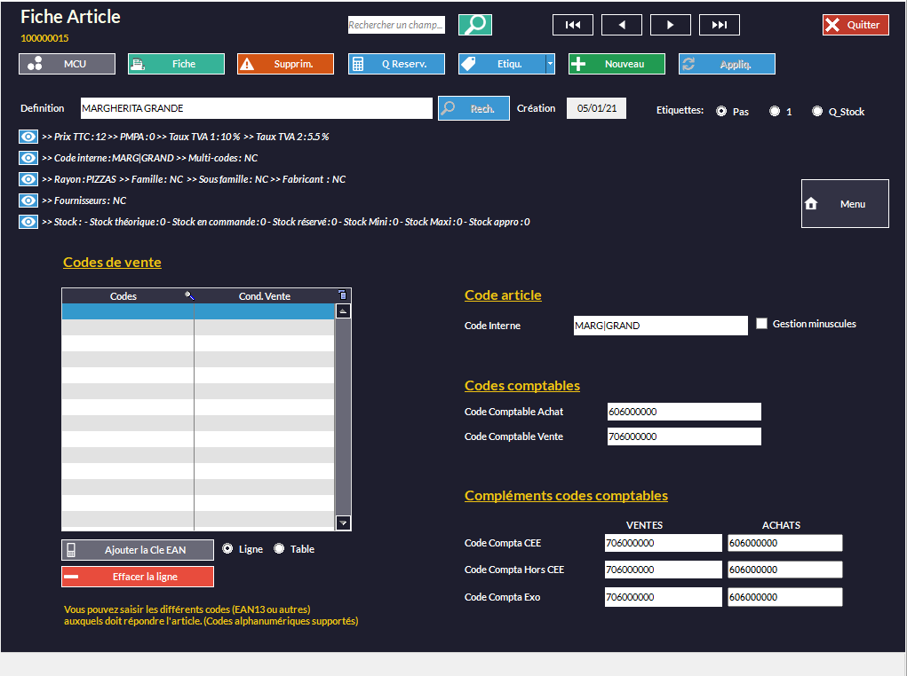

Une fois votre logiciel de caisse Kezia II connecté à HubRise, une dernière étape de configuration est nécessaire. Les différents éléments présents dans Kezia II sont identifiés par des codes ref. Vous devez indiquer ces codes ref dans les applications connectées à HubRise, afin que les commandes puissent être réceptionnées dans Kezia II.

Il y a deux façons de procéder :
- Exporter le catalogue Kezia II vers HubRise, puis importer ce catalogue dans les applications connectées qui le permettent.
- Saisir manuellement les codes ref.

Ces deux méthodes sont parfois complémentaires. Seules certaines applications connectées permettent l'import d'un catalogue depuis HubRise. Pour les autres, il faudra saisir manuellement les codes ref.

Cette page explique comment exporter un catalogue et trouver les codes ref depuis Kezia II. Pour plus d'informations sur l'import d'un catalogue et la saisie des codes ref dans une application connectée, référez-vous à la documentation de l'application sur le site de HubRise.

## Exporter le catalogue

Lors de la première connexion, vous devez exporter votre catalogue manuellement vers HubRise en suivant les étapes suivantes :

1. Sur l'écran d'accueil, sélectionnez **CAISSE**.
   
1. Sélectionnez un vendeur.
   
1. Cliquez sur **Paramètres Web**.
   
1. Cliquez sur **HubRise**.
   
1. Dans l'onglet **E/S**, sélectionnez **Envoi Articles sur HubRise**.

Les informations client et les commandes sont envoyées automatiquement. En cas de problème avec la synchronisation automatique, vous pouvez vous rendre dans cet onglet pour faire ces exports manuellement.

Les produits que vous créez ou modifiez dans votre catalogue ne sont pas systématiquement exportés vers HubRise. Pour que ce soit le cas, cochez l'option correspondante en suivant les étapes suivantes :

1. Sur l'écran d'accueil, sélectionnez **ARTICLES**.
   
1. Double-cliquez sur le produit à synchroniser.
   
1. Sélectionnez **Menu**.
   
1. Sélectionnez **Paramètres**.
1. Cochez l'option **Publication WEB**.
   
1. Sélectionnez **Appliq.**.

Vous pouvez ensuite exporter de nouveau votre catalogue en suivant les étapes décrites au début de [cette partie](/apps/kezia/associer-codes-ref#exporter-le-catalogue).

## Produits

Un produit dans HubRise correspond à un article dans Kezia II. Pour en retrouver le code ref, suivez les étapes suivantes :

1. Sur l'écran d'accueil, sélectionnez **ARTICLES**.
1. Double-cliquez sur le produit désiré.
1. Sélectionnez **Menu**.
1. Sélectionnez **EAN Multi-codes Codes comptables**. Le code ref de l'article s'affiche dans la section **Code article**, dans le champ **Code Interne**.
   

## SKUs

Une SKU (*Stock Keeping Unit*) dans HubRise correspond au multi-tarif dans Kezia II, mais il est conseillé plutôt de créer un article différent pour chaque SKU. Par exemple, une pizza margherita en trois tailles différentes correspond dans Kezia II à trois articles distincts :
- Margherita Grande
- Margherita Medium
- Margherita Petite

## Options

Une option dans HubRise correspond à un article option dans Kezia II. Pour vérifier qu'un article est considéré comme une option, vérifiez que la case nécessaire est cochée :

1. Sur l'écran d'accueil, sélectionnez **ARTICLES**.
1. Double-cliquez sur le produit désiré.
1. Sélectionnez **Menu**.
1. Sélectionnez **Préparation**. La case **Article Option** doit être cochée.
   

Pour trouver le code ref de cet article, suivez la même procédure que pour les [produits](/apps/kezia/associer-codes-ref#produits).