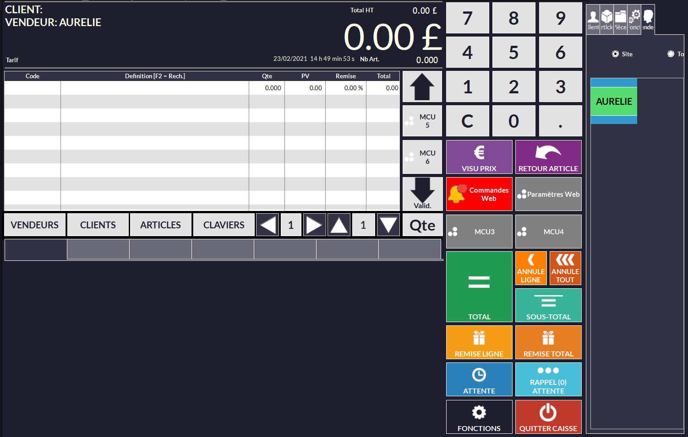
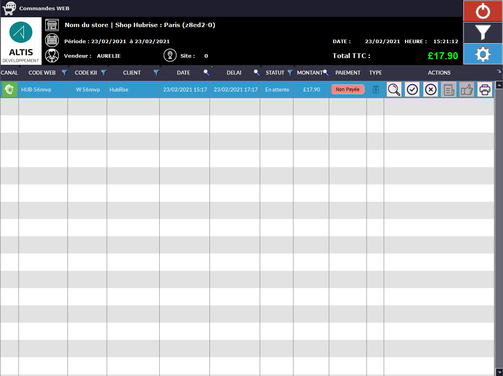
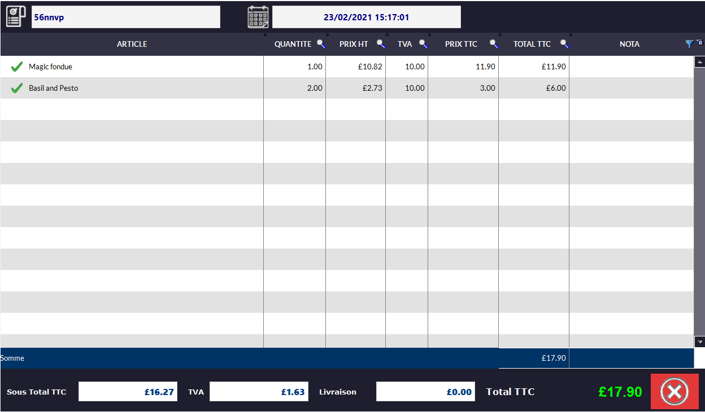
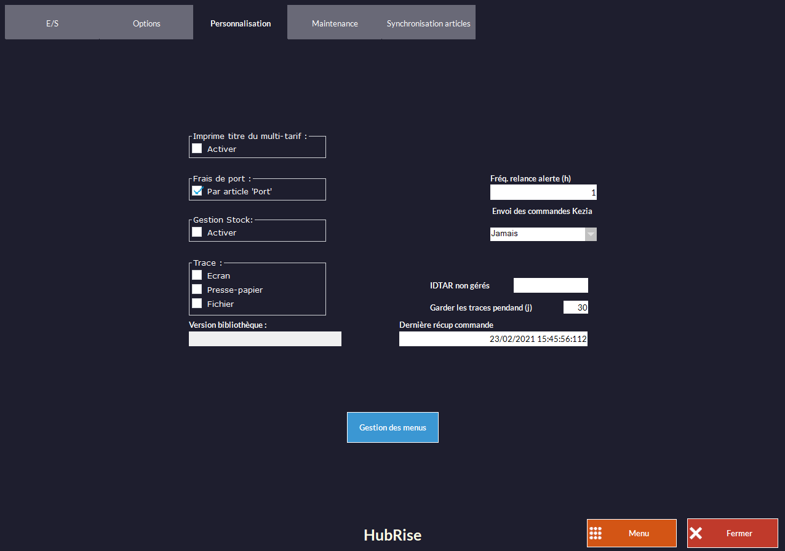
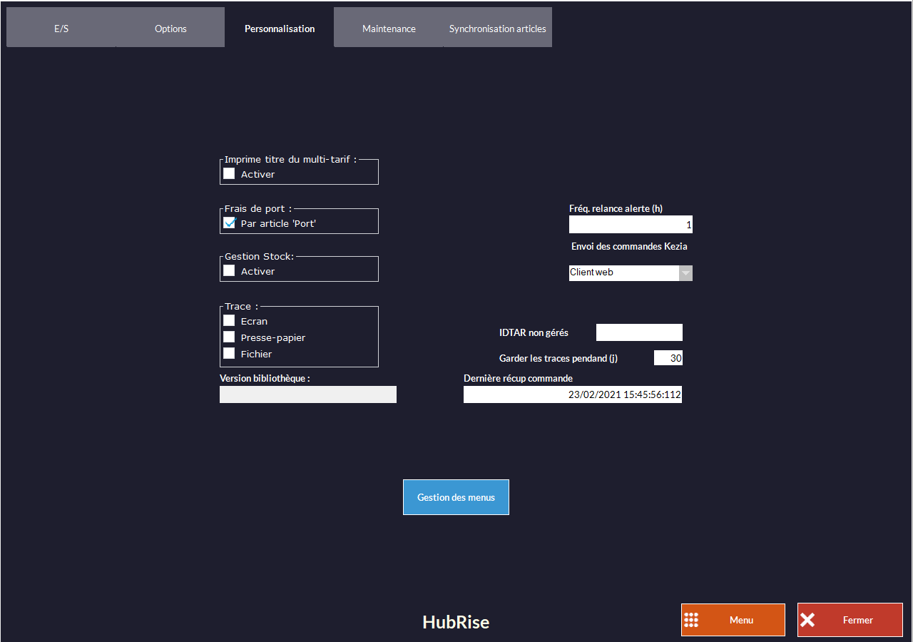
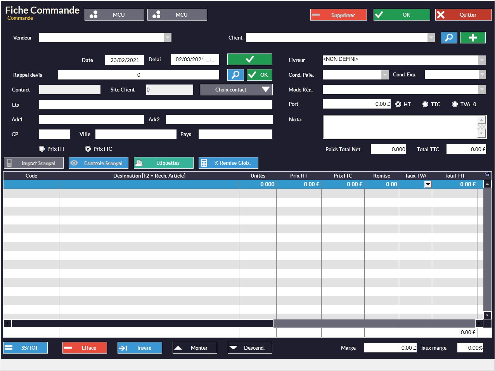
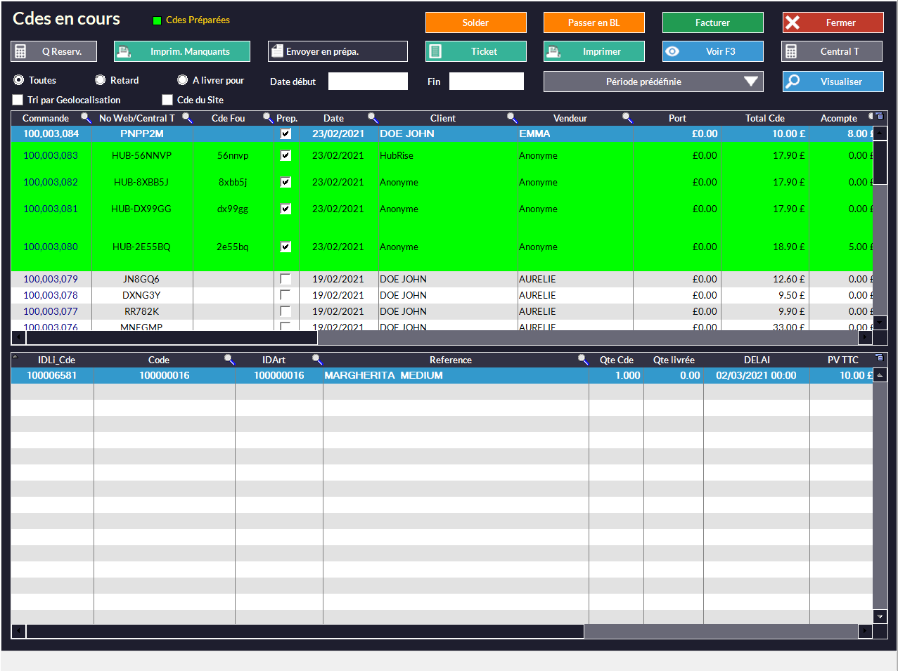

Lorsque Kezia II est connecté à HubRise, les commandes envoyées à HubRise arrivent automatiquement dans votre logiciel de caisse.

## Recevoir des commandes

Kezia II vérifie toutes les 30 secondes si de nouvelles commandes ont été envoyées à HubRise. Une fenêtre d'avertissement vous signale l'arrivée d'une nouvelle commande dans Kezia II.

Pour voir la liste des commandes web en cours, suivez les étapes suivantes :

1. Sur l'écran d'accueil, sélectionnez **CAISSE**.
   
1. Sélectionnez un vendeur.
   
1. Cliquez sur **Commandes Web**.
   

### Détail de la commande

Depuis la liste des commandes web, cliquez sur le bouton en forme de loupe pour consulter le détail d'une commande.
   

### Gestion de la commande

À réception d'une nouvelle commande web, vous pouvez l'accepter ou la rejeter. Vous pouvez ensuite la facturer si elle n'est pas encore payée, puis la prendre en charge.

Le statut de la commande web est mis à jour sur HubRise quelques secondes après changement dans Kezia II.

## Envoyer les commandes

Par défaut, Kezia II n'envoie pas les commandes vers HubRise. Changez la configuration pour que les commandes soient envoyées automatiquement après création :

1. Sur l'écran d'accueil, sélectionnez **CAISSE**.
   
1. Sélectionnez un vendeur.
   
1. Cliquez sur **Paramètres Web**.
   
1. Cliquez sur **HubRise**.
   
1. Sélectionnez l'onglet **Personnalisation**.
   
1. Pour l'option **Envoi des commandes Kezia**, sélectionnez **Client web**.
   
1. Cliquez sur **Fermer**.

Pour envoyer une commande vers HubRise, suivez les étapes suivantes :

1. Sur l'écran d'accueil, sélectionnez **COMMANDES**.
   
1. Remplissez les champs selon vos besoins.
1. Cliquez sur **OK**.

Pour consulter la liste des commandes envoyées vers HubRise, vous pouvez utiliser une de ces méthodes :

- Dans la barre de menu, sélectionnez **Client** > **Commande** > **Commandes en cours**.
- Sur l'écran d'accueil, appuyez sur la touche **F3** de votre clavier.
   