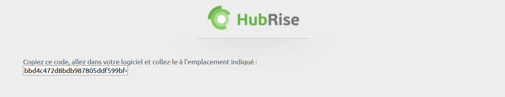
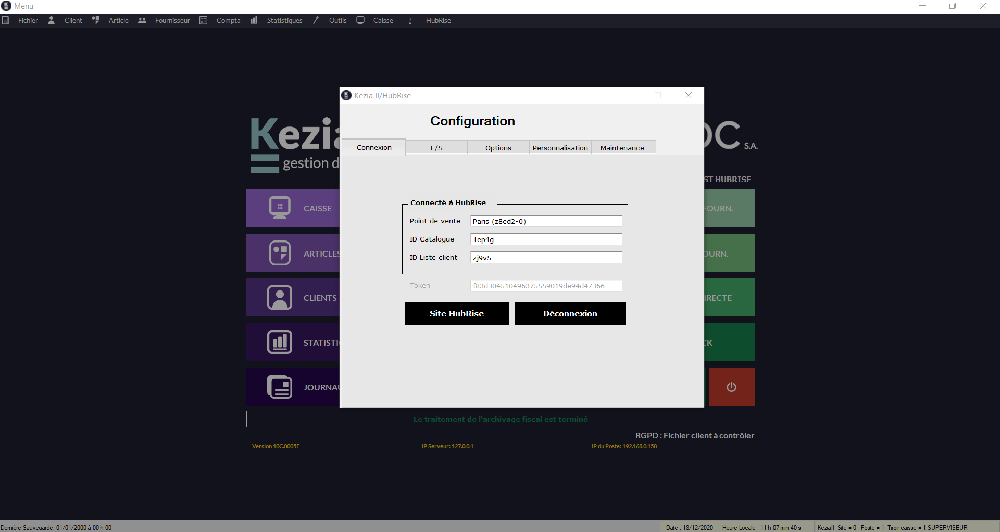

Connecter Kezia II à HubRise peut être fait en seulement quelques étapes.

## Se connecter

Pour établir la connexion entre un point de vente Kezia II et HubRise, vous devez tout d'abord contacter JDC pour que le module HubRise soit installé dans Kezia II. Suivez ensuite ces étapes depuis l'interface Kezia II :

1. Cliquez sur le menu **Hubrise** dans la barre de menu. Une fenêtre nommée **Kezia II/HubRise** s'ouvre.
1. Cliquez sur **Connexion à HubRise**. Vous êtes redirigés vers l'interface HubRise.
1. Choisissez le point de vente que vous désirez connecter et cliquez sur **Autoriser** pour donner à Kezia II l'accès à vos informations. Si plusieurs listes de clients ou catalogues sont disponibles, cliquez sur **Suivant** afin d'afficher les listes déroulantes correspondantes avant de cliquer sur **Autoriser**.
   
1. Copiez le code affiché et collez-le dans la fenêtre **Kezia II/HubRise** dans Kezia II.
   
1. Cliquez sur **OK**. La fenêtre de configuration affiche **Connecté à HubRise**, ainsi que toutes les informations de votre point de vente. Le bouton **Compte HubRise** permt d'accéder au tableau de bord HubRise. Un autre onglet **E/S** (*Entrée/Sortie*) apparaît et permet de transmettre les données manuellement entre Kezia II et HubRise.
   
1. En cas de besoin, l'éditeur du logiciel Kezia II peut vous venir en aide. Pour permettre cela, [donnez les accès nécessaires au support de Kezia II](/apps/kezia/connect-hubrise#donner-acc-s-au-support-de-kezia-ii).

---

**NOTE IMPORTANTE** Vous devrez vous connecter à un compte HubRise existant, ou créer un nouveau compte pour terminer d'établir la connexion. Pour plus d'informations sur la manière de créer un profil utilisateur ou vous connecter à HubRise, veuillez consulter notre [Guide de prise en main](/docs/getting-started/).

---

## Donner accès au support de Kezia II

Il est conseillé de donner à l'éditeur du logiciel Kezia II les droits nécessaires pour vous venir en aide en cas de besoin. Pour cela, suivez les étapes suivantes depuis votre espace HubRise :

1. Dans le menu de gauche, sélectionnez **CONFIGURATION** > **COMPTES**. La liste de vos comptes s'affiche.
1. Sélectionnez le compte auquel votre point de vente est rattaché.
1. Dans l'espace **Points de vente**, sélectionnez votre point de vente.
1. Dans l'espace **Permissions**, ajoutez *hotline.kezia@jdc.fr* en sélectionnant l'option **Manager** (et non **Admin**) dans la liste déroulante des rôles, puis cliquez sur l'icône *+*. L'ajout d'un utilisateur est le moyen recommandé de donner accès à un tiers à votre point de vente, le partage de mot de passe est déconseillé pour des raisons de sécurité.

## Se déconnecter

1. Cliquez sur le menu **Hubrise** dans la barre de menu. Une fenêtre nommée **Kezia II/HubRise** s'ouvre.
1. Cliquez sur **Déconnexion**.