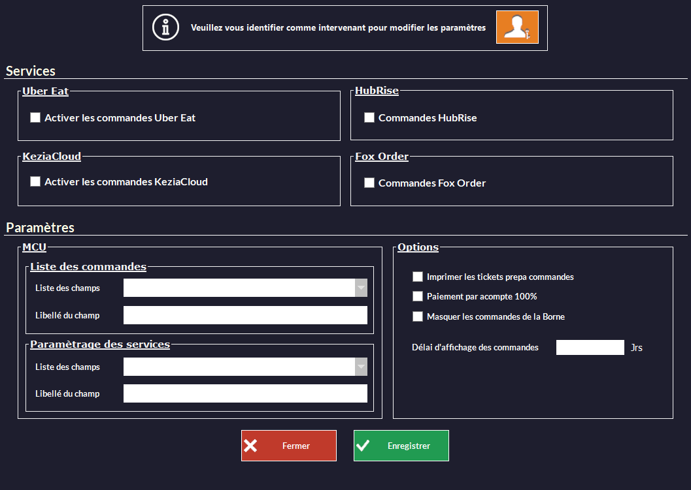
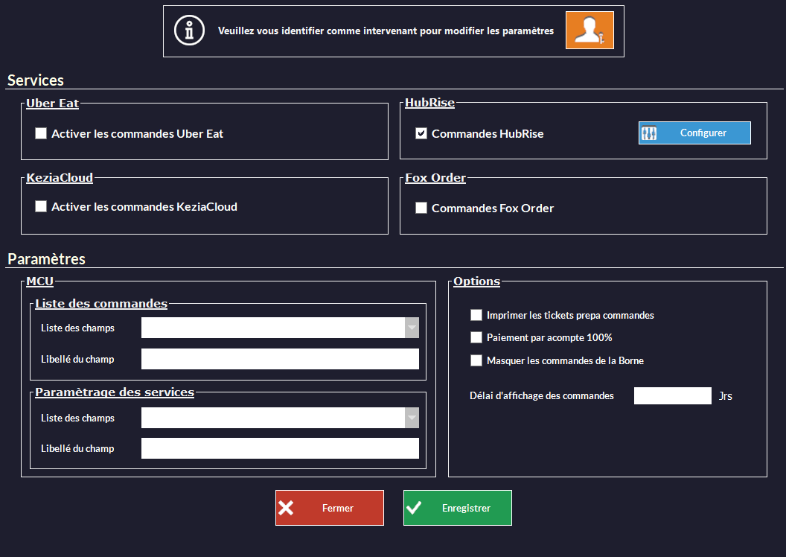
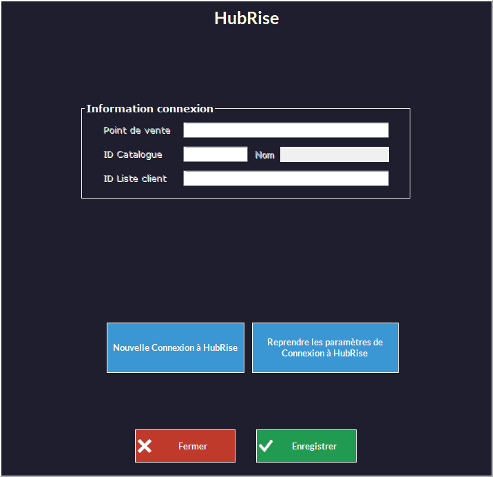
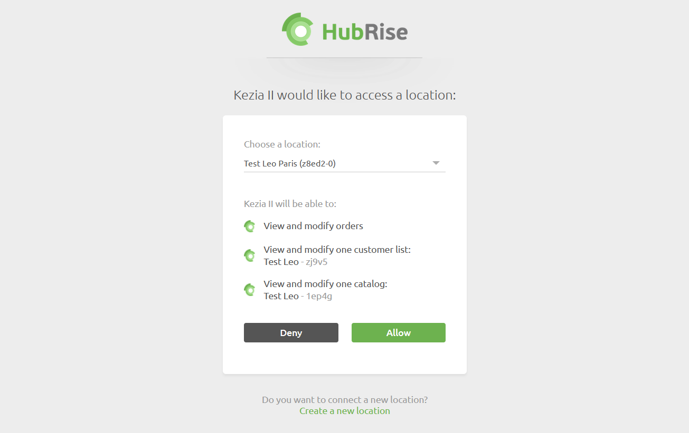
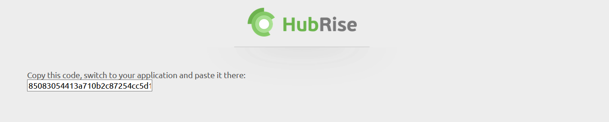
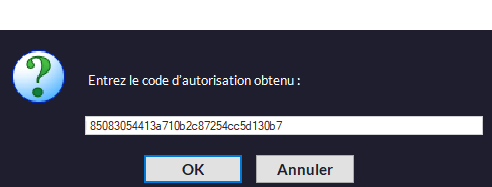
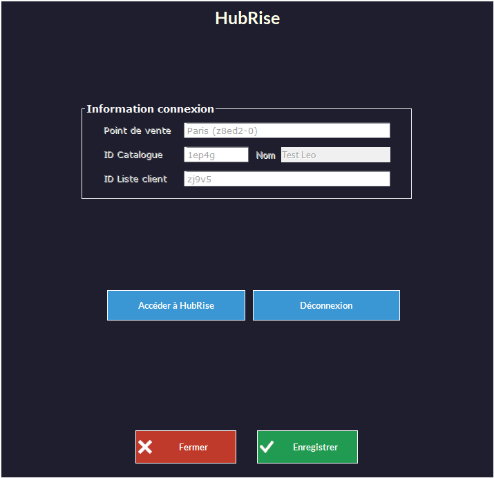

Pour connecter Kezia II à HubRise, il suffit de suivre quelques étapes.

---

**REMARQUE IMPORTANTE :** La connexion est faite par le support JDC, cette démarche n'est décrite ici qu'à titre d'information.

---

## Se connecter

Pour établir la connexion entre un point de vente Kezia II et HubRise, vous devez tout d'abord contacter JDC pour que le module HubRise soit installé dans Kezia II. Suivez ensuite ces étapes depuis l'interface Kezia II :

1. Dans la barre de menu, sélectionnez **Fichier** > **Paramètres** > **Commandes Web**.
   
1. Cochez la case **Commandes HubRise**.
   
1. À côté de cette case, cliquez sur **Configurer**.
   
1. Cliquez sur **Nouvelle Connexion à HubRise**. Vous êtes redirigés vers l'interface HubRise.
   
1. Choisissez le point de vente que vous désirez connecter et cliquez sur **Autoriser** pour donner à Kezia II l'accès à vos informations. Si plusieurs listes de clients ou catalogues sont disponibles, cliquez sur **Suivant** afin d'afficher les listes déroulantes correspondantes avant de cliquer sur **Autoriser**.
   
1. Copiez le code affiché et collez-le dans la fenêtre prévue à cet effet dans Kezia II.
   
1. Cliquez sur **OK**. La fenêtre de configuration affiche toutes les informations de votre point de vente. Le bouton **Accéder à HubRise** permt d'accéder au tableau de bord HubRise.
   
1. Cliquez sur **Enregistrer**.
1. En cas de besoin, l'éditeur du logiciel Kezia II peut vous venir en aide. Pour permettre cela, [donnez les accès nécessaires au support de Kezia II](/apps/kezia/connect-hubrise#donner-acc-s-au-support-de-kezia-ii).

---

**REMARQUE IMPORTANTE :** Vous devrez vous connecter à un compte HubRise existant, ou créer un nouveau compte pour terminer d'établir la connexion. Pour plus d'informations sur la manière de créer un profil utilisateur ou vous connecter à HubRise, veuillez consulter notre [Guide de prise en main](/docs/getting-started/).

---

## Donner accès au support de Kezia II

Il est conseillé de donner à l'éditeur du logiciel Kezia II les droits nécessaires pour vous venir en aide en cas de besoin. Pour cela, suivez les étapes suivantes depuis votre espace HubRise :

1. Dans le menu de gauche, sélectionnez **CONFIGURATION** > **COMPTES**. La liste de vos comptes s'affiche.
1. Sélectionnez le compte auquel votre point de vente est rattaché.
1. Dans l'espace **Points de vente**, sélectionnez votre point de vente.
1. Dans l'espace **Permissions**, ajoutez *licencekezia@jdc.fr* en sélectionnant l'option **Manager** (et non **Admin**) dans la liste déroulante des rôles, puis cliquez sur **+**. L'ajout d'un utilisateur est le moyen recommandé de donner accès à un tiers à votre point de vente, le partage de mot de passe est déconseillé pour des raisons de sécurité.

## Configurer les actions de caisse

Afin que vous ayiez accès à la liste des commandes venant de HubRise et aux paramètres de synchronisation avec HubRise, vous devez configurer les actions accessibles depuis la caisse de Kezia II. Pour cela, suivez les étapes suivantes :

1. Dans la barre de menu, sélectionnez **Fichier** > **Paramètres** > **Commandes Web**.
1. Dans la section **Paramètres**, pour le paramétrage de **Liste des commandes**, sélectionnez une touche et un libellé. Par exemple, sélectionnez *MCU 1* et entrez le nom *Commandes Web*.
   
1. Dans la section **Paramètres**, pour le paramétrage de **Paramétrage des services**, sélectionnez une touche et un libellé. Par exemple, sélectionnez *MCU 2* et entrez le nom *Paramètres Web*.
   
1. Cliquez sur **Enregistrer**.

---

**REMARQUE IMPORTANTE :** Les libellés **Commandes Web** et **Paramètres Web** pris en exemples ici seront utilisés dans toute cette documentation.

---

## Se déconnecter

1. Dans la barre de menu, sélectionnez **Fichier** > **Paramètres** > **Commandes Web**.
1. Cochez la case **Commandes HubRise**.
1. À côté de cette case, cliquez sur **Configurer**.
1. Cliquez sur **Déconnexion**.