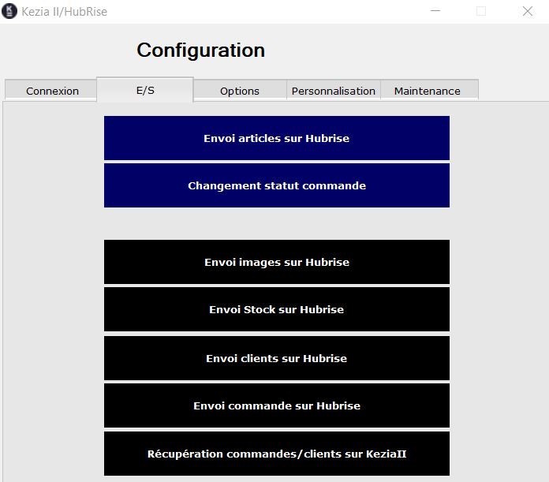
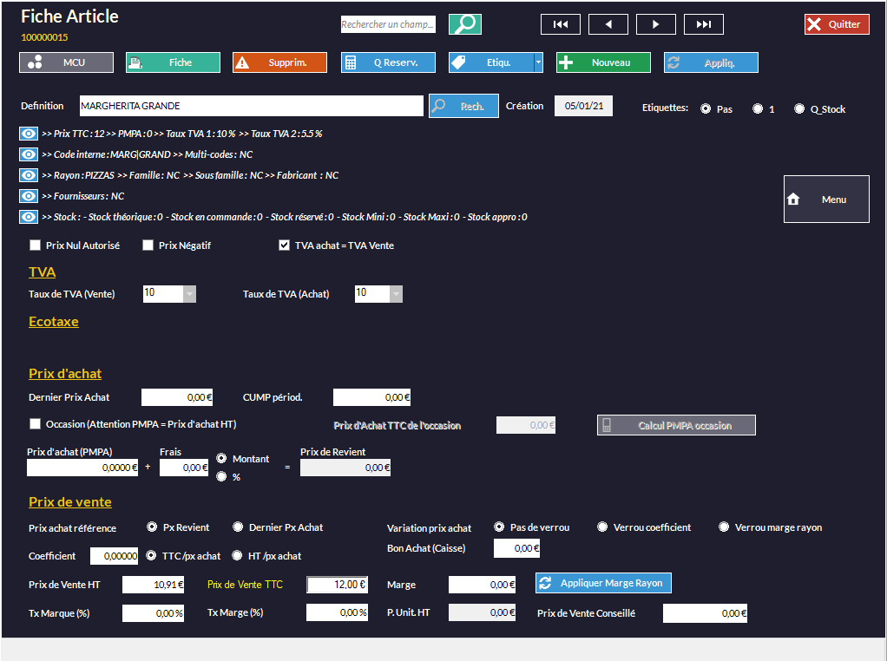
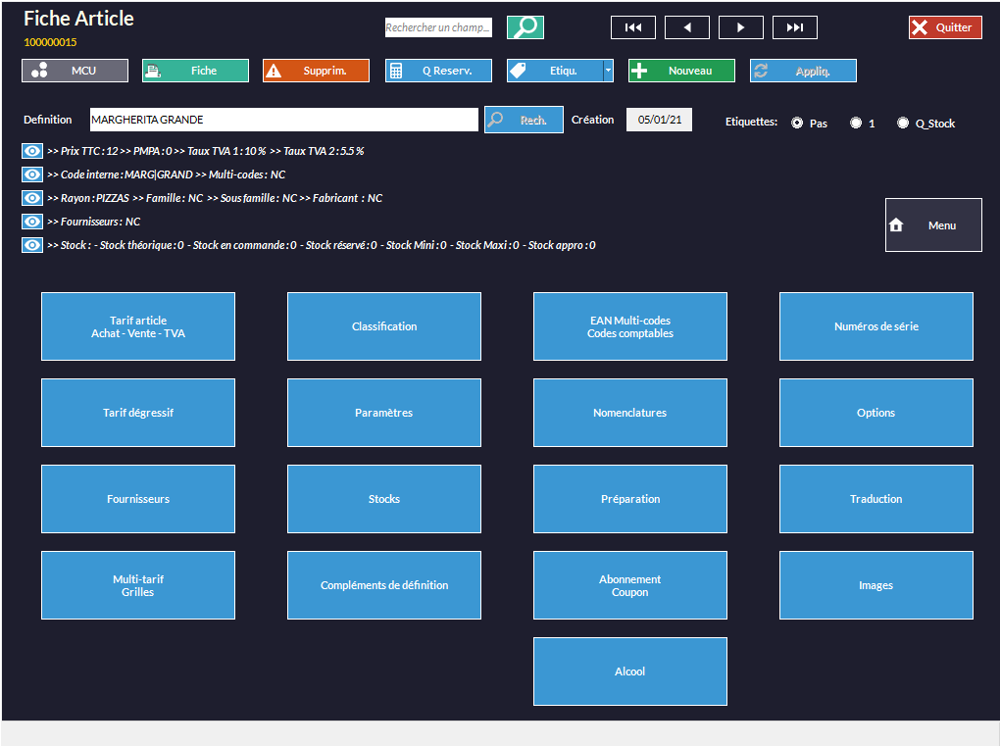
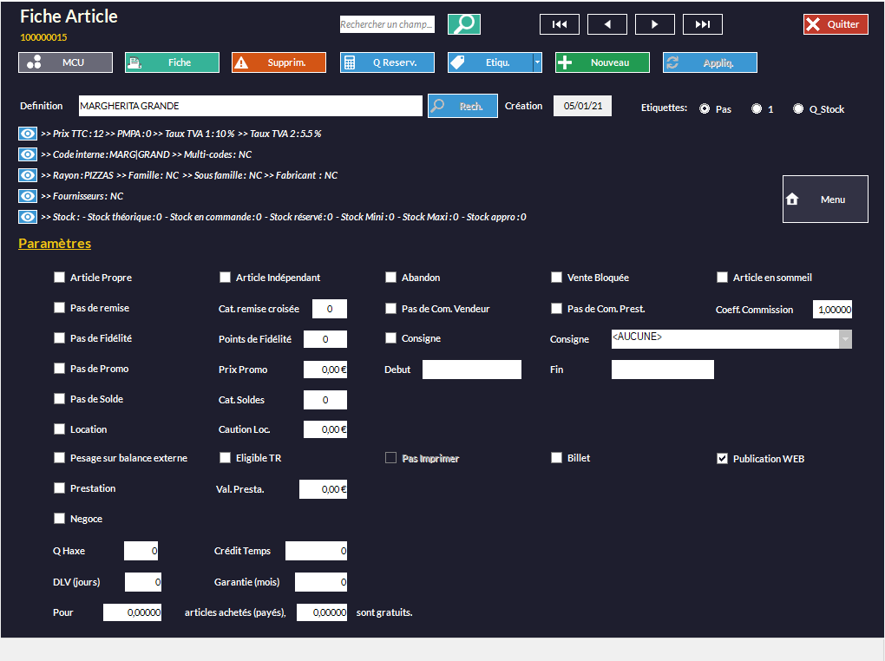

Après avoir connecté votre logiciel de caisse Kezia II à votre compte HubRise, vous pouvez synchroniser leurs données. Pour cela, certaines étapes doivent être entreprises. Les différents éléments présents dans Kezia II sont identifiés par des codes uniques. Quand vous mettez en place la connexion entre HubRise et d'autres applications, vous devez fournir ces codes.

## Exporter le catalogue

Lors de la première connexion, vous devez exporter votre catalogue manuellement vers HubRise en suivant les étapes suivantes :

1. Dans la barre de menu, sélectionnez **Hubrise**. Une fenêtre nommée **Kezia II/HubRise** s'affiche.
1. Dans l'onglet **E/S**, sélectionnez **Envoi articles sur HubRise**.
   

Les informations client et les commandes sont envoyées automatiquement. En cas de problème avec la synchronisation automatique, vous pouvez vous rendre dans cet onglet pour faire ces exports manuellement.

Les produits que vous créez ou modifiez dans votre catalogue ne sont pas systématiquement exportés vers HubRise. Pour que ce soit le cas, cochez l'option correspondante en suivant les étapes suivantes :

1. Sur l'écran d'accueil, sélectionnez **ARTICLES**.
   
1. Double-cliquez sur le produit à synchroniser.
   
1. Sélectionnez **Menu**.
   
1. Sélectionnez **Paramètres**.
1. Cochez l'option **Publication WEB**.
   
1. Sélectionnez **Appliq.**.

Vous pouvez ensuite exporter de nouveau votre catalogue en suivant les étapes décrites au début de [cette partie](/apps/kezia/map-ref-codes#exporter-le-catalogue).

---

**NOTE IMPORTANTE** Vous devrez vous connecter à un compte HubRise existant, ou créer un nouveau compte pour terminer d'établir la connexion. Pour plus d'informations sur la manière de créer un profil utilisateur ou vous connecter à HubRise, veuillez consulter notre [Guide de prise en main](/docs/getting-started/).

---

## Produits

Un produit dans HubRise correspond à un article dans Kezia II. Pour en retrouver le code ref, suivez les étapes suivantes :

1. Sur l'écran d'accueil, sélectionnez **ARTICLES**.
1. Double-cliquez sur le produit désiré.
1. Sélectionnez **Menu**.
1. Sélectionnez **EAN Multi-codes Codes comptables**. Le code ref de l'article s'affiche dans la section **Code article**, dans le champ **Code Interne**.
   

## SKUs

Une SKU (*Stock Keeping Unit*) dans HubRise correspond au multi-tarif dans Kezia II, mais il est conseillé plutôt de créer un article différent pour chaque SKU. Par exemple, une pizza margherita en trois tailles différentes correspond dans Kezia II à trois articles distincts :
- Margherita Grande
- Margherita Medium
- Margherita Petite

## Options

Une option dans HubRise correspond à un article option dans Kezia II. Pour vérifier qu'un article est considéré comme une option, vérifiez que la case nécessaire est cochée :

1. Sur l'écran d'accueil, sélectionnez **ARTICLES**.
1. Double-cliquez sur le produit désiré.
1. Sélectionnez **Menu**.
1. Sélectionnez **Préparation**. La case **Article Option** doit être cochée.
   

Pour trouver le code ref de cet article, suivez la même procédure que pour les [produits](/apps/kezia/map-ref-codes#produits).