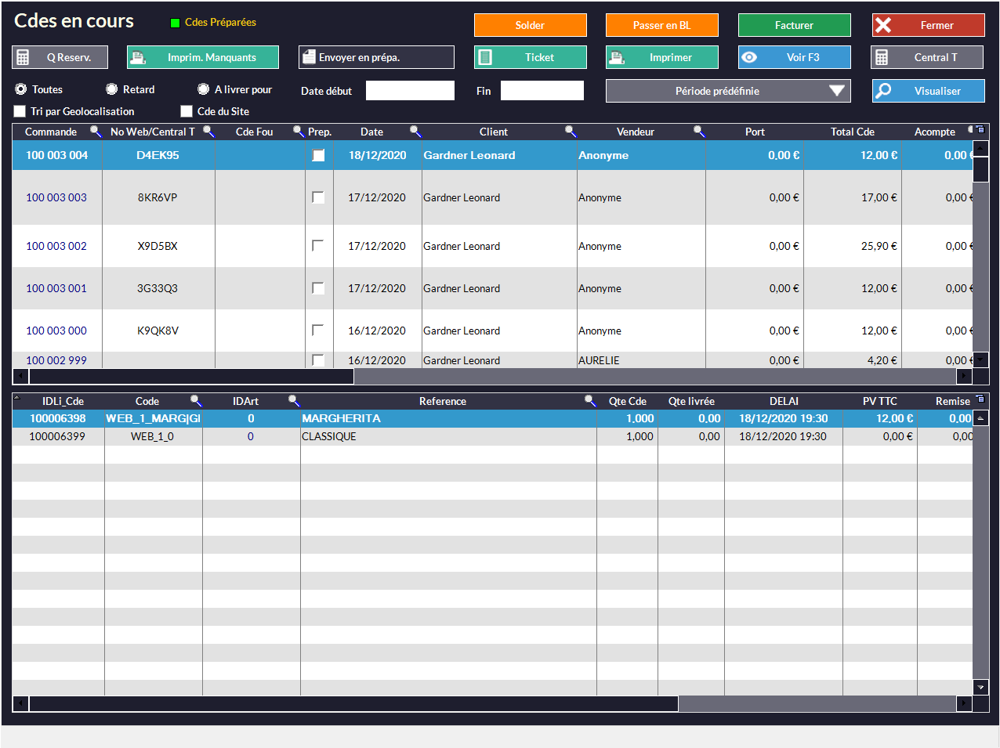
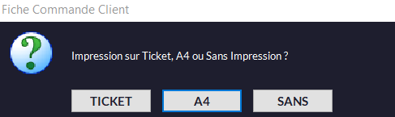
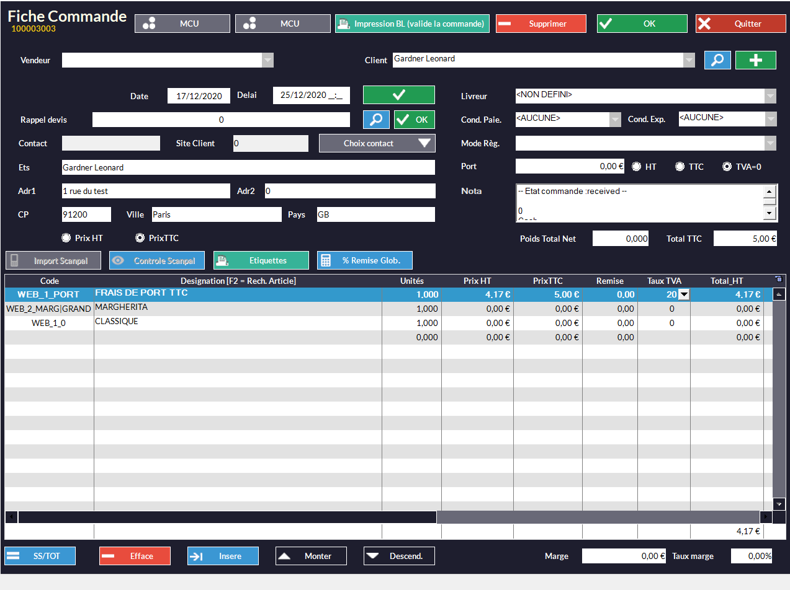
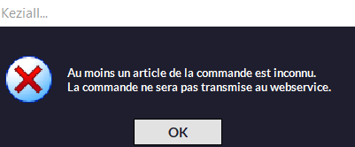

À partir du moment où Kezia II est connecté à HubRise et le catalogue est synchronisé, plus aucune action n'est requise de votre part. Votre logiciel de caisse va recevoir automatiquement toutes les commandes envoyées à HubRise depuis d'autres applications.

## Recevoir des commandes

Kezia II vérifie toutes les 60 secondes (paramètre réglable) si de nouvelles commandes ont été envoyées à HubRise. Une fenêtre d'avertissement vous signale l'arrivée d'une nouvelle commande dans Kezia II.
   

Pour voir la liste des commandes en cours, suivez les étapes suivantes :

1. Cliquez sur le menu **Client** dans la barre de menu.
1. Survolez l'option **Commande** et sélectionnez **Commandes en cours**. Une fenêtre nommée **Cdes en cours** s'ouvre.
   

La présence de produits non reconnus peut bloquer la validation (voir [Commande avec des articles inconnus](/apps/kezia/orders#commande avec-des-articles-inconnus)). Si ce n'est pas le cas, vous pouvez valider la commande :
1. Sélectionnez un vendeur dans le champ **Vendeur**.
1. Cliquez sur le bouton **OK**. Une fenêtre vous demandant le type d'impression désiré s'ouvre.
   
1. Sélectionnez le type selon vos préférences.

### Détails de la commande

Pour voir le détail d'une commande depuis la liste des commandes en cours :

1. Sélectionnez la ligne de la commande désirée.
1. Cliquez sur le bouton **Voir F3**. Une fenêtre nommée **Fiche Commande** s'ouvre, contenant les informations de la commande.
   

**Interprétation technique**

Voici comment les champs d'une commande HubRise sont utilisés dans Kezia II :

| Nom du champ HubRise                   | Utilisation dans Kezia II                                                   |
| -------------------------------------- | --------------------------------------------------------------------------- |
| `service_type`                         | Permet de savoir si la commande est en livraison, sur place, ou à emporter. |
| `service_type_ref`                     | Non utilisé.                                                                |
| `expected_time`                        | Heure et date auxquelles la commande sera prête ou livrée. Remplit la colonne *Delai* de chaque ligne produit. |
| `item.sku_ref`                         | Code permettant de retrouver l'article dans le catalogue Kezia II.          |
| `charges`                              | Ajoute une charge à la commande sous forme de ligne produit.                |

### Commande avec des articles inconnus

Il n'est pas possible de valider une commande contenant des produits dont le code ref n'est pas reconnu.
   

Pour éviter que ce problème se reproduise, vérifiez les codes ref de vos produits. Les articles inconnus sont causés par des codes refs invalides. Pour trouver un code ref, consultez la page [Trouver les codes ref](/apps/nestor/map-ref-codes).