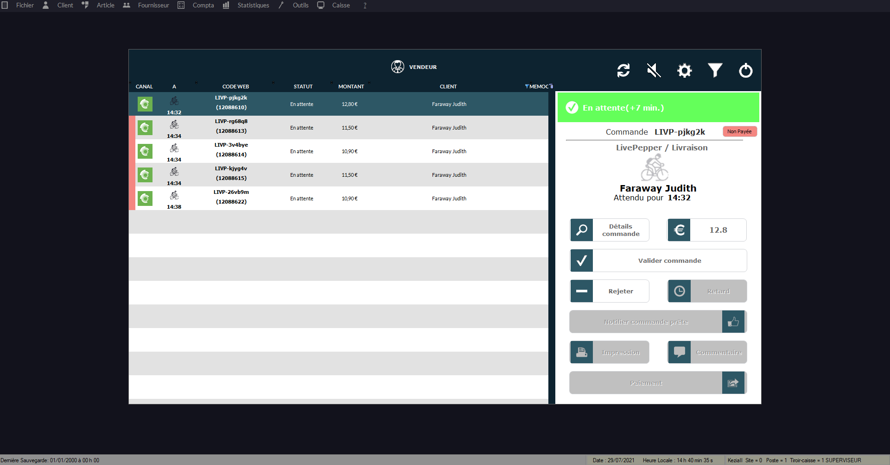

Lorsque Kezia II est connecté à HubRise, les commandes envoyées à HubRise arrivent automatiquement dans votre logiciel de caisse.

## Recevoir des commandes {#receive-orders}

Kezia II vérifie l'arrivée de nouvelles commandes toutes les 30 secondes. Une fenêtre d'avertissement vous signale l'arrivée d'une nouvelle commande.

Pour voir la liste des commandes web en cours, suivez les étapes suivantes :

1. Depuis l'écran d'accueil, sélectionnez **CAISSE**.
1. Sélectionnez un vendeur.
1. Cliquez sur **Commandes Web**.
   

### Détail de la commande

Pour consulter le détail d'une commande :

1. Accédez à la liste des commandes web en suivant les étapes décrites dans la partie [Recevoir des commandes](/apps/kezia/orders#receive-orders).
1. Sélectionnez la commande désirée.
1. Cliquez sur **Détails commande**.
   

### Gestion de la commande

À réception d'une nouvelle commande web, vous pouvez la valider ou la rejeter. Si elle n'est pas encore payée, vous pouvez la facturer.

Le statut de la commande web est mis à jour sur HubRise quelques secondes après changement dans Kezia II.

## Envoyer les commandes

Par défaut, Kezia II n'envoie pas les commandes vers HubRise. Pour envoyer les commandes automatiquement vers HubRise, modifiez la configuration de la façon suivante :

1. Depuis l'écran d'accueil, sélectionnez **CAISSE**.
1. Sélectionnez un vendeur.
1. Cliquez sur **Commandes Web**.
1. Cliquez sur le bouton en forme de roue dentée.
1. Cliquez sur **HubRise**.
1. Sélectionnez l'onglet **Personnalisation**.
1. Pour l'option **Envoi des commandes Kezia**, sélectionnez **Client web**.
   

Pour envoyer une commande vers HubRise sans passer par la caisse, suivez les étapes suivantes :

1. Depuis l'écran d'accueil, sélectionnez **COMMANDES**.
   
1. Remplissez les champs selon vos besoins.
1. Cliquez sur **OK**.

Pour consulter la liste de toutes les commandes (envoyées et reçues), vous pouvez utiliser une de ces méthodes :

- Dans la barre de menu, sélectionnez **Client** > **Commande** > **Commandes en cours**.
- Depuis l'écran d'accueil, appuyez sur la touche **F3** de votre clavier.
