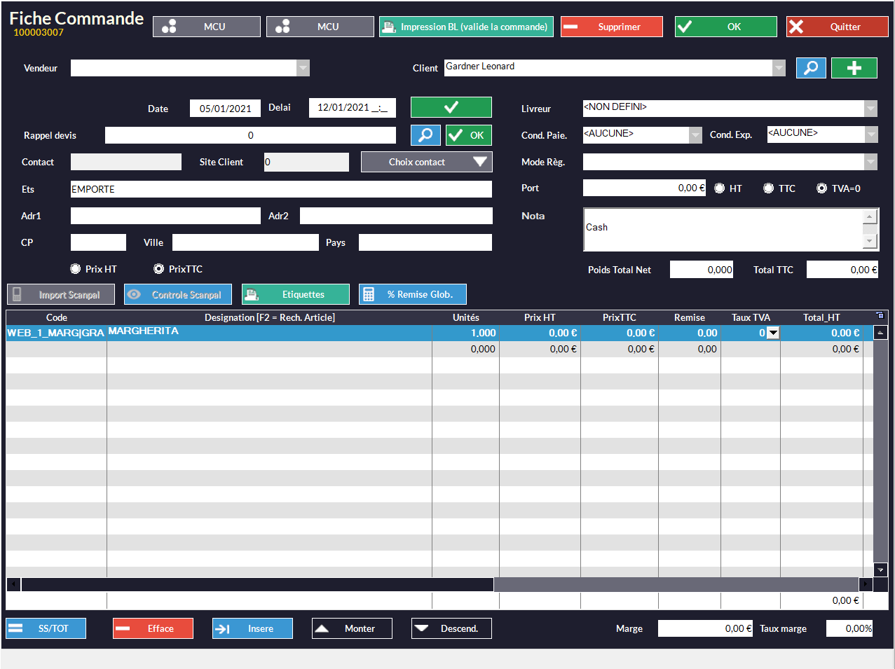
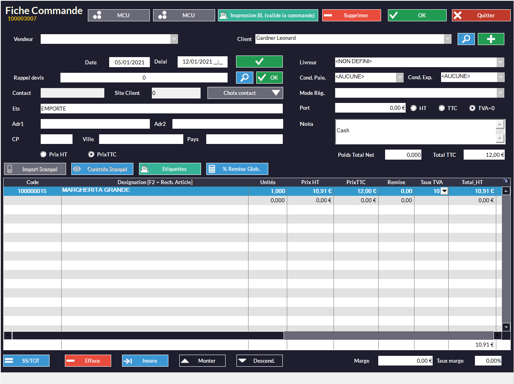

À partir du moment où Kezia II est connecté à HubRise et le catalogue est synchronisé, plus aucune action n'est requise de votre part. Votre logiciel de caisse va recevoir automatiquement toutes les commandes envoyées à HubRise depuis d'autres applications.

## Recevoir des commandes

Kezia II vérifie toutes les 60 secondes (paramètre réglable) si de nouvelles commandes ont été envoyées à HubRise. Une fenêtre d'avertissement vous signale l'arrivée d'une nouvelle commande dans Kezia II.
   

Pour voir la liste des commandes en cours, suivez les étapes suivantes :

1. Dans la barre de menu, sélectionnez **Client**.
1. Survolez l'option **Commande** et sélectionnez **Commandes en cours**. Une fenêtre nommée **Cdes en cours** s'affiche.
   

Pour voir le détail de la commande, sélectionnez la ligne correspondante puis sélectionnez **Voir F3** ou appuyez sur la touche F3. Pour la valider, procédez de la manière suivante :
1. Sélectionnez un vendeur dans le champ **Vendeur**.
1. Sélectionnez **OK**. Une fenêtre vous demandant le type d'impression désiré s'affiche.
   
1. Sélectionnez le type selon vos préférences.

Si le message d'erreur suivant apparaît, consultez la section [Commande avec des articles inconnus](/apps/kezia/orders#commande avec-des-articles-inconnus).
*Au moins un article de la commande est inconnu. La commande ne sera pas transmise au webservice.*

### Détails de la commande

Pour voir le détail d'une commande depuis la liste des commandes en cours :

1. Sélectionnez la ligne de la commande désirée.
1. Sélectionnez **Voir F3** ou appuyez sur la touche F3. Une fenêtre nommée **Fiche Commande** s'affiche, contenant les informations de la commande.
   

**Interprétation technique**

Voici comment les champs d'une commande HubRise sont utilisés dans Kezia II :

| Nom du champ HubRise                   | Utilisation dans Kezia II                                                   |
| -------------------------------------- | --------------------------------------------------------------------------- |
| `service_type`                         | Permet de savoir si la commande est en livraison, sur place, ou à emporter. |
| `service_type_ref`                     | Non utilisé.                                                                |
| `expected_time`                        | Heure et date auxquelles la commande sera prête ou livrée. Remplit la colonne *Delai* de chaque ligne produit. |
| `item.sku_ref`                         | Code permettant de retrouver l'article dans le catalogue Kezia II.          |
| `charges`                              | Ajoute une charge à la commande sous forme de ligne produit.                |

### Commande avec des articles inconnus

Dans le cas où une commande contient des produits dont le code ref n'est pas reconnu, un message d'erreur apparaît lorsque vous validez la commande.
   

Pour remédier à ce problème, suivez les étapes suivantes :
1. Sélectionnez votre commande pour en voir le détail.
   
1. Sélectionnez la dernière ligne et appuyez sur la touche F2. Votre menu apparaît.
   
1. Double-cliquez sur le produit correspondant en vous aidant du nom du produit non reconnu.
1. Sélectionnez la ligne du produit non reconnu.
1. Sélectionnez **Efface**. La ligne est supprimée.
   
1. Répétez ces étapes pour chaque produit non reconnu.
1. Lorsque toutes ces lignes sont supprimées, validez la commande.

Pour éviter que ce problème se reproduise, vérifiez les codes ref de vos produits. Les produits non reconnus sont causés par des codes refs invalides. Pour trouver un code ref, consultez la page [Trouver les codes ref](/apps/kezia/map-ref-codes).