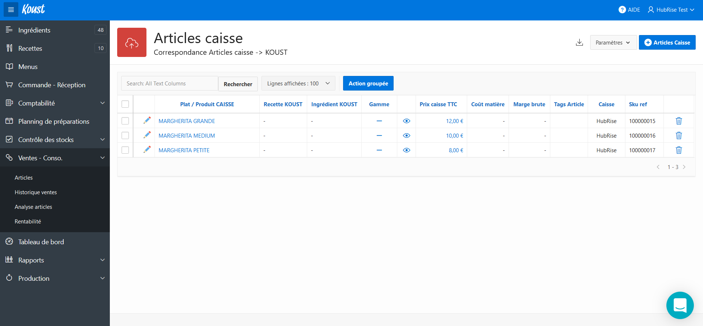

Après avoir connecté Koust à votre compte HubRise, vous pouvez synchroniser leurs données. Pour cela, certaines étapes doivent être entreprises.

## Importer le catalogue

Le catalogue est importé automatiquement lorsque la connexion avec HubRise est établie. Il peut aussi être importé dans un second temps manuellement. Pour cela, suivez les étapes suivantes :

1. Depuis votre tableau de bord Koust, cliquez sur le nom de votre entreprise dans la barre de menu (en haut à droite). Un menu déroulant s'affiche.
1. Sélectionnez **Paramètres**. La page **Paramètres de l'établissement** s'affiche.
1. Sélectionnez l'onglet **Intégrations**.
   
1. Cliquez sur le bloc **HubRise** présent dans la liste des intégrations. Une fenêtre modale s'ouvre.
   
1. Cliquez sur **Importer le catalogue**. Le message **Catalogue importé avec succès.** s'affiche.
   

## Produits

Un produit dans HubRise correspond à un article dans Koust. Pour retrouver le code ref d'un article, suivez les étapes suivantes :

1. Dans le menu latéral, sélectionnez **Ventes - Conso.** > **Historique ventes**.
   
1. Sélectionnez l'icône de modification ou le nom de l'article. Le code ref s'affiche dans le champ **Référence distante (SKU_REF)**.
   

---

**NOTE IMPORTANTE :** Vérifiez bien que la valeur de ce champ est la même que celle provenant de votre logiciel de caisse. Si ce n'est pas le cas, le mapping entre les articles provenant des commandes et ceux du catalogue HubRise ne peut pas se faire. Koust crée alors un nouvel article. Pour lier ces nouveaux articles à ceux du catalogue HubRise, consultez la page [Interface utilisateur](/apps/koust/interface-utilisateur#commandes).

---