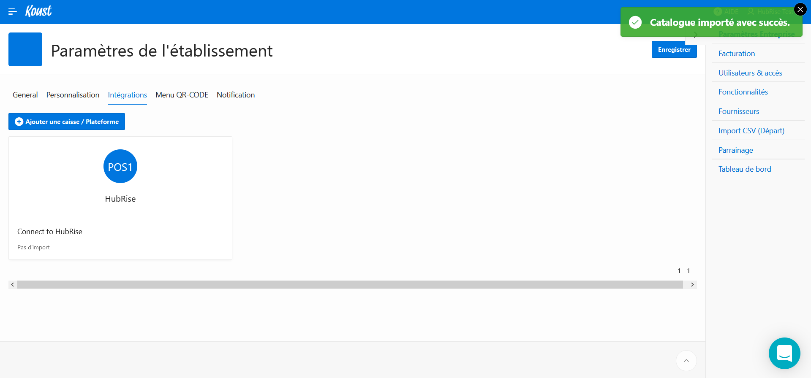

Une fois Koust connecté à HubRise, les commandes provenant de HubRise sont importées automatiquement. Pour vous assurer de la bonne synchronisation des articles, suivez les instructions détaillées sur cette page.

## Importer le catalogue

A tout moment, vous pouvez importer manuellement le catalogue depuis HubRise :

1. Ouvrez votre tableau de bord Koust, et dans la barre de menu, cliquez sur le nom de votre entreprise.
1. Dans le menu déroulant, sélectionnez **Paramètres**. La page **Paramètres de l'établissement** s'affiche.
1. Sélectionnez l'onglet **Intégrations**.
   
1. Cliquez sur le bloc **HubRise** présent dans la liste des intégrations. Une boîte de dialogue s'ouvre.
   
1. Cliquez sur **Importer le catalogue**. Le message **Catalogue importé avec succès.** s'affiche.
   

---

**REMARQUE IMPORTANTE :** Le catalogue est importé automatiquement dans Koust au moment de la connexion avec HubRise.

---

## Produits

Un produit dans HubRise correspond à un article dans Koust. Pour retrouver le code ref d'un article, suivez les étapes suivantes :

1. Dans le menu latéral, sélectionnez **Ventes - Conso.** > **Historique ventes**.
   
1. Sélectionnez l'icône de modification ou le nom de l'article. Le code ref s'affiche dans le champ **Référence distante (SKU_REF)**.
   

## SKUs

Une SKU (_Stock Keeping Unit_) dans HubRise correspond aussi à un article dans Koust. Par exemple, si un produit dans HubRise comprend 3 SKUs, 3 articles sont créés dans Koust lors de l'import du catalogue.

Pour retrouver le code ref d'un article, suivez les mêmes étapes que pour un [produit](/apps/koust/associer-codes-ref#produits).

## Options

Une option dans HubRise correspond aussi à un article dans Koust. Pour retrouver le code ref d'un article, suivez les mêmes étapes que pour un [produit](/apps/koust/associer-codes-ref#produits).
