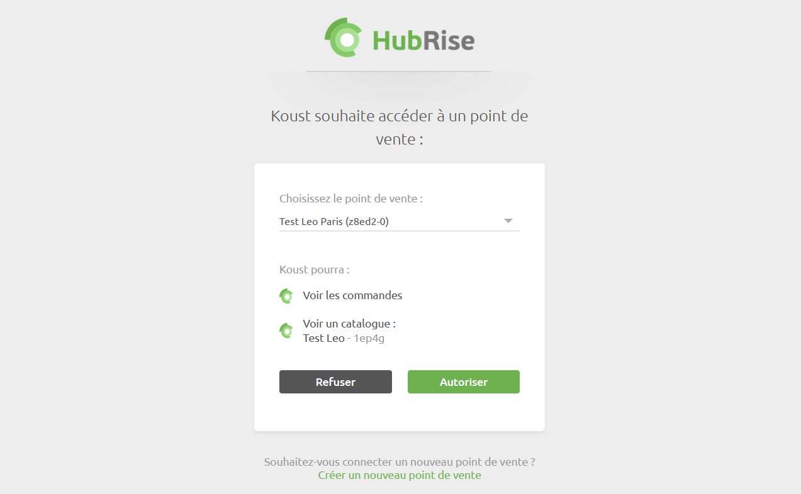

Connecter Koust à HubRise peut être fait en seulement quelques étapes.

## Se connecter

Pour établir la connexion entre Koust et HubRise :

1. Depuis votre tableau de bord Koust, cliquez sur le nom de votre entreprise dans la barre de menu (en haut à droite). Un menu déroulant s'affiche.
1. Sélectionnez **Paramètres**. La page **Paramètres de l'établissement** s'affiche.
1. Sélectionnez l'onglet **Intégrations**.
   
1. Cliquez sur **Ajouter une caisse / Plateforme**. Une fenêtre modale nommée **POS** s'ouvre.
1. Dans le champ **Caisse**, sélectionnez **HubRise**. Une section **HubRise** s'affiche en-dessous.
   
1. Cliquez sur **Se connecter à hubrise**. L'interface HubRise s'ouvre dans un nouvel onglet.
1. Choisissez le point de vente que vous désirez connecter et cliquez sur **Autoriser** pour donner à Koust l'accès à vos informations. Si plusieurs catalogues sont disponibles, cliquez sur **Suivant** afin d'afficher les listes déroulantes correspondantes avant de cliquer sur **Autoriser**. Vous êtes redirigés vers l'écran de connexion de Koust et le message suivant s'affiche : *HubRise connecté avec succès, veuillez vous reconnecter.*
   

---

**NOTE IMPORTANTE** Vous devrez vous connecter à un compte HubRise existant, ou créer un nouveau compte pour terminer d'établir la connexion. Pour plus d'informations sur la manière de créer un profil utilisateur ou vous connecter à HubRise, veuillez consulter notre [Guide de prise en main](/docs/getting-started/).

---

## Se déconnecter

1. Suivez les 3 premières étapes de la partie [Se connecter](/apps/koust/connect-hubrise#se-connecter).
   
1. Cliquez sur le bloc **HubRise** présent dans la liste des intégrations. Une fenêtre modale s'ouvre.
   
1. Cliquez sur **Se déconnecter**.