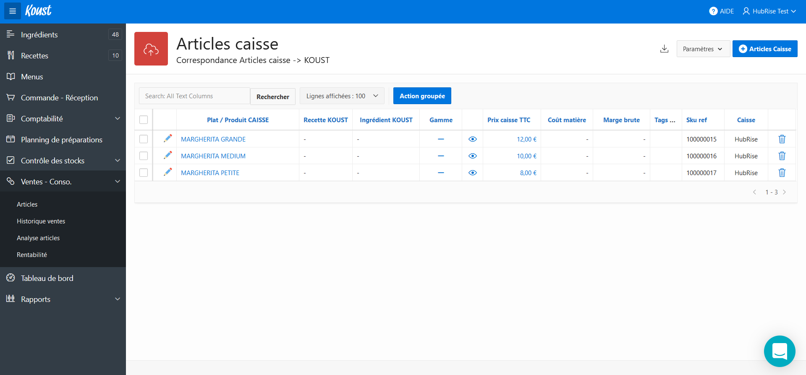
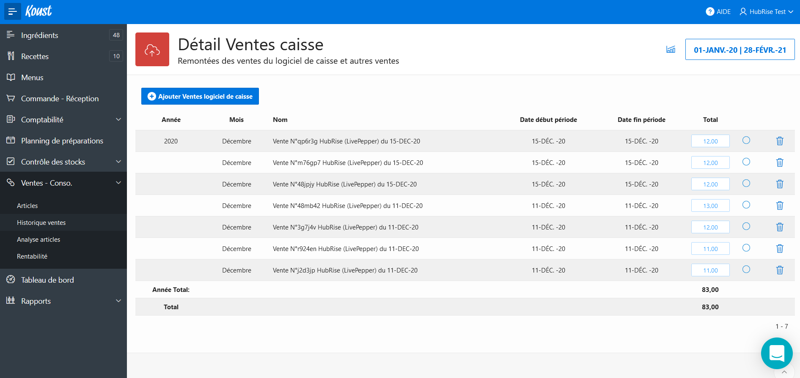
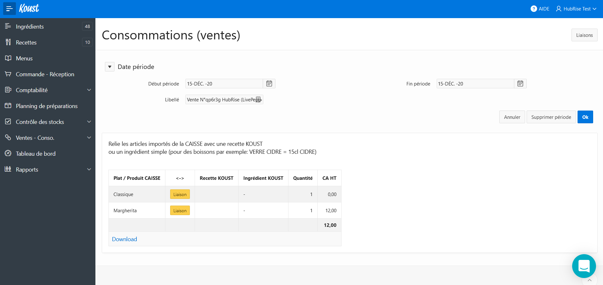
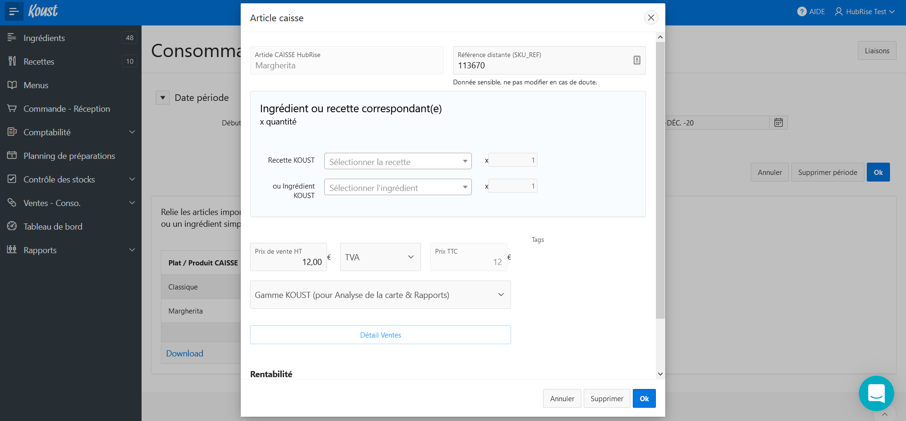

Depuis votre tableau de bord Koust, vous pouvez accéder à la page listant les commandes, ou à celle listant les articles provenant de votre catalogue HubRise.

## Articles

Lorsque vous avez importé votre catalogue HubRise, vous pouvez retrouver les articles dans la page **Articles caisse**. Pour y accéder, sélectionnez **Ventes - Conso.** dans le menu latéral.
   

Lors de la réception d'une commande, Koust vérifie les codes ref des différents articles afin de voir s'ils n'existent pas déjà dans le catalogue que vous avez importé au préalable depuis HubRise. Si aucun article n'est trouvé, un nouveau est créé et répertorié sur cette page.

Afin de s'assurer que le mapping entre les articles des commandes et ceux du catalogue se fait correctement, vérifiez la valeur de ces codes ref en suivant les étapes de la page [Associer les codes ref](/apps/koust/associer-codes-ref#produits).

## Commandes

L'historique de vos commandes passées depuis d'autres applications est accessible sur la page **Détail Ventes caisse**. Pour y accéder, sélectionnez **Ventes - Conso.** > **Historique ventes** dans le menu latéral.
   

Vous pouvez accéder au détail d'une commande en sélectionnant son montant dans la colonne **Total**.
   

Si cette commande contient des articles inconnus, sélectionnez **Liaison** sur la ligne de l'article correspondant et modifiez la valeur du champ **Référence distante (SKU_REF)** avec le code ref provenant du catalogue HubRise.
   