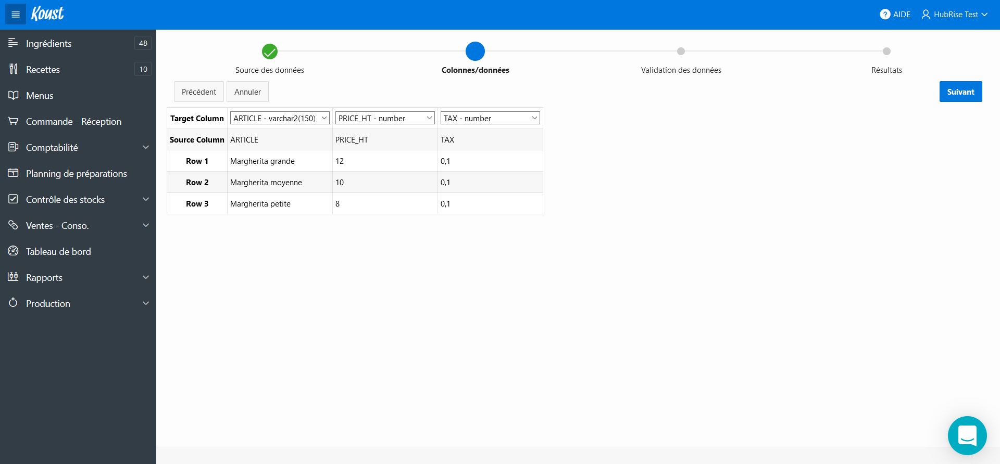
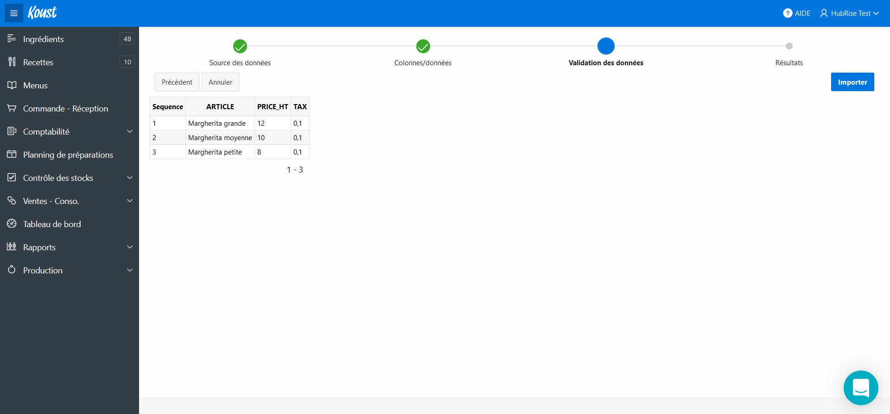
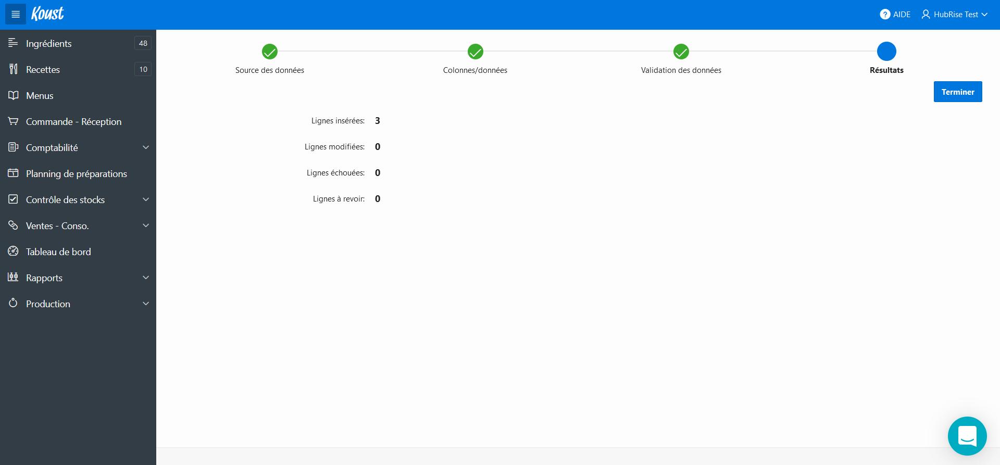
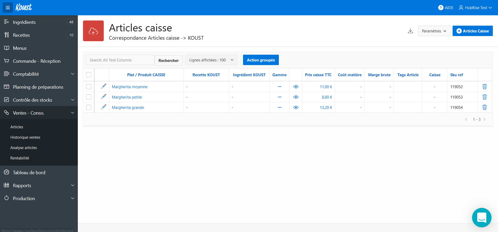

## Import CSV

Pour réaliser votre import CSV, suivez les étapes suivantes :

1. Sélectionnez **Ventes - Conso.** dans le menu latéral.
   
1. Sélectionnez **+ Articles caisse**. Une modale s'affiche.
1. Dans le champ **Caisse**, sélectionnez l'option **Import manuel**.
   
1. Sélectionnez le fichier CSV que vous désirez importer. Vous pouvez vous inspirer du fichier exemple fourni par Koust. Passez à l'étape suivante en sélectionnant **Suivant**.
   
1. Si les données sont affichées correctement, sélectionnez **Suivant**.
   
1. Sélectionnez **Importer**.
   
1. Sélectionnez **Terminer**.
   