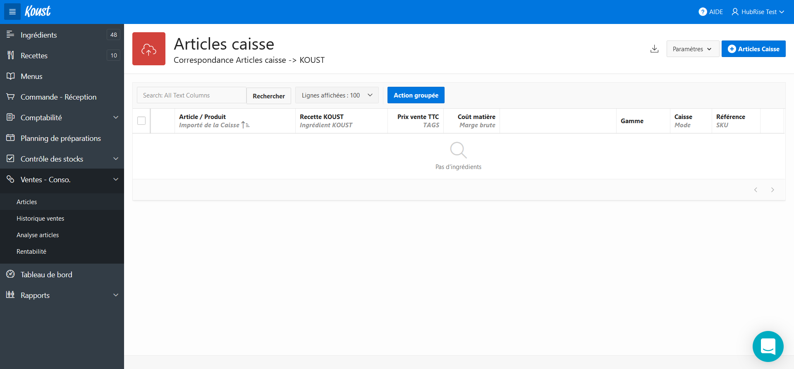
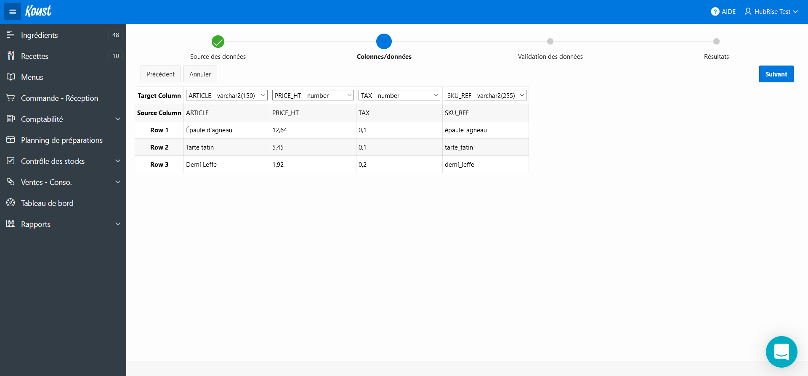
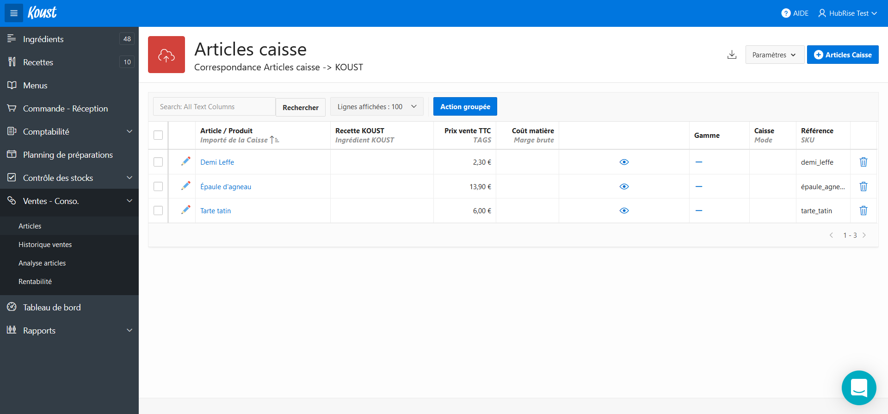

## Import CSV

Si votre entreprise n'utilise pas de logiciel de caisse, vous pouvez importer vos codes ref depuis un fichier CSV. Pour connaître la structure de ce fichier, suivez les étapes ci-dessous jusqu'à la sélection du fichier, puis téléchargez le fichier exemple fourni par Koust.

---

**REMARQUE IMPORTANTE :** Pour éviter tout problème d'encodage ou d'accent, assurez-vous d'enregistrer votre fichier CSV en encodage UTF-8.

---

Pour importer un fichier CSV dans Koust, suivez les étapes suivantes :

1. Dans le menu latéral, sélectionnez **Ventes - Conso.**.
   
1. Cliquez sur **+ Articles caisse**. Une boîte de dialogue s'affiche.
1. Dans le champ **Caisse**, sélectionnez l'option **Import manuel**.
   
1. Sélectionnez le fichier CSV à importer. Passez à l'étape suivante en sélectionnant **Suivant**.
   
1. Si les données sont affichées correctement, cliquez sur **Suivant**.
   
1. Cliquez sur **Importer**.
   
1. Cliquez sur **Terminer**.
   

Contrairement aux articles importés depuis le catalogue HubRise, les codes ref des articles importés en CSV ne peuvent pas être modifiés. Si vous devez modifier le code ref d'un article, supprimez cet article puis importez à nouveau.
