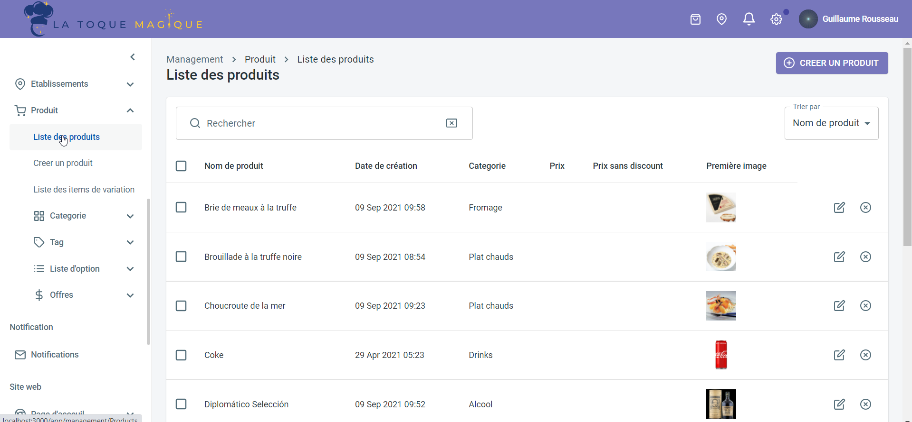

---

**REMARQUE IMPORTANTE :** Pour accéder à certains codes ref dans le back office La Toque Magique, vous devez être connecté en mode gestion d'enseigne. Pour activer ce mode, cliquez en haut à droite sur l'icône en forme d'épingle, puis sélectionnez **Gérer l'enseigne**. Pour revenir en mode gestion d'établissement, cliquez en haut à droite sur l'icône en forme d'épingle, puis sélectionnez l'établissement.

---

## Produits et SKUs

Les SKUs dans HubRise correspondent aux items de variation dans La Toque Magique.

Pour modifier le code ref d'une SKU, suivez ces étapes :

1. En mode gestion d'enseigne, sélectionnez **Produit** dans le menu latéral, puis **Liste des Produits**.
   
2. Cliquez sur l'icône éditer du produit.
3. Dans la page d'édition du produit, dans la section **Liste des items de variation**, cliquez sur l'icône éditer de la SKU choisie.
   
4. Renseignez le code ref dans le champ **Référence externe**.
5. Cliquez à gauche sur l'icône en forme de **v** pour valider.

La Toque Magique permet de saisir un code ref sur le produit. Ce code n'est pas utilisé en pratique, et seuls les codes refs des SKUs doivent être renseignés.

## Options

Pour modifier le code ref d'une option, suivez ces étapes :

1. En mode gestion d'enseigne, sélectionnez **Produit** dans le menu latéral, puis **Liste d'options** et enfin **Liste de Listes d'options**.
2. Cliquez sur l'icône éditer de la liste d'options à éditer.
   
3. Sous le libellé **Liste d'options**, cliquez sur l'icône éditer de l'option à éditer.
4. Renseignez le code ref dans le champ **Référence externe**
5. Cliquez sur l'icône en forme de **v** pour valider.

La Toque Magique permet d'indiquer un code ref sur une catégorie de liste d'options, dans le champ **Référence externe** de la section **Catégorie**. Ce code n'est pas utilisé en pratique, et il n'est pas nécessaire de le renseigner.

## Promotions

Les promotions dans HubRise sont les offres spéciales qui s'appliquent à certains articles. Elles correspondent aux offres sur La Toque Magique.

Pour modifier le code ref d'une offre, suivez ces étapes :

1. En mode gestion d'enseigne, sélectionnez **Produit** dans le menu latéral, puis **Offres** et enfin **Liste d'offres**.
2. Cliquez sur l'icône éditer de l'offre à éditer.
3. Renseignez le code ref dans le champ **Référence externe**.
4. Cliquez sur **METTRE À JOUR**.

## Remises

Les remises dans HubRise sont les offres spéciales qui s'appliquent à l'ensemble de la commande. Elles correspondent aux réductions sur La Toque Magique.

Pour modifier le code ref d'une réduction, suivez ces étapes :

1. En mode gestion d'enseigne, sélectionnez **Produit** dans le menu latéral, puis **Réductions** et enfin **Liste de réductions**.
2. Cliquez sur l'icône éditer de la réduction à éditer.
3. Renseignez le code ref dans le champ **Référence externe**.
4. Cliquez sur **METTRE À JOUR**.

## Méthodes de paiement

Selon les apps connectées à La Toque Magique, les méthodes de paiement peuvent nécessiter un code ref. Référez-vous à la documentation des apps connectées sur le site de HubRise pour vérifier.

Pour modifier le code ref d'une méthode de paiement, suivez ces étapes :

1. Dans votre back-office La Toque Magique, en haut à droite, cliquez sur l'icône en forme d'épingle, puis sélectionnez l'établissement.
2. Dans le menu à gauche, sous Management, cliquez sur **Établissements**, puis sur **Mon établissement**. Allez dans l'onglet **INTÉGRATION DES SERVICES**, puis **ASSOCIATION CODE DE PAIEMENT CAISSE**.
3. Renseignez les codes ref dans les champs **Espèce**, **Carte**, **Ticket restaurant**, **Chèque** et **Stripe**
4. Cliquez sur **SAUVEGARDER LES CHANGEMENTS**.

## Types de service

Les types de service tels que livraison, à emporter ou sur place peuvent nécessiter un code ref. Référez-vous à la documentation des apps connectées sur le site de HubRise pour vérifier.

Pour modifier le code ref d'un type de service, suivez ces étapes :

1. Dans votre back-office La Toque Magique, en haut à droite, cliquez sur l'icône en forme d'épingle, puis sélectionnez l'établissement.
2. Dans le menu à gauche, sous Management, cliquez sur **Établissements**, puis sur **Mon établissement**.
3. Ouvrez l'onglet **INTÉGRATION DES SERVICES**, puis le sous-onglet **ASSOCIATION CODE DE SERVICE**.
4. Renseignez les codes ref dans les champs **Code livraison**, **Code click N Collect** et **Code sur place**.
5. Cliquez sur **SAUVEGARDER LES CHANGEMENTS**.
