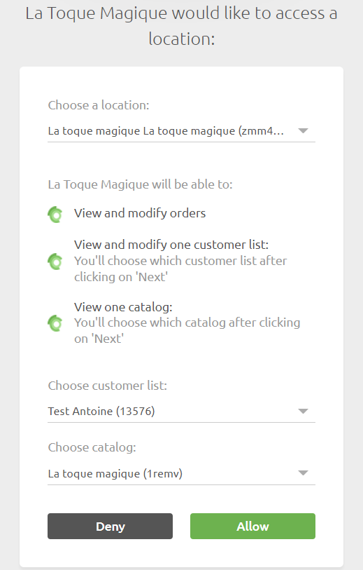

---

**REMARQUE IMPORTANTE :** Si vous ne possédez pas encore de compte HubRise, commencez par en ouvrir un sur la [page d'inscription à HubRise](https://manager.hubrise.com/signup). L'inscription ne prend que quelques minutes !

---

## Se connecter

Pour établir la connexion entre La Toque Magique et HubRise :

1. Dans votre back-office La Toque Magique, en haut à droite de la fenêtre, cliquez sur l'icône en forme d'épingle **Changer d'établissement**, puis sur **Gérer l'établissement** pour passer en mode Gestion d'établissement.
   
2. Dans le menu à gauche, sous Management, cliquez sur **Établissements**, puis sur **Mon établissement**. Allez dans l'onglet **INTÉGRATION DES SERVICES**, puis **CONFIGURATION HUBRISE**.
3. Cliquez sur **SE CONNECTER À HUBRISE**.
   
4. Choisissez votre point de vente, ainsi que votre liste de clients et votre catalogue, puis validez. Une page de confirmation s'affiche.
   
   
5. Cliquez sur **RETOURNER À LA PAGE PRINCIPALE** pour revenir à la page de votre établissement.
   

## Se déconnecter

1. Suivez les deux premières étapes de la partie [Se connecter](/apps/la-toque-magique/connexion-hubrise#se-connecter).
2. Cliquez sur **SE DÉCONNECTER DE HUBRISE**.