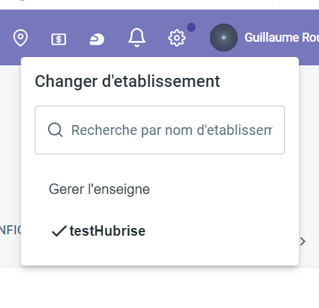
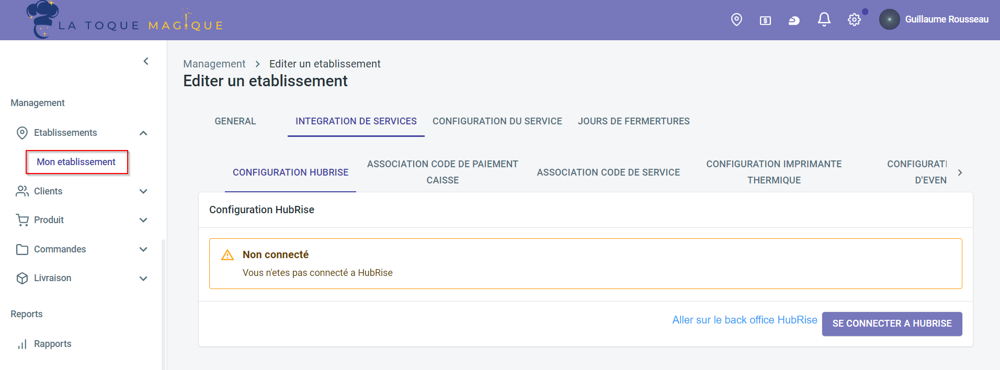
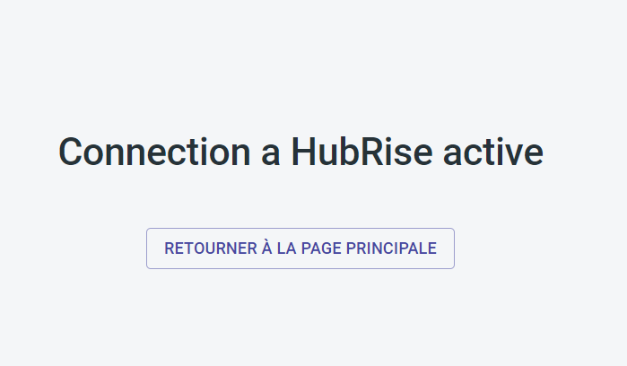

---

**REMARQUE IMPORTANTE :** Si vous ne possédez pas encore de compte HubRise, commencez par en ouvrir un sur la [page d'inscription à HubRise](https://manager.hubrise.com/signup). L'inscription ne prend que quelques minutes !

---

## Connecter La Toque Magique

Pour établir la connexion entre La Toque Magique et HubRise :

1. Dans votre back-office La Toque Magique, en haut à droite, cliquez sur l'icône en forme d'épingle, puis sélectionnez l'établissement.
   
1. Dans le menu à gauche, sous **Management**, cliquez sur **Établissements**, puis sur **Mon établissement**.
1. Ouvrez l'onglet **INTÉGRATION DES SERVICES**, puis le sous-onglet **CONFIGURATION HUBRISE**.
   
1. Cliquez sur **SE CONNECTER À HUBRISE**. La page HubRise s'ouvre dans votre navigateur.
1. Si vous avez plusieurs points de vente, choisissez le point de vente à connecter. Si le point de vente sélectionné possède plusieurs listes de clients ou catalogues, cliquez sur **Suivant** pour afficher les listes déroulantes correspondantes, puis sélectionnez les options voulues.
1. Cliquez sur **Autoriser**.
   
1. Cliquez sur **RETOURNER À LA PAGE PRINCIPALE** pour revenir à la page de votre établissement.
   

## Déconnecter La Toque Magique

1. Dans votre back-office La Toque Magique, en haut à droite, cliquez sur l'icône en forme d'épingle, puis sélectionnez l'établissement.
1. Dans le menu à gauche, sous **Management**, cliquez sur **Établissements**, puis sur **Mon établissement**.
1. Ouvrez l'onglet **INTÉGRATION DES SERVICES**, puis le sous-onglet **CONFIGURATION HUBRISE**.
1. Cliquez sur **SE DÉCONNECTER DE HUBRISE**.
