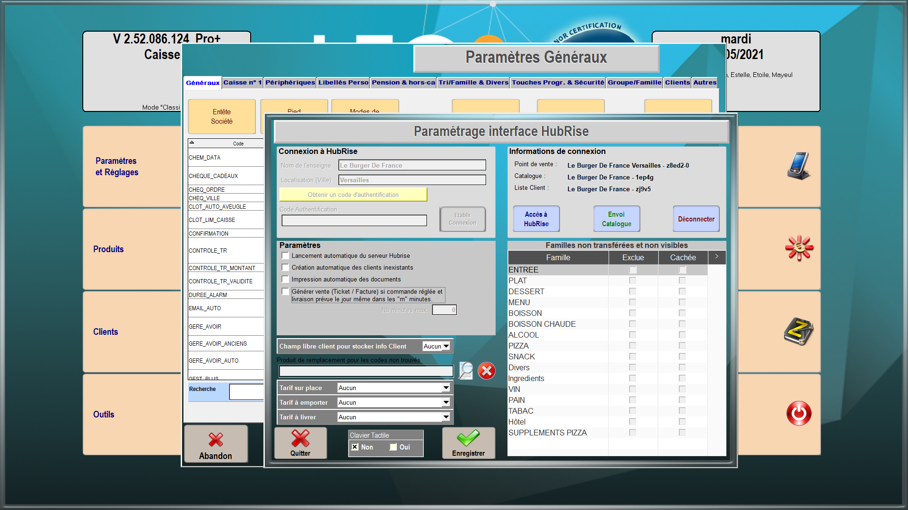

---

**REMARQUE IMPORTANTE :** Si vous ne possédez pas encore de compte HubRise, commencez par en ouvrir un sur la [page d'inscription à HubRise](https://manager.hubrise.com/signup). L'inscription ne prend que quelques minutes !

---

## Connecter LEO2

Pour connecter votre logiciel de caisse LEO2 à HubRise, suivez les étapes suivantes :

1. Vérifiez que le module **Vente Externe** est activé. Pour plus d'informations, contactez votre revendeur.
1. Depuis l'écran d'accueil de LEO2, cliquez sur **Gestion**.
1. Entrez le mot de passe que vous avez choisi lors de l'installation de LEO2. Par défaut, ce mot de passe est **1234**.
   
1. Cliquez sur **Paramètres et Réglages**.
1. Dans l'onglet **Généraux**, cliquez sur **HubRise**.
   
1. Si les champs **Nom de l'enseigne** et **Localisation (Ville)** sont vides, remplissez-les.
1. Cliquez sur **Obtenir un code d'authentification**. Vous êtes redirigé vers l'interface HubRise.
1. Si vous avez plusieurs points de vente, choisissez le point de vente à connecter. Si le point de vente sélectionné possède plusieurs listes de clients ou catalogues, cliquez sur **Suivant** pour afficher les listes déroulantes correspondantes, puis sélectionnez les options voulues.
1. Cliquez sur **Autoriser**.
1. Copiez le code affiché et collez-le dans la fenêtre **Paramétrage interface HubRise** de LEO2.
1. Cliquez sur **Etablir Connexion**.
1. Cliquez sur **OK**. Les identifiants des point de vente, catalogue et liste de clients sont automatiquement renseignés dans la fenêtre **Informations de connexion**.
   
1. Cochez la case **Lancement automatique du serveur HubRise**.
1. Cliquez sur **Enregistrer**.
1. En cas de besoin, l'éditeur du logiciel LEO2 peut vous venir en aide. Pour leur donner accès à votre compte HubRise, [ajoutez les permissions nécessaires](/apps/leo2/connect-hubrise#give-access).
1. Pour pouvoir redémarrer facilement le serveur d'HubRise, nous vous recommandons de [créer un raccourci sur votre bureau](/apps/leo2/connect-hubrise#shortcut).

## Donner accès au support de LEO2 {#give-access}

Pour faciliter la prise en charge de vos demandes de support, nous vous recommandons de donner accès à votre compte HubRise à l'éditeur de la solution LEO2.

Pour donner accès à LEO2, procédez comme suit :

1. Depuis le back-office de HubRise, sélectionnez **CONFIGURATION** dans le menu de gauche.
1. Dans la section **Permissions**, ajoutez atoo@atoosarl.fr en sélectionnant l'option **Manager** dans la liste déroulante des rôles.
1. Cliquez sur l'icône **+** pour ajouter le nouvel utilisateur.

L'ajout d'un utilisateur est le moyen recommandé de donner accès à un tiers à votre point de vente. Le partage de mot de passe est déconseillé pour des raisons de sécurité.

## Créer un raccourci sur le bureau {#shortcut}

Le fonctionnement d'HubRise nécessite que le serveur HubRise soit démarré sur le même ordinateur que LEO2.

Pour faciliter le démarrage du serveur HubRise, vous pouvez créer un raccourci sur le bureau de votre ordinateur en suivant les étapes suivantes :

1. Ouvrez le dossier d'installation de LEO2.
1. Cliquez avec le bouton droit sur l'exécutable **LEO250.exe**.
1. Sélectionnez **Envoyer vers** > **Bureau (créer un raccourci)**.
1. Une fois le raccourci créé, cliquez avec le bouton droit sur le raccourci
1. Sélectionnez **Propriétés**.
1. Dans l'onglet **Raccourci**, ajoutez **SERVEUR_HUBRISE** à la fin de la ligne **Cible**, en laisant un espace. Par exemple, si la ligne **Cible** est `C:\atoo_leo250\LEO250.exe`, elle deviendra:
   `C:\atoo_leo250\LEO250.exe SERVEUR_HUBRISE`.
1. Cliquez sur **OK**.

## Déconnecter LEO2 {#connect}

1. Depuis l'écran d'accueil, cliquez sur **Gestion**.
1. Entrez le mot de passe que vous avez choisi lors de l'installation de LEO2. Par défaut, ce mot de passe est **1234**.
1. Cliquez sur **Paramètres et Réglages**.
1. Cliquez sur **HubRise**.
1. Cliquez sur **Déconnecter**.
