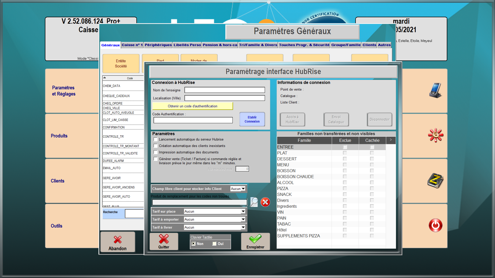

---

**REMARQUE IMPORTANTE :** Si vous ne possédez pas encore de compte HubRise, commencez par en ouvrir un sur la [page d'inscription à HubRise](https://manager.hubrise.com/signup). L'inscription ne prend que quelques minutes !

---

## Connecter LEO2

Pour connecter votre solution d'encaissement LEO2 à HubRise, suivez les étapes suivantes :

1. Vérifiez que le module **Vente Externe** est activé. Pour plus d'informations, contactez l'éditeur.
1. Depuis l'écran d'accueil de LEO2, cliquez sur **Gestion**.
1. Entrez le mot de passe que vous avez choisi lors de l'installation de LEO2. Par défaut, ce mot de passe est **1234**.
   
1. Cliquez sur **Paramètres et Réglages**.
1. Dans l'onglet **Généraux**, cliquez sur **HubRise**.
   
1. Si les champs **Nom de l'enseigne** et **Localisation (Ville)** sont vides, remplissez-les.
1. Cliquez sur **Obtenir un code d'authentification**. Vous êtes redirigé vers l'interface HubRise.
1. Si vous avez plusieurs points de vente, choisissez le point de vente à connecter. Si le point de vente sélectionné possède plusieurs listes de clients ou catalogues, cliquez sur **Suivant** pour afficher les listes déroulantes correspondantes, puis sélectionnez les options voulues.
1. Cliquez sur **Autoriser**.
1. Copiez le code affiché et collez-le dans la fenêtre **Paramétrage interface HubRise** de LEO2.
1. Cliquez sur **Etablir Connexion**.
1. Cliquez sur **OK**.
   
1. Cochez la case **Lancement automatique du serveur HubRise**.
1. Cliquez sur **Enregistrer**.
1. En cas de besoin, l'éditeur du logiciel LEO2 peut vous venir en aide. Pour leur donner accès à votre compte HubRise, [ajoutez les permissions nécessaires](/apps/leo2/connexion-hubrise#donner-acc-s-au-support-de-leo2).

## Donner accès au support de LEO2

Il est conseillé de donner à l'éditeur du logiciel LEO2 l'accès à votre compte HubRise. En cas de besoin, ils pourront ainsi vous venir en aide. Pour cela, suivez les étapes suivantes :

1. Depuis votre espace HubRise, sélectionnez **CONFIGURATION** > **COMPTES** dans le menu de gauche. La liste de vos comptes s'affiche.
1. Sélectionnez le compte auquel votre point de vente est rattaché.
1. Dans la section **Points de vente**, sélectionnez votre point de vente.
1. Dans la section **Permissions**, ajoutez *atoo@atoosarl.fr* en sélectionnant l'option **Manager** (et non **Admin**) dans la liste déroulante des rôles, puis cliquez sur l'icône _+_. L'ajout d'un utilisateur est le moyen recommandé de donner accès à un tiers à votre point de vente, le partage de mot de passe étant déconseillé pour des raisons de sécurité.

## Déconnecter LEO2

1. Depuis l'écran d'accueil, cliquez sur **Gestion**.
1. Entrez le mot de passe que vous avez choisi lors de l'installation de LEO2. Par défaut, ce mot de passe est **1234**.
1. Cliquez sur **Paramètres et Réglages**.
1. Cliquez sur **HubRise**.
1. Cliquez sur **Déconnecter**.
