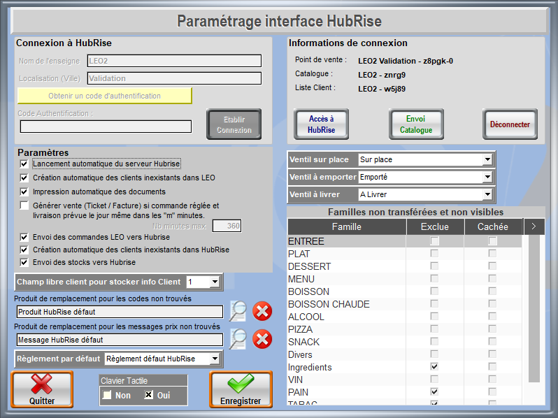
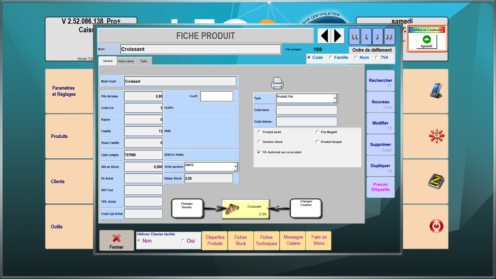
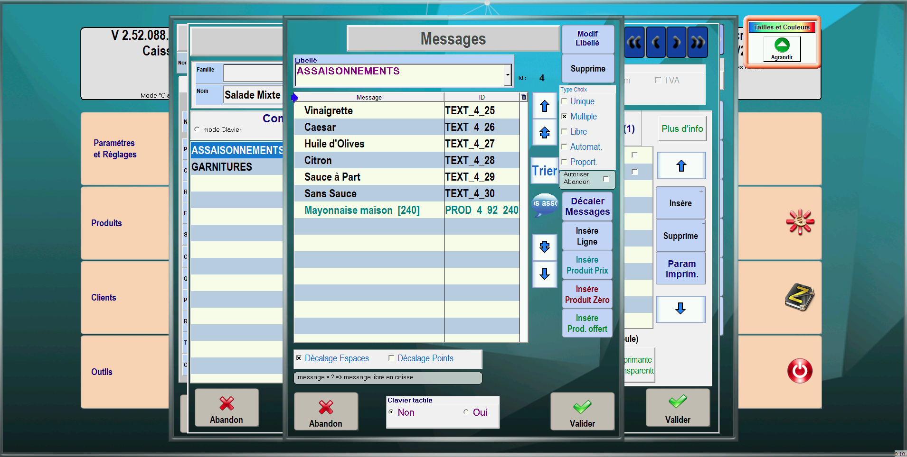
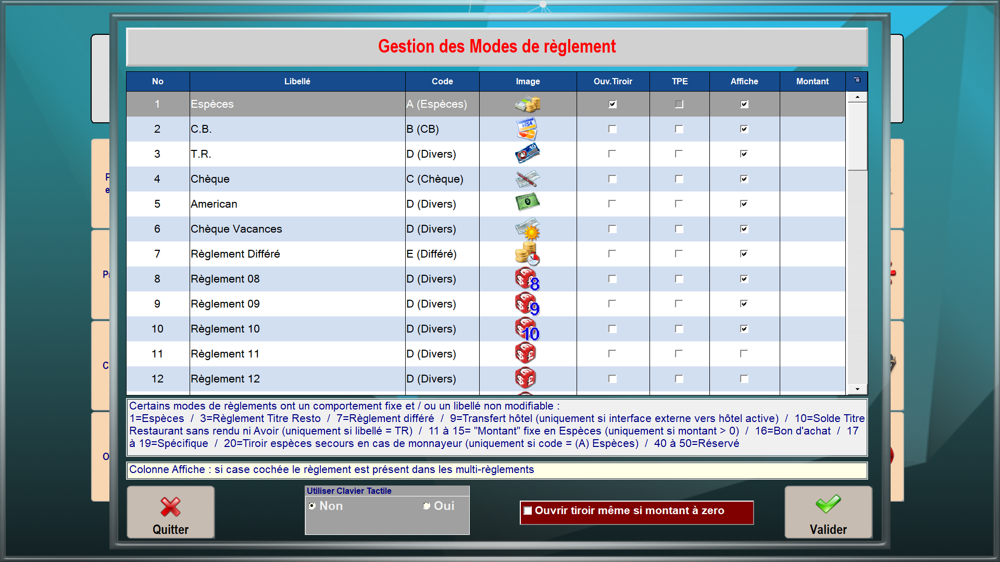

Une fois votre logiciel de caisse LEO2 connecté à HubRise, vous devez configurer vos autres applications connectées, afin que les différents éléments présents dans les commandes soient bien identifiés par LEO2.

LEO2 identifie chaque élément d'une commande par un code ref. Vous devez indiquer les codes ref fournis par LEO2 dans vos autres applications, afin que les commandes puissent être réceptionnées.

Il y a deux façons de procéder :

- Vous pouvez exporter le catalogue LEO2 vers HubRise, puis importer ce catalogue dans vos autres applications.
- Ou vous pouvez saisir manuellement les codes ref dans vos autres applications.

Seules certaines applications permettent l'import d'un catalogue depuis HubRise. Pour les autres, il faudra saisir manuellement les codes ref.

## Exporter le catalogue {#export-catalog}

Pour exporter manuellement un catalogue vers HubRise, suivez les étapes suivantes :

1. Depuis l'écran d'accueil, cliquez sur **Gestion**.
1. Entrez le mot de passe que vous avez choisi lors de l'installation de LEO2. Par défaut, ce mot de passe est **1234**.
1. Cliquez sur **Paramètres et Réglages**.
1. Cliquez sur **HubRise**.
   
1. Cliquez sur **Envoi catalogue**.
1. Cliquez sur **Oui**.

Vous devez maintenant importer le catalogue HubRise dans vos autres applications connectées à HubRise. Pour effectuer cette opération, référez-vous à la documentation de ces applications sur le site de HubRise.

## Produits {#products}

Pour retrouver le code ref d'un produit, suivez les étapes suivantes :

1. Depuis l'écran d'accueil, cliquez sur **Gestion**.
1. Entrez le mot de passe que vous avez choisi lors de l'installation de LEO2. Par défaut, ce mot de passe est **1234**.
1. Cliquez sur **Produits**.
1. Cliquez sur **Rechercher** ou appuyez sur la touche **F1**.
   
1. Sélectionnez dans la liste le produit désiré. Le code ref s'affiche en haut à droite de la fenêtre **FICHE PRODUIT**, dans le champ **Clé unique**.
   

## SKUs

LEO2 ne permet pas de créer de SKU. Pour remplacer cette fonctionnalité, vous devez associer chaque SKU d'un produit HubRise avec un produit distinct dans LEO2.

## Options

Les options dans HubRise correspondent aux messages cuisine dans LEO2.

LEO2 supporte deux types de messages cuisine :

- Les messages simples, réservés aux options gratuites.
- Les messages produits, qui peuvent être utilisés pour les options gratuites ou payantes.

Pour retrouver le code ref d'une option, suivez les étapes suivantes :

1. Depuis l'écran d'accueil, cliquez sur **Gestion**.
1. Entrez le mot de passe que vous avez choisi lors de l'installation de LEO2. Par défaut, ce mot de passe est **1234**.
1. Cliquez sur **Produits**.
1. Cliquez sur **Messages Cuisine**.
1. Dans la table **Commentaires associés**, cliquez sur le commentaire auquel appartient le message cuisine désiré. Le code ref s'affiche dans la colonne **ID**.
   

Les messages simples sont créés avec le bouton **Insère Ligne**. Leur code ref est au format **TEXT_xx_yy**.

Les messages produits sont créés avec les boutons **Insère Produit Prix**, **Insère Produit Zéro**, ou **Insère Prod. Offert**. Leur code ref est au format **PROD_xx_yy_zz**.

---

**REMARQUE IMPORTANTE :** Le code ref d'une option payante, qui est un message produit, doit toujours être au format **PROD_xx_yy_zz**.

---

## Promotions

Les promotions dans HubRise correspondent aux menus dans LEO2. Les lignes de promotion correspondent aux choix de menu. Pour retrouver le code ref et les choix de menu dans LEO2 :

1. Ouvrez le produit correspondant au menu, en suivant les mêmes étapes que pour un [produit](/apps/leo2/map-ref-codes#products).
1. Le code ref du menu s'affiche en haut à droite de la fenêtre **FICHE PRODUIT**, dans le champ **Clé unique**.
   
1. Pour accéder aux choix de menu, cliquez sur **Faire un Menu**.
1. Pour voir les produits associés à chaque choix de menu, cliquez sur l'onglet du choix correspondant.
   

## Remises

Les remises sont appliquées par LEO2 sans tenir compte des codes ref. Il n'est donc pas nécessaire de les associer.

## Frais

Les frais de livraison ou de service doivent être créés comme des produits dans LEO2. Pour trouver le code ref des frais, procédez comme pour les [produits](#products).

## Méthodes de paiement

Les méthodes de paiement dans HubRise correspondent aux modes de règlement dans LEO2. Pour retrouver leur code ref, suivez les étapes suivantes :

1. Depuis l'écran d'accueil, cliquez sur **Gestion**.
1. Entrez le mot de passe que vous avez choisi lors de l'installation de LEO2. Par défaut, ce mot de passe est **1234**.
1. Cliquez sur **Paramètres et Réglages**.
1. Cliquez sur **Modes de Règlement**. Le code ref s'affiche dans la colonne **No**.
   

## Types de service {#service-types}

Les types de service dans HubRise sont **Sur place**, **Emporter** et **Livraison**. Chaque type de service doit être associé à un tarif dans LEO2.

Pour associer un type de service à un tarif, suivez les étapes suivantes :

1. Depuis l'écran d'accueil de LEO2, cliquez sur **Gestion**.
1. Entrez le mot de passe que vous avez choisi lors de l'installation de LEO2. Par défaut, ce mot de passe est **1234**.
1. Cliquez sur **Paramètres et Réglages**.
1. Dans l'onglet **Généraux**, cliquez sur **HubRise**.
   
1. Dans les champs **Tarif sur place**, **Tarif à emporter** et **Tarif à livrer**, choisissez le tarif correspondant dans la liste déroulante.

## Codes ref des types de service {#service-types}

Les codes refs des types de service dans HubRise correspondent aux vendeurs dans LEO2. Les vendeurs permettent de connaître la provenance des commandes. Selon vos besoins, vous pouvez par exemple créer un vendeur "Uber Eats" et un vendeur "WooCommerce".

Une fois le vendeur créé, vous pouvez trouver son code ref en suivant les étapes suivantes :

1. Depuis l'écran d'accueil, cliquez sur **Gestion**.
1. Entrez le mot de passe que vous avez choisi lors de l'installation de LEO2. Par défaut, ce mot de passe est **1234**.
1. Cliquez sur **Vendeurs**. Le code ref s'affiche dans la colonne **N°**.
   
