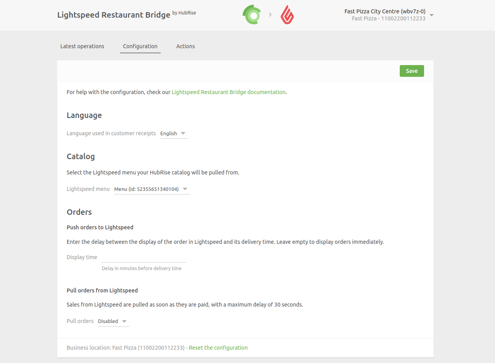

The configuration page allows you to customise the behaviour of Lightspeed Restaurant Bridge based on your preferences.
These are divided into different sections for an easier navigation.

## Language

Choose the language to use for generic items such as `Delivery charge`. These names may appear in customer receipts.

## Catalog

This section allows you to choose which Lightspeed menu to use when you want to pull your catalog to HubRise. Select a value from the drop-down list.

## Orders

From this section, you can customise how Lightspeed Restaurant Bridge handles orders.

If you want to delay orders until shortly before the delivery time, you can set the **Display time** field. If you leave it empty, orders will be displayed immediately on Lightspeed.

By default, Lightspeed Restaurant Bridge does not pull Lightspeed sales into HubRise. If you want to enable this feature, select**Enabled for paid sales** from **Pull orders**.

## Save the Configuration

To save the configuration, click **Save** at the top of the page.

## Reset the Configuration

If you need to reset the configuration, click **Reset the configuration** at the bottom of the page.

---

**IMPORTANT NOTE:** Resetting the configuration will instantly disconnect the bridge from Lightspeed Restaurant.

---

Resetting the configuration does not delete the operation logs displayed in the main page.
