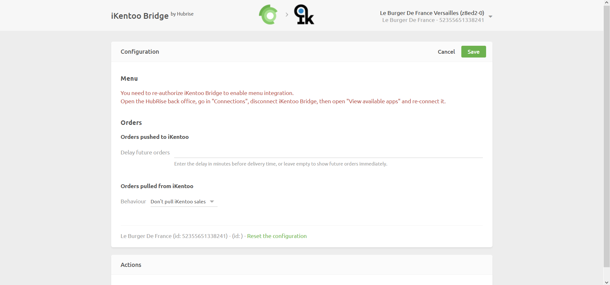

Lightspeed Restaurant Bridge can pull local orders created and closed from your Lightspeed Restaurant EPOS to HubRise.
This page explains how to enable this feature from the Bridge and what information is sent to HubRise.

## Enabling The Feature

To start pulling local Lightspeed orders into HubRise, you need to activate this feature from the Configuration page of Lightspeed Restaurant Bridge, first. Follow these steps.

1. From the Lightspeed Restaurant Bridge main page, click the arrow <InlineImage width="20" height="20"></InlineImage> at the top right corner of the page to expand the menu, then click **Configuration**.
1. From the **Orders pulled from Lightspeed** section, select the behaviour **Pull Lightspeed sales on payment**.
1. Click **Save** to confirm.

Lightspeed Restaurant Bridge fetches new orders every 30 seconds.

---

**IMPORTANT NOTE:** Only closed orders, that is, orders that have been paid for in the EPOS, are currently sent to HubRise. Support for open orders will be added soon, as well.

---

## Information Sent To HubRise

The following sections describe which information about local orders is sent to HubRise.

### Items and Options

Lightspeed Restaurant Bridge sends to HubRise the complete information about items and options in a local order, including name, EPOS ref code, quantity, and price.

Information about the course number is not sent to HubRise.

### Order Statuses

All local orders are created in HubRise with the default status "accepted".

### Payments

Lightspeed Restaurant Bridge sends to HubRise the complete information about the payment in a local order, including name, EPOS ref code, and amount.

### Service Types

All local orders are created in HubRise as eat in orders. Lightspeed Restaurant Bridge sends to HubRise the service type ref code corresponding to eat in orders in Lightspeed, when available.

### Additional Information

Lightspeed Restaurant Bridge sends to HubRise additional information about the local order, such as the table number and the time the order was paid for.
