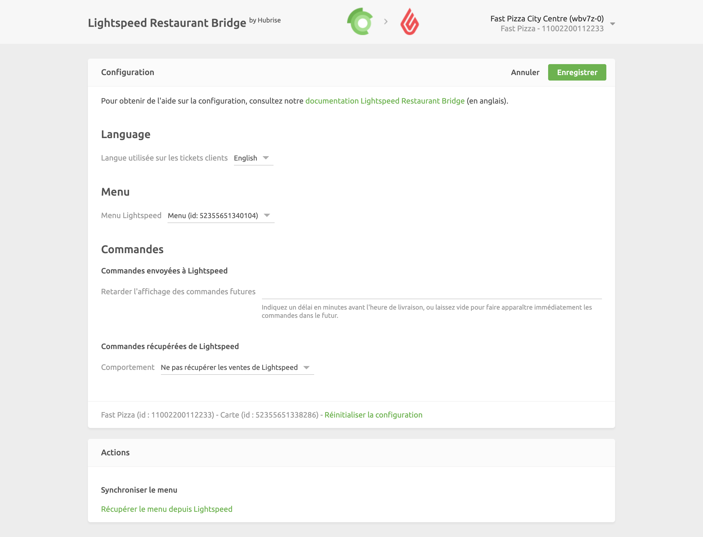

Pour profiter des fonctionnalités offertes par la nouvelle intégration avec Lightspeed Restaurant, telles que la synchronisation de catalogue ou la remontée des commandes depuis votre caisse, vous devez mettre à jour Lightspeed Restaurant Bridge. Pour cela, suivez les étapes suivantes.

## Reconnexion de l'app Lightspeed Restaurant Bridge

1. Depuis le back-office de HubRise, sélectionnez **CONNEXIONS**.

1. Dans l'application **Lightspeed Restaurant Bridge**, cliquez sur **Actions** > **Déconnecter**.

1. Cliquez sur **Voir les apps disponibles**.

1. Recherchez l'app **Lightspeed Restaurant Bridge**, cliquez sur celle-ci puis sur **Connecter**, et suivez les étapes indiquées à l'écran.

Pour plus d'informations, consultez les pages [Bloquer ou déconnecter une app](/docs/connections/#block-or-disconnect-app) (en anglais) et [Connecter une nouvelle app](/docs/connections/#connect-a-new-app) (en anglais).

## Reconnexion de votre compte Lightspeed

1. Depuis le back-office de HubRise, sélectionnez **CONNEXIONS**.

1. Dans l'application **Lightspeed Restaurant Bridge**, cliquez **Ouvrir**. Lightspeed Restaurant Bridge s'ouvre dans un nouvel onglet de votre navigateur.

1. Cliquez sur le nom de votre point de vente en haut à droite pour ouvrir le menu déroulant et sélectionnez **Configuration**.
   

1. Cliquez sur **Réinitialiser la configuration**, situé en bas de page. Dans la modale de confirmation, cliquez sur **Réinitialiser**.

1. Cliquez sur **Connexion à Lightspeed**. Si vous êtes redirigé vers votre espace Lightspeed, munissez-vous de vos identifiants et connectez-vous à votre compte Lightspeed.

1. Sélectionnez votre établissement et cliquez sur **Enregistrer**.

1. Optionnel : Si vous souhaitez synchroniser votre menu Lightspeed, sélectionnez un menu dans la section **Menu**.

1. Optionnel : Si vous souhaitez remonter les commandes Lightspeed vers HubRise, sélectionnez **Commandes récupérées depuis Lightspeed** > **Comportement** > **Récupérer les ventes payées de Lightspeed**.

1. Cliquez sur **Enregistrer**.

Si vous possédez plusieurs points de vente, répétez les étapes précédentes pour chacun d'entre eux.
