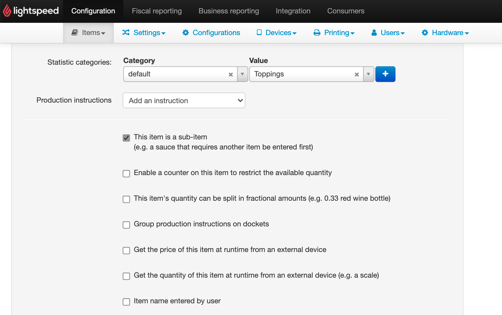

This page explains how to troubleshoot failed orders that are caused by products with sales restrictions.

## "Check Restrictions" Error

In some cases, orders sent to Lightspeed Restaurant might fail with the following error in the [logs of Lightspeed Resturant Bridge](/apps/lightspeed-restaurant/user-interface/#operation-page):

```
{
  "status": "FAILURE",
  "reason": "Could not add item Topping 1 (check sales restrictions)",
  "thirdPartyReference": "zvv25|w9988-0|qdvrjd"
}
```

This error happens when sales restrictions applied to a product prevent customers from ordering it.
Sales restrictions are not compatible with online orders.

In the `reason` field, notice how the error message informs you about the item that caused the issue (in this case, `Topping 1`). To resolve the issue, remove the sales restrictions for the product.

## Remove Sales Restrictions

To remove sales restrictions from a product, follow these steps:

1. Log in to your [Lightspeed back office](https://console.ikentoo.com/).
1. From the menu bar, select **Items > Items**.
1. From the list of products, find the product mentioned in the error message, then click <InlineImage width="20" height="20"></InlineImage> **Edit** in the **Actions** column.
1. In the **Item details** section, disable the checkbox next to **Enable a counter on this item to restrict the available quantity**.
   
1. Click **Save**.
