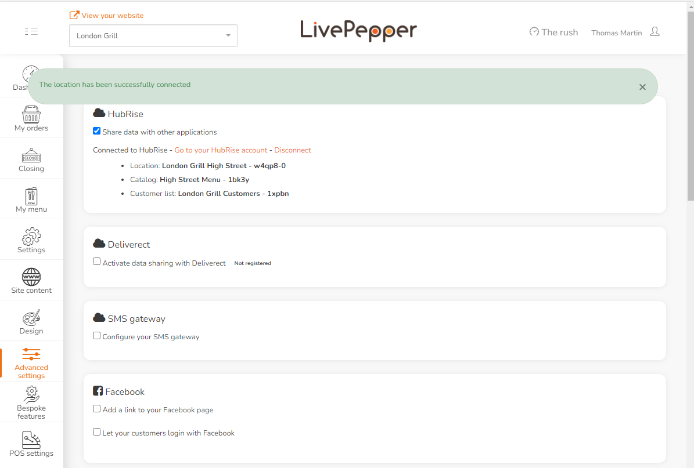

Connecting LivePepper to HubRise can be done with a few simple steps. If you do not have a HubRise account yet, it will be created automatically in the process.

---

**IMPORTANT NOTE:** To connect a LivePepper website with multiple locations, refer to this [FAQ](/apps/livepepper/faqs/connect-branches-hubrise-accounts).

---

## Connect LivePepper

Follow these steps if you don't have a HubRise account:

1. Log in to your LivePepper back office.
2. Select **Advanced settings** > **Add-ons**.
3. Under HubRise, click the checkbox **Share data with other applications**.
4. Click **Connect to HubRise**.
5. When the HubRise login page is presented, click **No account yet?**
6. Enter your personal information and click **Create account**.
7. Verify that your account and location names have been correctly prefilled by LivePepper. Click **Create**.
8. Click **Allow**.

If you already have a HubRise account, follow these steps:

1. Log in to your LivePepper back office.
2. Select **Advanced settings > Add-ons**.
3. Under HubRise, click the checkbox **Share data with other applications**.
4. Click **Connect to HubRise**.
5. If prompted, log in to your existing HubRise user profile.
6. Select the HubRise **Location** to connect, then click **Allow**.

## Disconnect LivePepper

In order to disable the connection between LivePepper and HubRise, follow these steps:

1. Log in to your LivePepper back office.
2. Select **Advanced settings** > **Add-ons**.
3. Under HubRise, click **Disconnect**.
