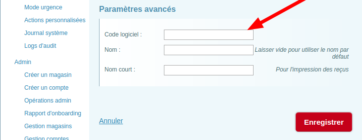

## Supported features

- Options
- Deals
- Pictures: products and deals

## Menu import

### Options

`option_lists` with type = `single` show as dropdowns on the site, with the first `option` of the list selected by default. Some `option_list` names are reserved:

- "Side 1" or "Side 2"

If type = `multiple`, shows as a set of checkboxes. Some `option_list` names are reserved:

- "Options"
- "Toppings" or "Toppings 1" or "Toppings 2"
- "Ingredients" or "Ingredients 1" or "Ingredients 2"

The variants with a trailing digit (1 or 2) are used for half & half products.

### Things not to forget
The iKentoo integration requires include the payment code in Settings / Payment settings. Select your payment method and include the corresponding POS code in "Advanced settings"

