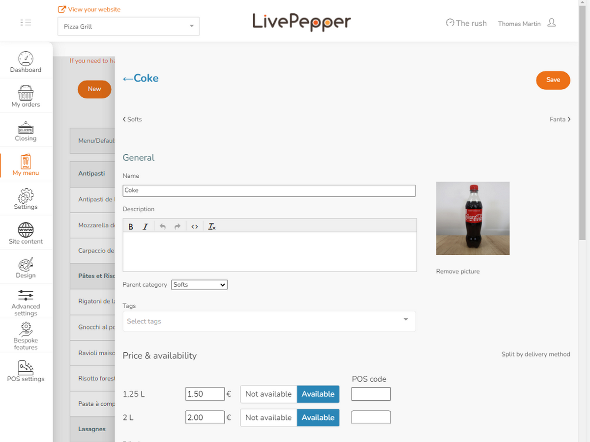
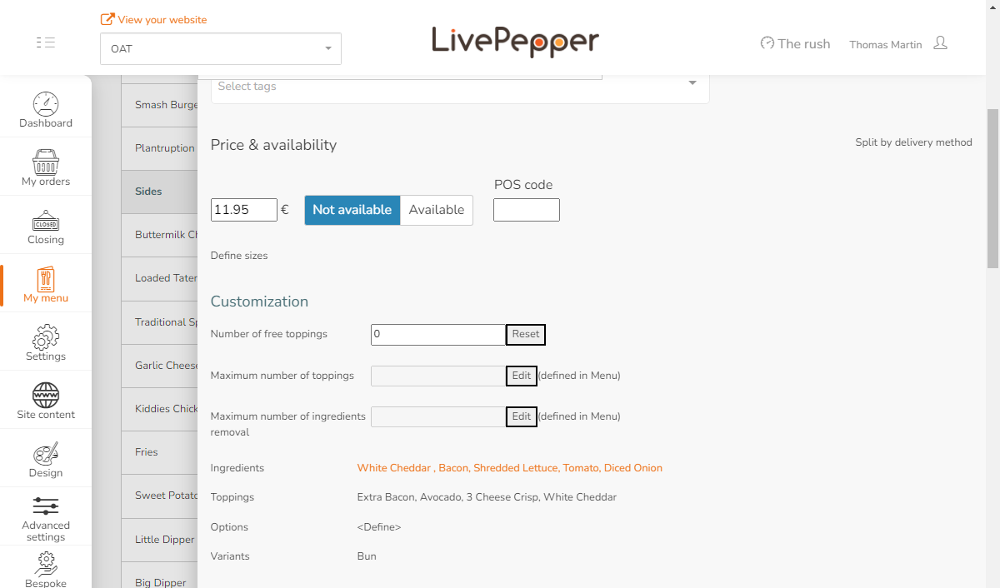
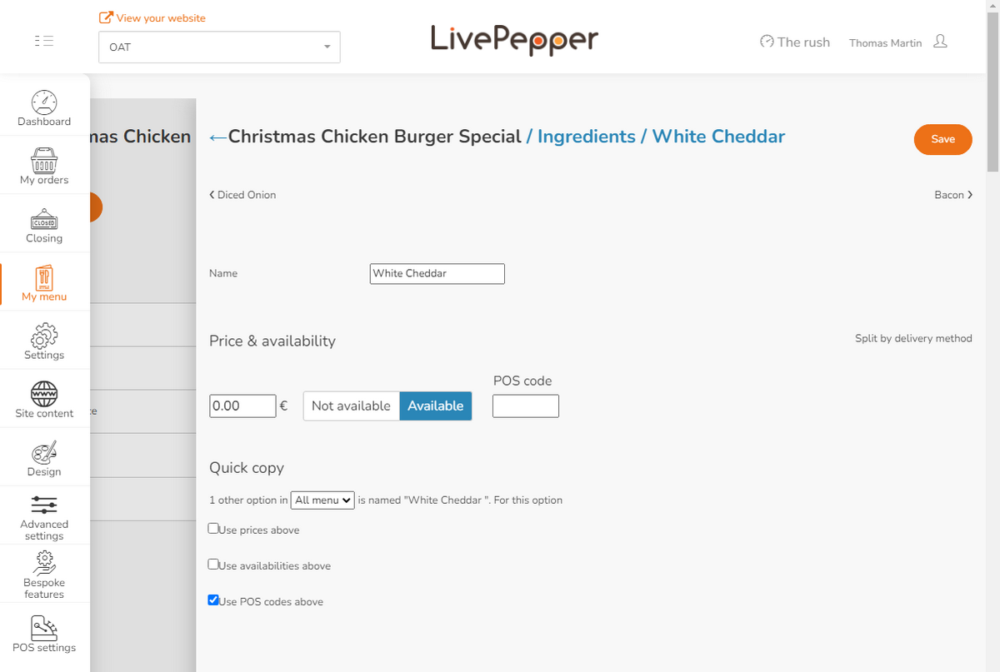

To receive LivePepper orders correctly on your EPOS, you need to configure ref codes for each item in the catalog, including toppings and options, ingredients, skus and deals. In some cases, the EPOS also requires ref codes for payment methods, service types and delivery charges. Refer to your EPOS documentation on the HubRise website for details.

This page explains how to configure ref codes in LivePepper. Some EPOS solutions offer the ability to export the menu to HubRise, allowing you to populate your LivePepper menu automatically with the correct ref codes. For more details, see [Pull the Catalog](/apps/livepepper/pull-catalog).

## Products and Skus

Each product has one or more skus. Each sku has a ref code that must be mapped to the corresponding item in your EPOS.

To update the ref code for each sku, follow these steps:

1. From your LivePepper back office, select **My Menu** > **Products**.
2. Select the product to update.
3. For each sku in the **Price & Availability** section, update the ref code under the **POS code** column.
4. Click **Save** to confirm.

At the end of the process, you can verify that all products have been mapped using the **Missing POS codes** custom action in LivePepper. For more information, see [Verify Product Mapping](/apps/livepepper/troubleshooting#verify-mapping)

## Toppings, Ingredients, and Options

LivePepper supports different types of optional changes to the products, called variants, toppings, ingredients, and options. These can be defined at the category- or product-level.

The following table provides an overview all these features.

| Name       | Description                                                                  | Level Definition     | Example                                               |
| ---------- | ---------------------------------------------------------------------------- | -------------------- | ----------------------------------------------------- |
| Variant    | Different choice of a product                                                | Category and Product | Choosing a pizza with thin crust or hand tossed crust |
| Topping    | Ingredients not available by default that customers can add to their product | Category             | Adding mushrooms to a pizza                           |
| Ingredient | An ingredient present by default that can be removed from the product        | Product              | Removing the pickles from a cheeseburger              |
| Option     | An optional service or item added to the product                             | Category             | Asking to slice the pizza                             |

To update the ref code for ingredients or variants defined at the product-level, follow these steps.

1. Select the product.
2. From the **Customization** section, select the item you want to update.
   
3. If the ingredient or variant is used in other products and they share the same ref code, you can update the ref code everywhere with these additional steps.
   - From the **Quick Copy** section, select whether the change applies to **All menu** items or to all products in a category.
   - Select **Use POS codes above**.
     
4. Click **Save** to confirm.

To update the ref code for toppings, options, and variants defined at the category-level, follow these steps.

1. From your LivePepper back office, select **My Menu** > **Products**.
2. Select the category.
3. From the **Customization** section, select the item you want to update.
4. If the item is used in other products and they share the same ref code, you can update the ref code everywhere with these additional steps
   - From the **Quick Copy** section, select whether the change applies to **All menu** items or to all products in a category.
   - Select **Use POS codes above**.
5. Click **Save** to confirm.

At the end of the process you can check if all product values and attributes have been mapped. For more information, see [Verify Product Mapping](/apps/livepepper/troubleshooting#verify-mapping).

## Deals and Discounts

Deals in LivePepper offer savings on products or on the entire order. Correct ref codes are essential for orders containing deals to be properly transmitted to your EPOS system and other apps connected to HubRise.

To add ref code to a deal, follow these steps.

1. From your LivePepper back office, select **My Menu** > **Deals**.
1. Find the deal to update, then select **Edit**.
1. Under **Advanced Settings**, enter the ref code in the **POS code** field.
1. Click **Save** to confirm.

At the end of the process you can check if all deals have been mapped. For more information, see [Verify Product Mapping](/apps/livepepper/troubleshooting#verify-mapping)

---

**IMPORTANT NOTE:** Depending on your EPOS, deals may be transmitted to the EPOS even without a ref code. Verify that your deals are properly set up to comply with your EPOS requirements.

---

## Payment Methods

Payment methods you set up on LivePepper may require a ref code. Refer to your EPOS documentation on the HubRise website to verify.

To add a ref code to a payment method, follow these steps.

1. From your LivePepper back office, select **Settings** > **Payment settings**.
1. Click the payment method to update.
1. Click the <InlineImage width="20" height="20"></InlineImage> Edit icon.
1. Under **Advanced settings**, enter the ref code in the **POS code** field.
1. Click **Save** to confirm.

## Service Types

Service types such as delivery, collection or eat-in might require a ref code. Refer to your EPOS documentation on the HubRise website to verify.

To add a ref code to a service type, follow these steps:

1. From your LivePepper back office, select **Settings** > **Delivery settings**.
1. Under **Delivery methods**, find the service type to update and add the ref code in the **POS code** field.
1. Click **Save** to confirm.

## Delivery Charges

If delivery charges apply for the service offered, a ref code might be required. Refer to your EPOS documentation on the HubRise website to verify.

To add a ref code to a delivery charge, follow these steps:

1. From your LivePepper back office, select **Settings** > **Delivery settings**.
1. Under **Delivery charge**, add the ref code in the **POS code** field.
1. Click **Save** to confirm.
