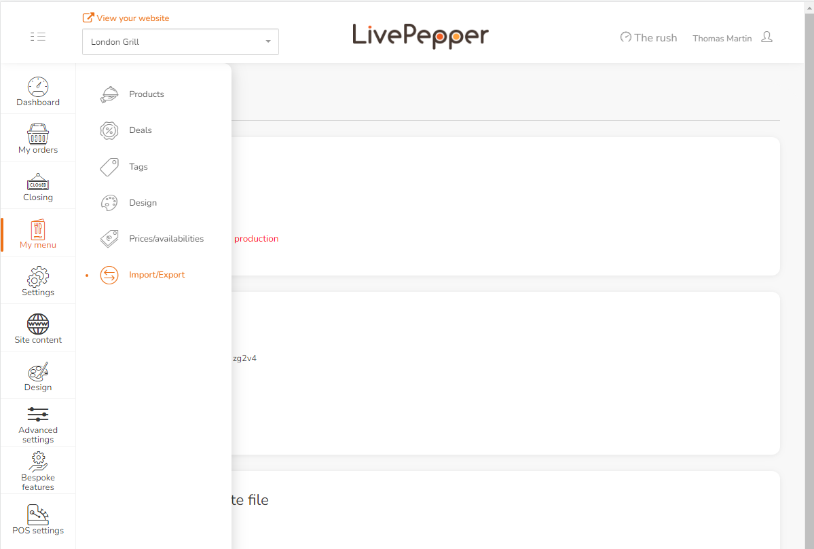
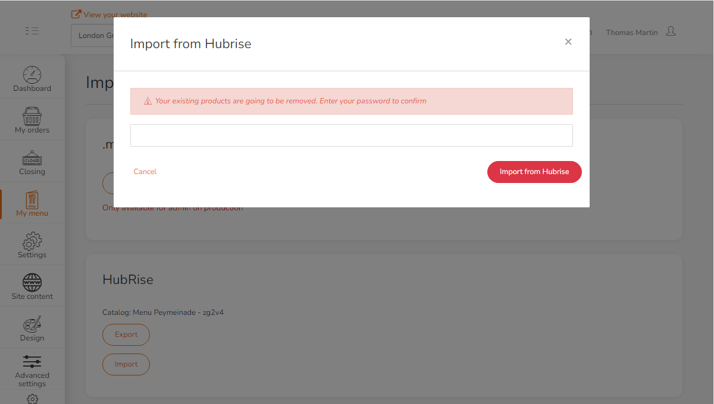
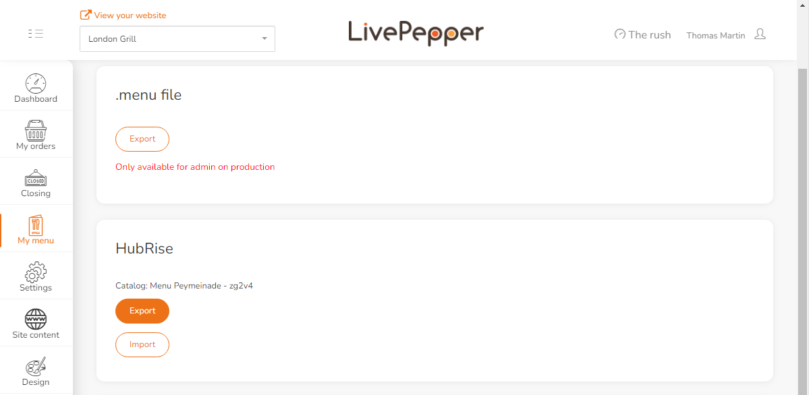

For LivePepper orders to be processed by your EPOS, you need to configure ref codes for each item in the menu, including toppings and options, ingredients, product sizes and deals.

Some EPOS solutions offer the ability to export the menu to HubRise, allowing you to populate your LivePepper menu automatically with the correct ref codes. However, if your EPOS cannot push a menu into HubRise, you will need to map ref codes manually, as described in [Map Ref Codes](/apps/livepepper/map-ref-codes). Refer to your connected EPOS documentation on the HubRise website to verify.

## Pulling the Menu

Before pulling your menu into LivePepper, you first need to populate a HubRise catalog. Refer to your connected EPOS documentation on the HubRise website for more information.

---

**IMPORTANT NOTE:** Make sure to associate ref codes to every product and option in your catalog. LivePepper will not pull a HubRise catalog if a ref code is missing.

---

To pull a HubRise catalog into LivePepper:

1. Log in to your LivePepper back office.
2. Click **My menu** > **Import / Export**.
   
3. In the **HubRise** section, click **Import**.
   
4. Enter your LivePepper password and click **Import from HubRise**.
   

---

**IMPORTANT NOTE:** Pulling a HubRise catalog will replace all your current products in LivePepper. This action cannot be reverted.

---

## Pushing the Menu

You can push your LivePepper menu into HubRise, if you want to share it with other connected apps.

To push your menu into HubRise:

1. Log in to your LivePepper back office.
2. Click **My menu** > **Import / Export**.
   
3. In the **HubRise** section, click **Export**.
   
The export can take a bit of time, especially if your menu contains pictures.

If some ref codes are missing in your menu, LivePepper will generate unique ref codes using product or option names.
