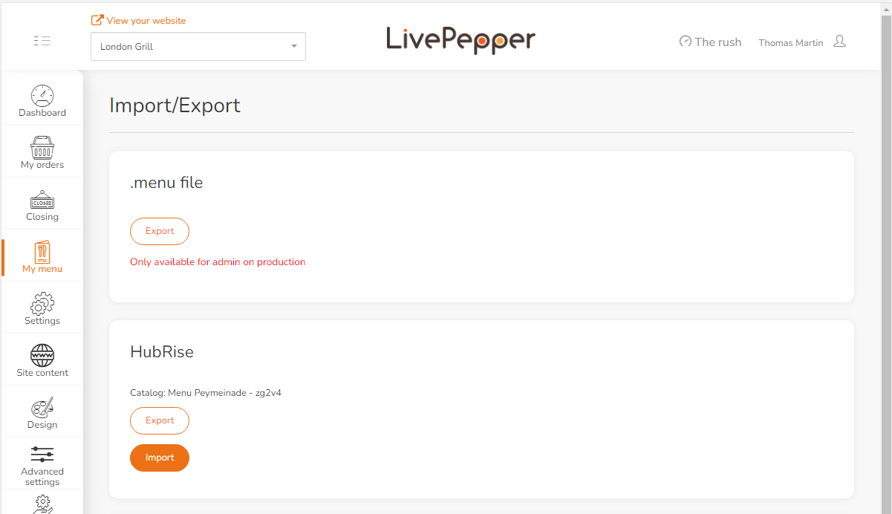

Pushing your LivePepper menu to HubRise provides you with the flexibility to share it with other connected applications, such as Uber Eats or Deliveroo.

To push your menu to HubRise:

1. Log in to your LivePepper back office.
2. Navigate to **My menu** > **Import / Export**.
3. Locate the **HubRise** section and click **Export**.
   
4. A notification will appear once the export is complete. This process might take some time, particularly for menus with a large number of images.

Note, if any ref codes are missing from your menu, LivePepper will automatically generate unique ref codes using product or option names.
